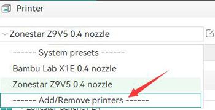
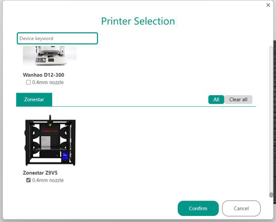

## Profiles for OrcaSlicer
### Step :one: Import zonestar 3d printer profiles
1. Download [:arrow_down: profles.zip](./profiles.zip) and unzip it on your PC.
2. Copy ***"Zonestar.json"*** and ***"Zonestar" folder*** to the ***"resources\profiles"*** directory where the OrcaSlicer installated.
### Step :two: Choose printer model
  