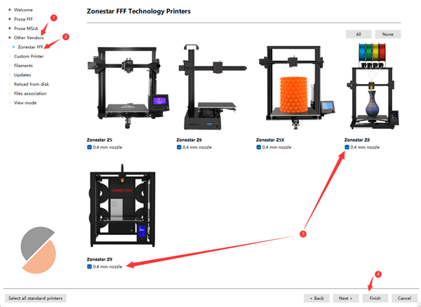

## Download and install PrusaSlicer
  ###  For Windows: 
  - [**:movie_camera: Video Tutorial**](https://github.com/ZONESTAR3D/Slicing-Guide/assets/29502731/ce48a22c-a9aa-45e8-8544-c1c67c7cd021)         
  - Download PrusaSlicer from the below link and unzip to your PC.     
    - [:+1: :arrow_down:**Download PrusaSlicer V2.4.2**][PrusaSlicer2.4.2] (Stable version)                      
    - [:new: :arrow_down:**Download PrusaSlicer**][PrusaSlicer] (All newer released version)                  

  ###  For MacOS:  
  :arrow_down: Download [**PrusaSlicer with ZONESTAR Profiles dmg file**](https://github.com/ZONESTAR3D/Slicing-Guide/releases/tag/2.4.2) and then install to your PC.

  ###  For Linux:
  :arrow_down: Download PrusaSlicer from [**Prusa Github Page**](https://github.com/prusa3d/PrusaSlicer/releases), and then import newest ZONESTAR 3d Printer Profiles.  

#### Import ZONESTAR 3D Printer Profiles
- [**:arrow_down:Download ZONESTAR 3d Printer profiles**](./Profiles.zip) and unzip it to your PC.
- Copy Profiles to "resource/profiles" directory of the installation directory of the PrusaSlicer software.    
:warning:You may need to delete previous configurations settings, otherwise the newer profiles can't be applied proper:warning:      
You can find the directory where store the previous configurations: ***help>>Show Configuration Floder***, for Windows, it is usually stored in ***"C:/Users/{your PC name}/AppData/Roaming/PrusaSlicer[-alpha/beta]"***. Delete all of these files in this directory, and then run PrusaSlicer again.    

-----
## 2. Setup printer
- 2.1 Find the prsua-slicer.exe and click it to run.    

- 2.2 Choose your printer, "Other Vendors>>Zonestar FFF>>your printer model>>finish".    

-----
## 3. Choose printer preset
Choose printer preset according to your printer model, hotend type and colors you want to print.   

|     Printer series  |        to print        |      Hotend type       |          presets       | Default for Machine    |
|:-------------------:|:----------------------:|:----------------------:|:----------------------:|:----------------------:|
|          Z5         |   one color or 2 color |       M2 hotend        |     Z5 + M2 hotend     |      Z5M2              |
|          Z5X        |        one color       |    one color hotend    |        Z5X             |      Z5X               |
|          Z6         |        one color       |    one color hotend    |        Z6              |      Z6                |
|      Z8 series      |        one color       |        Any             |     Z8 + one color     |      /                 |
|      Z8 series      |        one color       | Direct drive extruder  |     Z8 + DDE           |      /                 |
|      Z8 series      |       multi color      |       M3 hotend        |     Z8 + M3 HOTEND     |    Z8S-M3/Z8T/Z8PM3    |
|      Z8 series      |       multi color      |       M4 hotend        |     Z8 + M4 HOTEND     |    Z8PM4/Z8PM4Pro      |
|      Z8 series      |       multi color      |       E4 hotend        |     Z8 + E4 HOTEND     |      /                 |
|      Z9 series      |        one color       |        Any             |     Z9 + one color     |      /                 |
|      Z9 series      |        one color       | Direct drive extruder  |     Z8 + DDE           |      /                 |
|      Z9 series      |       multi color      |       M3 hotend        |     Z9 + M3 HOTEND     |      Z9M3              |
|      Z9 series      |       multi color      |       M4 hotend        |     Z9 + M4 HOTEND     | Z9M4/Z9V5Pro-MK1/2/3   |
|      Z9 series      |       multi color      |       M4 hotend        |     Z9 + E4 HOTEND     |    Z9V5Pro-MK4         |

(*)Default for Machine: The default hotend type used by this 3d printer model.

-----
[PrusaSlicer2.4.2]: https://github.com/ZONESTAR3D/Slicing-Guide/releases/tag/PrusaSlicer2.4.2
[PrusaSlicer]: https://github.com/ZONESTAR3D/Slicing-Guide/releases