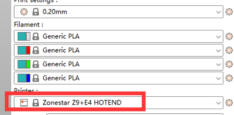

[FAQ_M4E4]: https://github.com/ZONESTAR3D/Upgrade-kit-guide/tree/main/HOTEND/FAQ_M4E4.md
[TOOLCHANGE_GCODE]: https://github.com/ZONESTAR3D/Slicing-Guide/blob/master/PrusaSlicer/Custom_Gcode.md#tool-change-g-code
[E4_USERGUIDE]: https://github.com/ZONESTAR3D/Upgrade-kit-guide/tree/main/HOTEND/E4/User_guide
[E4_GCODE]: https://github.com/ZONESTAR3D/Slicing-Guide/tree/master/PrusaSlicer/test_gcode/E4/readme.md

----
## <a id="choose-language">:globe_with_meridians: Choose language </a>

<!--  -->

----
## :warning: ATENCIÓN POR FAVOR :warning:
### **Preste atención para distinguir el tipo de extremo caliente: extremo caliente M4 o extremo caliente E4**.
Preste atención para distinguir el tipo de extremo caliente que utilizó: extremo caliente **color mezclado (M4)** o extremo caliente **color no mezclado (E4)**.
<u>**Si imprime un archivo gcode cortado en un hotend M4 con un hotend E4, puede bloquear el hotend, y viceversa.**</u>
Si no sabe cuál es la diferencia entre el hotend E4 y M4, consulte [aquí][FAQ_M4E4].

-----
## Rebanado multicolor para hotend E4
***Tome Z9V5Pro-MK4 como ejemplo***
##### :movie_camera:[**Tutorial en vídeo**](https://youtu.be/aets9JZ92iU)

### Paso 1: elija los ajustes preestablecidos de la impresora "Z9 + E4 hotend"

### Paso 2: cargue archivos de modelo 3D (archivo stl/obj/AMF, etc.)
 
- :memo: Por lo general, el "modelo dividido" no es necesario para imprimir archivos de modelos 3D de varios colores, es decir, un modelo 3D se ha dividido en múltiples archivos STL según los colores, y estos archivos usan la misma posición de coordenadas de origen para que puedan fusionarse correctamente.
- :star2: PrusaSlicer tiene una característica nueva y poderosa: puede pintar un archivo de modelo 3D en varios colores. Para más detalles, consulte [:movie_camera:  **Guía de corte: convierta un archivo 3D de un color en varios colores**](https://youtu.be/Yx4fKDRGEJ4)
##### 
### Paso 3: elija el tipo de filamento y establezca el color del filamento

### Paso 4: Asigne extrusores a diferentes partes

### Paso 5: cambie el tamaño, corte, gire y mueva el modelo 3D si es necesario

### Paso 6: Establezca la configuración de impresión
#### Configure "Retracción" y "Retracción cuando la herramienta está deshabilitada"
Por favor distinga entre 2 tipos de ***"Retracción"***:
1. La ***"Retracción"*** habitual se refiere a cuando se imprimen hilos finos del mismo color, cuando la impresora se mueve de un punto a otro, los hilos finos se retiran un poco para reducir la salida del hilo fino. boquilla de hilo. :warning: ***"Longitud de retracción"*** debe ser inferior a 10 mm para el extremo caliente E4.
2. ***"Retracción cuando la herramienta está desactivada"*** se refiere al proceso de sacar el cable fino del extremo caliente cuando la impresora cambia de un cable fino a otro. :warning: ***"Retracción cuando la herramienta está deshabilitada"*** debe establecerse en 0 porque agregamos ***"Personalizar códigos G"*** en ***"Cambiar código G de herramienta"*** a manejar más eficazmente el proceso de cambio de filamentos. Para obtener más detalles, consulte [**tool-change-gcode**][TOOLCHANGE_GCODE].    
    

#### Establezca la altura de la capa, la velocidad de impresión, el soporte, el relleno, etc.
   
Debe configurar estos parámetros de acuerdo con la forma del modelo y sus requisitos de calidad de impresión. Incluso para algunos modelos, la impresión no se puede completar normalmente sin soporte. Para obtener más información, consulte:
- :point_right: [**Introducción a PrusaSlicer**](https://help.prusa3d.com/article/general-info_1910)
- :point_right: [**Manual del usuario de Slic3r**](https://manual.slic3r.org/)

### Paso 7: Establecer los parámetros para *torre de limpieza*
Puede notar que aparecerá un cuadrado en la figura cortada, que se llama "Torre de limpieza" en PrusaSlicer. Debido a que para la impresora multicolor, al cambiar de extrusora, todavía quedan los filamentos de color anteriores dentro del hotend, es necesario limpiarlo antes de imprimir otro color.    
     
Para obtener un mejor efecto de limpieza y minimizar el desperdicio de filamento, podemos configurar el volumen de purga según diferentes colores. Consulte la siguiente tabla, las columnas muestran el extrusor anterior y las filas muestran el siguiente extrusor que se imprimirá. Cuando cambiamos del extrusor con filamento de color más claro al extrusor con filamentos de color más oscuro, podemos establecer un "volumen de purga" más pequeño. Por el contrario, cuando cambiamos del extrusor con filamentos de color más oscuro al extrusor con filamento de color más oscuro, necesitamos establecer un "volumen de purga" mayor.    
:warning: ***La longitud de retracción debe ser inferior a 10 mm; de lo contrario, podría provocar el bloqueo del hotend.***    
:star: Para el hotend E4, quedan pocos filamentos en el hotend, por lo que podemos usar un volumen de purga más pequeño en la torre de limpieza.
    
### Paso 8: Cortar

### Paso 9: Obtenga una vista previa del resultado cortado (archivo gcode) y luego guárdelo en el archivo gcode en su PC y luego cópielo en la tarjeta SD     
      
:star: Al obtener una vista previa del archivo gcode, puede ver que aparecerán algunas líneas de impresión adicionales en el costado de la cama, que son para precargar los filamentos. Para obtener detalles sobre cómo precargar el filamento, consulte [**:book: Guía del usuario del hotend E4**][E4_USERGUIDE].    

-----
## Apéndice
### Introducción de personalizar el código G
Si ha instalado correctamente el archivo de perfiles de la impresora 3D ZONESTAR, verá que hemos agregado algunos códigos gcode en ***"Configuración de la impresora>>Código G personalizado"***.
Para obtener detalles sobre el "código G personalizado", consulte [:book: **Descripción del código G personalizado**](./Custom_Gcode.md)   

### [:book: Guía de uso del extremo caliente E4][E4_USERGUIDE]
### [:arrow_down: prueba los archivos gcode para el hot end E4][E4_GCODE]