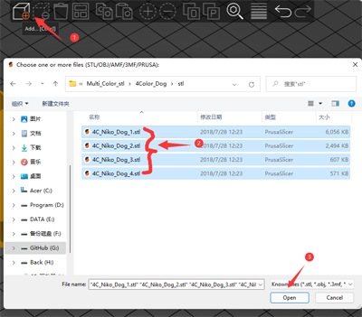
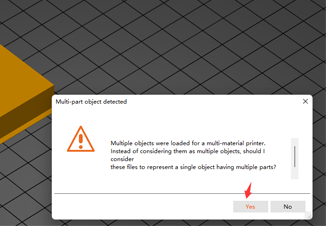
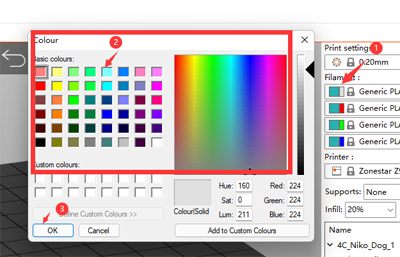
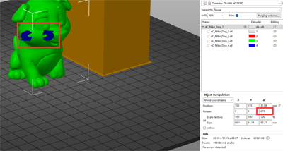
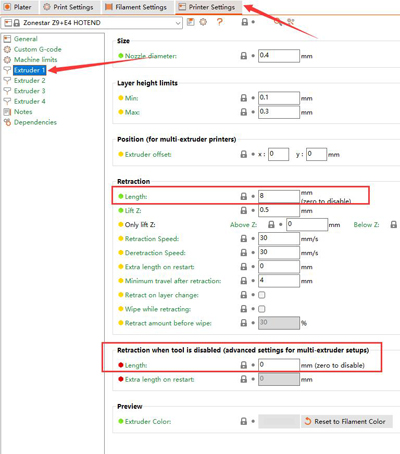
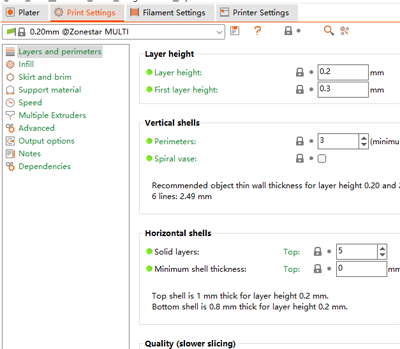
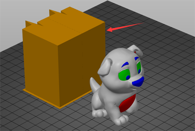
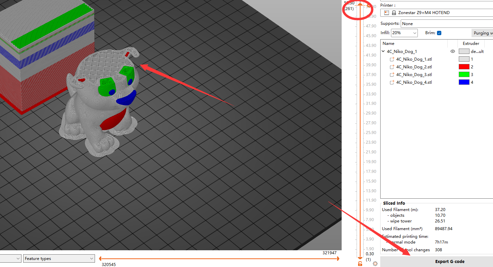

[FAQ_M4E4]: https://github.com/ZONESTAR3D/Upgrade-kit-guide/tree/main/HOTEND/FAQ_M4E4.md
[TOOLCHANGE_GCODE]: https://github.com/ZONESTAR3D/Slicing-Guide/blob/master/PrusaSlicer/Custom_Gcode.md#tool-change-g-code
[E4_USERGUIDE]: https://github.com/ZONESTAR3D/Upgrade-kit-guide/tree/main/HOTEND/E4/User_guide
[E4_GCODE]: https://github.com/ZONESTAR3D/Slicing-Guide/tree/master/PrusaSlicer/test_gcode/E4/readme.md

----
## <a id="choose-language">:globe_with_meridians: Choose language </a>

<!--  -->

----
## :warning: 注意してください :warning:
### ホットエンドのタイプの区別に注意してください: M4 ホットエンドまたは E4 ホットエンド。     
使用したホットエンドのタイプが**ミックスカラー(M4)**ホットエンドか**非ミックスカラー(E4)**ホットエンドかを区別するように注意してください。    
<u>**M4 ホット エンドでスライスされた gcode ファイルを E4 ホット エンドで印刷すると、ホット エンドがブロックされる可能性があります。その逆も同様です。**</u>    
E4 ホットエンドと M4 ホットエンドの違いがわからない場合は、[こちら][FAQ_M4E4] を参照してください。

-----
## E4 ホットエンド用のマルチカラーのスライス
***Z9V5Pro-MK4を例に挙げます***
##### :movie_camera: [**ビデオチュートリアル**](https://youtu.be/aets9JZ92iU)

### ステップ 1 プリンターのプリセット「Z9 + E4 ホットエンド」を選択します。
  
### ステップ 2: 3D モデル ファイル (stl/obj/AMF ファイルなど) をロードします。
    
- :memo: 通常、複数色の 3D モデル ファイルを印刷するには「分割モデル」が必要です。つまり、3D モデルが色に従って複数の STL ファイルに分割されており、これらのファイルは同じ原点座標位置を使用するため、 正しくマージされます。   
- :star2: PrusaSlicer には強力な新機能があり、3D モデル ファイルをマルチカラーにペイントできます。詳細については、次を参照してください:movie_camera: [**スライス ガイド - 1 つのカラー 3D ファイルをマルチカラーに変換**](https://youtu.be/Yx4fKDRGEJ4)
##### 
### ステップ 3: フィラメントのタイプを選択し、フィラメントの色を設定します

### ステップ 4: 押出機をさまざまなパーツに割り当てる

### ステップ 5: 必要に応じて、3D モデルのサイズ変更、切り取り、回転、移動を行います。

### ステップ 6: 印刷設定を設定する
#### 「退避」と「ツール無効時の退避」を設定します。
***「撤回」*** の 2 つのタイプを区別してください:
1. 通常の ***「リトラクション」*** とは、同じ色の細糸を印刷するときに、プリンターがある点から別の点に移動するときに、細糸の流出を減らすために細糸を少しだけ引き戻すことを指します。 糸ノズル。 :warning: ***「後退長さ」*** は、E4 ホットエンドの場合は 10mm 未満である必要があります。   
2. ***「ツール無効時の退避」*** は、プリンターが 1 つの細線から別の細線に切り替えるときに、細線をホット エンドから引き出すプロセスを指します。 :warning: ***「ツール変更 G コード」*** に ***「G コードのカスタマイズ」*** を追加したため、***「ツールが無効な場合の撤回」*** は 0 に設定する必要があります。 フィラメントの切り替えプロセスをより効果的に処理します。 詳細については、[**tool-change-gcode**][TOOLCHANGE_GCODE]を参照してください。    

#### レイヤーの高さ、印刷速度、サポート、充填などを設定します。

モデルの形状や印刷品質の要件に応じて、これらのパラメータを設定する必要があります。 一部の機種でもサポートが無い場合は正常に印刷ができない場合がございます。 詳細については、以下を参照してください。   
- :point_right: [**PrusaSlicer の紹介**](https://help.prusa3d.com/article/general-info_1910)   
- :point_right: [**Slic3r ユーザーマニュアル**](https://manual.slic3r.org/)

### ステップ 7: *ワイプタワー* のパラメータを設定する
スライスされた図に四角形が表示されることに気づくかもしれません。これは、PrusaSlicer では「ワイプ タワー」と呼ばれます。 マルチカラープリンタの場合、押出機を切り替えている間、ホットエンド内に前の色のフィラメントがまだ残っているため、別の色を印刷する前にホットエンドをきれいにする必要があります。
    
より良いクリーニング効果を得てフィラメントの無駄を最小限に抑えるために、色に応じてパージ量を設定できます。 次の表を参照してください。列は前の押出機を示し、行は印刷される次の押出機を示します。 明るい色のフィラメントを使用したエクストルーダーから濃い色のフィラメントを使用したエクストルーダーに変更すると、「パージ量」をより小さく設定できます。 逆に、濃い色のフィラメントを使用したエクストルーダーから濃い色のフィラメントを使用したエクストルーダーに変更した場合は、「パージ量」をより大きく設定する必要があります。   
:warning: ***後退長は 10mm 未満である必要があります。そうしないと、ホットエンドが詰まる可能性があります。***    
:star: E4 ホットエンドの場合、ホットエンドにほとんどフィラメントが残っていないため、ワイプ タワーでより少ないパージ量を使用できます。   

### ステップ 8: スライス

### ステップ 9: スライス結果 (gcode ファイル) をプレビューし、gcode ファイルを PC に保存して、SD カードにコピーします。
     
:star: gcode ファイルをプレビューすると、フィラメントを事前にロードするための追加の印刷行がベッドの側面に表示されることがわかります。 フィラメントのプリロード方法の詳細については、[**:book: E4 Hotend ユーザー ガイド**][E4_USERGUIDE] を参照してください。     

----
## 付録
### カスタマイズGコードの紹介
ZONESTAR 3D プリンターのプロファイル ファイルを正しくインストールしている場合は、***「プリンター設定>>カスタム G コード」*** にいくつかの G コード コードが追加されていることがわかります。   
「カスタムGコード」の詳細については、[:book: **カスタムGコードの説明**](./Custom_Gcode.md)を参照してください。    

### [:book: E4 ホットエンド使用ガイド][E4_USERGUIDE]   
### [:arrow_down: E4 ホットエンドの gcode ファイルをテストする][E4_GCODE]

