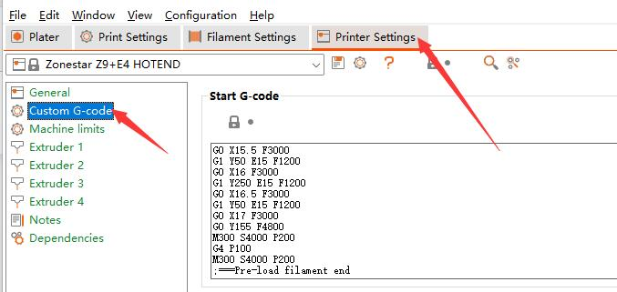

[FAQ_M4E4]: https://github.com/ZONESTAR3D/Upgrade-kit-guide/tree/main/HOTEND/FAQ_M4E4.md
[TOOLCHANGE_GCODE]: https://github.com/ZONESTAR3D/Slicing-Guide/blob/master/PrusaSlicer/Custom_Gcode.md#tool-change-g-code
[E4_USERGUIDE]: https://github.com/ZONESTAR3D/Upgrade-kit-guide/tree/main/HOTEND/E4/User_guide
[E4_GCODE]: https://github.com/ZONESTAR3D/Slicing-Guide/tree/master/PrusaSlicer/test_gcode/E4/readme.md

----
## <a id="choose-language">:globe_with_meridians: Choose language </a>

<!--  -->

----
## :warning: 주의하세요 :warning:
### 핫엔드 유형을 구별하는 데 주의하십시오: M4 핫엔드 또는 E4 핫엔드.
사용하신 핫엔드 유형이 **혼합색(M4)** 핫엔드인지 **비혼합색(E4)** 핫엔드인지 구분하시기 바랍니다.    
<u>**M4 핫엔드와 E4 핫엔드에서 슬라이스된 gcode 파일을 인쇄하면 핫엔드가 차단될 수 있으며 그 반대의 경우도 마찬가지입니다.**</u>    
E4 핫엔드와 M4 핫엔드의 차이점을 모르신다면 [여기][FAQ_M4E4]를 참고해주세요.

-----
## E4 핫엔드용 다중 색상 슬라이싱
***Z9V5Pro-MK4를 예로 들어보세요***
##### :movie_camera: [**동영상 튜토리얼**](https://youtu.be/aets9JZ92iU)

### 1단계 프린터 사전 설정 "Z9 + E4 hotend"를 선택합니다.

### 2단계: 3D 모델 파일(stl/obj/AMF 파일 등) 로드
     
- :memo: 일반적으로 다중 색상 3D 모델 파일을 인쇄하려면 분할 모델 이 필요합니다. 즉, 3D 모델은 색상에 따라 여러 STL 파일로 분할되었으며 이러한 파일은 동일한 원점 좌표 위치를 사용하여 인쇄할 수 있습니다. 올바르게 병합됩니다.  
- :star2: PrusaSlicer에는 3D 모델 파일을 다중 색상으로 칠할 수 있는 강력한 새 기능이 있습니다. 자세한 내용은 다음을 참조하십시오 :movie_camera: [**슬라이싱 가이드 - 하나의 색상 3D 파일을 다중 색상으로 변환**](https://youtu.be/Yx4fKDRGEJ4)   
#####   
### 3단계: 필라멘트 유형 선택 및 필라멘트 색상 설정

### 4단계: 다양한 부품에 압출기 할당

### 5단계: 필요한 경우 3D 모델 크기 조정, 자르기, 회전, 이동

### 6단계: 인쇄 설정 지정
#### 후퇴 및 도구 비활성화 시 후퇴 설정
***철회***의 2가지 유형을 구별하십시오:
1. 일반적인 ***후퇴*** 는 동일한 색상의 가는 실을 인쇄할 때 프린터가 한 지점에서 다른 지점으로 이동할 때 미세한 실이 약간 뒤로 당겨져 미세 유출을 줄이는 것을 의미합니다. 스레드 노즐. :warning: ***후퇴 길이*** E4 핫 엔드의 경우 10mm 미만이어야 합니다.
2. ***도구가 비활성화되었을 때 후퇴*** 는 프린터가 한 가는 와이어에서 다른 가는 와이어로 전환할 때 뜨거운 끝에서 가는 와이어를 당기는 프로세스를 나타냅니다. :warning: ***도구 비활성화 시 후퇴*** 는 0으로 설정해야 합니다. 왜냐하면 ***도구 변경 G코드*** 에 ***G 코드 사용자 정의***를 추가했기 때문입니다. 필라멘트 전환 과정을 보다 효과적으로 처리합니다. 자세한 내용은 [**tool-change-gcode**][TOOLCHANGE_GCODE]를 참고하세요.    

#### 레이어 높이, 인쇄 속도, 지지대, 채우기 등을 설정합니다.

모델의 모양과 인쇄 품질 요구 사항에 따라 이러한 매개변수를 설정해야 합니다. 일부 모델의 경우에도 지원하지 않으면 인쇄가 정상적으로 완료되지 않습니다. 자세한 내용은 다음을 참조하세요.
- :point_right: [**PrusaSlicer 소개**](https://help.prusa3d.com/article/general-info_1910)
- :point_right: [**Slic3r 사용자 매뉴얼**](https://manual.slic3r.org/)

### 7단계: *wipe tower*에 대한 매개변수 설정
PrusaSlicer에서 "Wipe tower"라고 불리는 사각형이 슬라이스 그림에 나타나는 것을 볼 수 있습니다. 멀티 컬러 프린터의 경우 압출기를 전환하는 동안 핫엔드 내부에 이전 컬러 필라멘트가 여전히 남아 있기 때문에 다른 컬러를 인쇄하기 전에 청소해야 합니다.    
     
더 나은 청소 효과를 얻고 필라멘트 낭비를 최소화하기 위해 다양한 색상에 따라 퍼지 볼륨을 설정할 수 있습니다. 다음 표를 참조하세요. 열에는 이전 압출기가 표시되고 행에는 프린트할 다음 압출기가 표시됩니다. 더 밝은 색상의 필라멘트를 사용하는 압출기에서 더 어두운 색상의 필라멘트를 사용하는 압출기로 변경할 때 더 작은 "퍼징 볼륨"을 설정할 수 있습니다. 반대로, 더 어두운 색상의 필라멘트를 사용하는 압출기에서 더 어두운 색상의 필라멘트를 사용하는 압출기로 변경할 경우 더 큰 "퍼징 볼륨"을 설정해야 합니다.     
:warning: ***후퇴 길이는 10mm 미만이어야 합니다. 그렇지 않으면 핫엔드가 막힐 수 있습니다.***   
:star: E4 핫엔드의 경우 핫엔드에 필라멘트가 거의 남아 있지 않으므로 와이프 타워에서 더 작은 퍼지 볼륨을 사용할 수 있습니다.    
   
### 8단계: 자르기
   
### 9단계: 슬라이스된 결과(gcode 파일)를 미리 보고 PC에 gcode 파일로 저장한 다음 SD 카드에 복사합니다.
   
:star: gcode 파일을 미리 보면 침대 측면에 필라멘트를 미리 로드하기 위한 몇 가지 추가 인쇄 라인이 나타나는 것을 볼 수 있습니다. 필라멘트 사전 로드 방법에 대한 자세한 내용은 [**:book: E4 Hotend 사용자 가이드**][E4_USERGUIDE]를 참조하세요.   

-----
## 부록
### G 코드 사용자 정의 소개
ZONESTAR 3d 프린터의 프로필 파일을 올바르게 설치했다면 ***Printer Setting>>Custom G-code*** 에 일부 gcode 코드가 추가된 것을 볼 수 있습니다.
"Custom G-code"에 대한 자세한 내용은 [:book: **Description of Custom Gcode**](./Custom_Gcode.md)를 참조하세요.      
   
### [:book: E4 핫엔드 사용 가이드][E4_USERGUIDE]
### [:arrow_down: E4 핫엔드용 gcode 파일 테스트][E4_GCODE]

