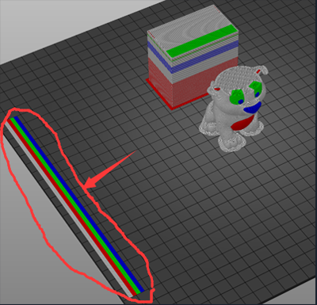

[FAQ_M4E4]: https://github.com/ZONESTAR3D/Upgrade-kit-guide/tree/main/HOTEND/FAQ_M4E4.md
[TOOLCHANGE_GCODE]: https://github.com/ZONESTAR3D/Slicing-Guide/blob/master/PrusaSlicer/Custom_Gcode.md#tool-change-g-code
[E4_USERGUIDE]: https://github.com/ZONESTAR3D/Upgrade-kit-guide/tree/main/HOTEND/E4/User_guide
[E4_GCODE]: https://github.com/ZONESTAR3D/Slicing-Guide/tree/master/PrusaSlicer/test_gcode/E4/readme.md

----
## <a id="choose-language">:globe_with_meridians: Choose language </a>

<!--  -->

----
## :warning: ПОЖАЛУЙСТА, ВНИМАНИЕ :warning:
### Обратите внимание на тип горячего конца: горячий конец M4 или горячий конец E4.
Пожалуйста, обратите внимание, чтобы отличить тип горячего конца, который вы использовали: **горячий конец смешанного цвета (M4)** или **горячий конец несмешанного цвета (E4)**.   
<u>**Если вы распечатаете файл gcode, нарезанный на хотэнде M4, с помощью хотэнда E4, он может заблокировать хотэнд, и наоборот.**</u>   
Если вы не знаете, чем отличаются хотэнды E4 и M4, обратитесь к [здесь][FAQ_M4E4].

-----
## Нарезка многоцветного цвета для хотенда E4
***В качестве примера возьмем Z9V5Pro-MK4***
##### :movie_camera: [**Видеоурок**](https://youtu.be/aets9JZ92iU)

### Шаг 1: выберите настройки принтера «Z9 + E4 hotend»

### Шаг 2: загрузите файлы 3D-модели (файл stl/obj/AMF и т. д.)
 
- :memo: Обычно для печати файлов многоцветных 3D-моделей требуется «разделенная модель», то есть 3D-модель была разделена на несколько файлов STL в соответствии с цветами, и эти файлы используют одну и ту же исходную координату, чтобы их можно было быть объединены правильно.
- :star2: PrusaSlicer имеет новую мощную функцию: он может раскрашивать файл 3D-модели в несколько цветов. Подробную информацию можно найти по адресу :movie_camera: [**Руководство по нарезке: преобразование одноцветного 3D-файла в многоцветный**](https://youtu.be/Yx4fKDRGEJ4)
##### 
### Шаг 3. Выберите тип нити и установите ее цвет.

### Шаг 4. Назначьте экструдеры различным частям

### Шаг 5. При необходимости измените размер, вырежьте, поверните и переместите 3D-модель.

### Шаг 6. Установите параметры печати
#### Установите «Отвод» и «Отвод при отключенном инструменте»
Пожалуйста, различайте 2 типа ***"Втягивания"***:
1. Обычное ***"Втягивание"*** относится к печати тонкими нитями одного и того же цвета, когда принтер перемещается из одной точки в другую, тонкие нити оттягиваются на небольшое расстояние назад, чтобы уменьшить вытекание тонких нитей. насадка для резьбы. :warning: ***Длина втягивания*** должна быть менее 10 мм для горячего конца E4.  
2. ***«Втягивание при отключенном инструменте»*** относится к процессу вытягивания тонкой проволоки из горячего конца, когда принтер переключается с одной тонкой проволоки на другую. :warning: ***"Отвод при отключении инструмента"*** должен быть установлен на 0, поскольку мы добавили ***"Настройка G-кодов"*** в ***"Изменение G-кода инструмента"*** в более эффективно справляются с процессом переключения нитей. Более подробную информацию можно найти в [**tool-change-gcode**][TOOLCHANGE_GCODE].      

#### Установите высоту слоя, скорость печати, поддержку, заполнение и т. д.
    
Вам необходимо задать эти параметры в соответствии с формой модели и вашими требованиями к качеству печати. Даже для некоторых моделей печать невозможно нормально выполнить без поддержки. Для получения подробной информации см.:   
- :point_right: [**Введение в PrusaSlicer**](https://help.prusa3d.com/article/general-info_1910)   
- :point_right: [**Руководство пользователя Slic3r**](https://manual.slic3r.org/)  

### Шаг 7: Установите параметры для *вышки очистки*
Вы можете заметить, что на разрезанной фигуре появится квадрат, который в PrusaSlicer называется «Wipe Tower». Поскольку в многоцветном принтере при переключении экструдеров внутри хотэнда все еще остаются нити предыдущего цвета, перед печатью другого цвета его необходимо очистить.    
    
Чтобы получить лучший эффект очистки и минимизировать количество отходов нити, мы можем установить объем продувки в соответствии с разными цветами. См. следующую таблицу: столбцы показывают предыдущий экструдер, а строки показывают следующий экструдер, который будет напечатан. Когда мы переключаемся с экструдера с нитями более светлого цвета на экструдер с нитями более темного цвета, мы можем установить меньший «объем очистки». Напротив, когда мы переходим от экструдера с нитями более темного цвета к экструдеру с нитями более темного цвета, нам необходимо установить больший «объем очистки».
:warning: ***Длина втягивания должна быть менее 10 мм, в противном случае это может привести к блокировке хотэнда.***
:star: Для хотэнда E4 в хотэнде осталось мало нитей, поэтому мы можем использовать меньший объем продувки на башне очистки.   
   
### Шаг 8: Нарезка

### Шаг 9. Просмотрите результат нарезки (файл gcode), затем сохраните его в файл gcode на свой компьютер, а затем скопируйте на SD-карту.
    
:star: При предварительном просмотре файла gcode вы можете увидеть, что на боковой стороне кровати появятся дополнительные линии печати, предназначенные для предварительной загрузки нитей. Подробную информацию о предварительной загрузке нити см. в [**:book: Руководство пользователя E4 Hotend**][E4_USERGUIDE].   

-----
## Приложение
### Введение в настройку G-кода
Если вы правильно установили файл профилей 3D-принтера ZONESTAR, вы увидите, что мы добавили несколько кодов gcode в *** «Настройки принтера>>Пользовательский G-код»***.
Подробную информацию о «Пользовательском G-коде» см. в [:book: **Описание пользовательского G-кода**](./Custom_Gcode.md).    

### [:book: Руководство по использованию E4 Hot End][E4_USERGUIDE]
### [:arrow_down: Тестирование файлов gcode для горячего конца E4][E4_GCODE]
