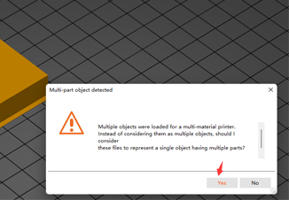

----
## <a id="choose-language">:globe_with_meridians: Choose language </a>

<!--  -->

----
## :warning: ACHTUNG BITTE :warning:
### Bitte achten Sie auf die Unterscheidung des Hot-End-Typs
Bitte achten Sie darauf, den von Ihnen verwendeten Hot-End-Typ zu unterscheiden: **Mischfarbe (M4)** Hot-End oder **Nicht-Mischfarbe (E4)** Hot-End.   
<u>**Wenn Sie eine Gcode-Datei drucken, die auf einem M4-Hot-End mit einem E4-Hot-End aufgeteilt ist, kann es sein, dass das Hot-End blockiert wird, und umgekehrt.**</u>    
Wenn Sie nicht wissen, was der Unterschied zwischen E4- und M4-Hotend ist, lesen Sie bitte [**hier**][FAQ_M4E4].

----
## Slicing Muti-Color für M4 Hotend
#### :loudspeaker: Dieses Handbuch dient als Beispiel Z9V5Pro-MK3
### :movie_camera: [**Video-Tutorial**](https://youtu.be/_Ww2RFGlLNA)

### Schritt 1: Druckervoreinstellungen „Z9 + M4 Hotend“ auswählen

### Schritt 2: 3D-Modelldateien laden (stl/obj/AMF-Datei usw.)
 
- :memo: Normalerweise ist „Modell aufteilen“ erforderlich, um mehrfarbige 3D-Modelldateien zu drucken, d korrekt zusammengeführt werden.
- :star2: PrusaSlicer verfügt über eine leistungsstarke neue Funktion: Es kann eine 3D-Modelldatei in mehrere Farben malen. Weitere Informationen finden Sie unter :movie_camera: [**Slicing-Anleitung – Konvertieren Sie eine 3D-Datei mit einer Farbe in mehrere Farben**](https://youtu.be/Yx4fKDRGEJ4).
##### 

### Schritt 3: Filamenttyp auswählen und Filamentfarbe festlegen

### Schritt 4: Extruder verschiedenen Teilen zuordnen

### Schritt 5: Ändern Sie die Größe, schneiden Sie das 3D-Modell aus, drehen Sie es und verschieben Sie es bei Bedarf

### Schritt 6: Legen Sie die Druckeinstellungen fest
#### :warning: Bitte beachten Sie, dass der „Rückzug bei deaktiviertem Werkzeug“ auf 0 gesetzt werden sollte.

#### Legen Sie die Schichthöhe, die Druckgeschwindigkeit, die Unterstützung, die Füllung usw. fest.

Sie müssen diese Parameter entsprechend der Form des Modells und Ihren Anforderungen an die Druckqualität einstellen. Selbst bei einigen Modellen kann der Druckvorgang ohne Unterstützung nicht normal durchgeführt werden. Einzelheiten finden Sie unter:
- :point_right: [**PrusaSlicer-Einführung**](https://help.prusa3d.com/article/general-info_1910)
- :point_right: [**Slic3r-Benutzerhandbuch**](https://manual.slic3r.org/)
  
### Schritt 7: Parameter für „Wischturm“ einstellen
Möglicherweise stellen Sie fest, dass in der geschnittenen Figur ein Quadrat erscheint, das in PrusaSlicer „Wipe Tower“ genannt wird. Da beim Mehrfarbendrucker beim Wechseln des Extruders immer noch die vorherigen Farbfilamente im Hotend vorhanden sind, muss es sauber sein, bevor eine andere Farbe gedruckt werden kann.
###### 
Um eine bessere Reinigungswirkung zu erzielen und die Filamentverschwendung zu minimieren, können wir die Spülmenge je nach Farbe einstellen. Bitte sehen Sie sich die folgende Tabelle an. Die Spalten zeigen den vorherigen Extruder und die Zeilen zeigen den nächsten Extruder, der gedruckt werden soll. Wenn wir vom Extruder mit Filamenten in hellerer Farbe zum Extruder mit Filamenten in dunklerer Farbe wechseln, können wir ein kleineres „Spülvolumen“ einstellen. Im Gegenteil, wenn wir vom Extruder mit dunkleren Filamentfarben zum Extruder mit helleren Filamentfarben wechseln, müssen wir ein größeres „Spülvolumen“ einstellen.
###### 
### Schritt 8: Schneiden

### Schritt 9: Vorschau des Sliced-Ergebnisses (Gcode-Datei) und dann als Gcode-Datei auf Ihrem PC speichern und dann auf die SD-Karte kopieren

----
## So drucken Sie mehr als 4 Farben mit dem M4-Hot-End
Das M4-Farbmisch-Hot-End kann 2 bis 4 tatsächliche Extruderfilamente mischen, um ein neues Farbfilament zu erzeugen. Dieses neue Farbfilament kann als neuer Extruder (**„virtueller Extruder“**) verwendet werden. Die Arbeitsschritte sind wie folgt :
***Das folgende Beispiel zeigt, wie 6 Extruder eingestellt werden – 4 tatsächliche Extruder und 2 virtuelle Extruder. E5 wird mit 50 % E1 und 50 % E2 gemischt, E6 wird mit 50 % E3 und 50 % E4 gemischt.***
### Schritt 1: Virtuelle Extruder hinzufügen
###### 
:warning: Wir empfehlen, die Einstellungen in einem **neuen Profil**2 zu **speichern**1.

### Schritt 2: Mischgeschwindigkeit des neuen „virtuellen Extruders“ einstellen
#### Befehle „Mischrate festlegen“ zu „Gcode starten“ hinzufügen.
###### 
:warning: Wir empfehlen, diese G-Codes am Anfang des „Start-G-Codes“ zu platzieren.
>
     ;Mischrate einstellen
     ;E5 = 50 %E1 + 50 %E2
     M163 S0 P50
     M163 S1 P50
     M163 S2 P0
     M163 S3 P0
     M164 S4
     ;E6 = 50 %E3 + 50 %E4
     M163 S0 P0
     M163 S1 P0
     M163 S2 P50
     M163 S3 P50
     M164 S5

#### :memo: Einführung in die Befehle „M163“ und „M164“.
>
     M163: Legen Sie einen einzelnen Mischfaktor für einen Mischextruder fest, gefolgt von M164, um sie zu normalisieren und festzuschreiben.
      S[index] Der einzustellende Kanalindex (tatsächlicher Extruder).
      P[float] Der Mischungswert von (0,0 ~ 100,0)
      R Alle Mischextrudereinstellungen auf die Standardeinstellungen zurücksetzen

     M164: Mischrate normalisieren und an einen virtuellen Extruder übergeben.
      S[index] Der zu speichernde virtuelle Extruder
  
     Normalisieren: Skalieren Sie die Mischungsverhältniswerte jedes Extruders automatisch, um den Maschinenanforderungen gerecht zu werden

### Schritt 3: Weisen Sie die neuen virtuellen Extruder dem 3D-Modell und dem Slicing zu
Jetzt können Sie dem 3D-Modell 6 Extruder zuweisen. Der Slicing-Vorgang ist genau der gleiche wie bei den 4 Extrudern.
1. Wählen Sie das Druckerprofil.
2. Stellen Sie die Filamentfarbe der neuen Extruder ein.
3. Weisen Sie dem Teil des 3D-Modells einen Extruder zu.
###### 

----
## Anhang
### [:book: M4 Hotend-Gebrauchsanleitung](https://github.com/ZONESTAR3D/Upgrade-kit-guide/tree/main/HOTEND/M4)
### [:book: Anleitung zur Verwendung der Farbmischfunktion](https://github.com/ZONESTAR3D/Document-and-User-Guide/tree/master/Mixing_Color)
### [:arrow_down:Test-Gcode-Dateien für M4-Hot-End](https://github.com/ZONESTAR3D/Slicing-Guide/tree/master/PrusaSlicer/test_gcode/M4/readme.md)

----
[FAQ_M4E4]: https://github.com/ZONESTAR3D/Upgrade-kit-guide/tree/main/HOTEND/FAQ_M4E4.md
