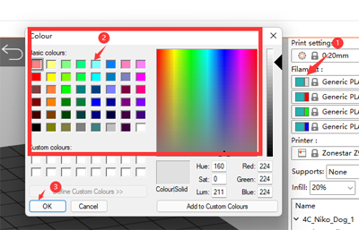
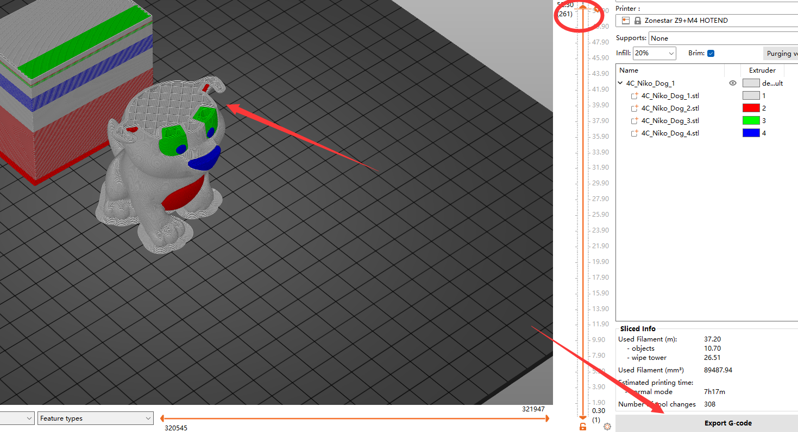
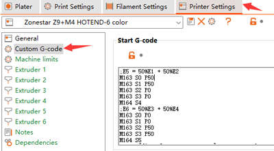

## <a id="choose-language">:globe_with_meridians: Choose language </a>

<!--  -->

----
## :warning: ATENCIÓN POR FAVOR :warning:
### Preste atención para distinguir el tipo de extremo caliente
Preste atención para distinguir el tipo de extremo caliente que utilizó: extremo caliente **color mezclado (M4)** o extremo caliente **color no mezclado (E4)**.     
<u>**Si imprime un archivo gcode cortado en un hotend M4 con un hotend E4, puede bloquear el hotend, y viceversa.**</u>    
Si no sabe cuál es la diferencia entre el hotend E4 y M4, consulte [**aquí**][FAQ_M4E4].

----
## Rebanado multicolor para hotend M4
#### :loudspeaker: Este manual se toma como ejemplo Z9V5Pro-MK3
### :movie_camera: [**Videotutorial**](https://youtu.be/_Ww2RFGlLNA)

### Paso 1: elija los ajustes preestablecidos de la impresora "Z9 + M4 hotend"

### Paso 2: cargue archivos de modelo 3D (archivo stl/obj/AMF, etc.)
 
- :memo: Por lo general, el "modelo dividido" no es necesario para imprimir archivos de modelos 3D de varios colores, es decir, un modelo 3D se ha dividido en múltiples archivos STL según los colores, y estos archivos usan la misma posición de coordenadas de origen para que puedan fusionarse correctamente.
- :star2: PrusaSlicer tiene una característica nueva y potente: puede pintar un archivo de modelo 3D en varios colores. Para más detalles, consulte :movie_camera: [**Guía de corte: convierta un archivo 3D de un color en varios colores**](https://youtu.be/Yx4fKDRGEJ4).
##### 

### Paso 3: elija el tipo de filamento y establezca el color del filamento

### Paso 4: Asigne extrusores a diferentes partes

### Paso 5: cambie el tamaño, corte, gire y mueva el modelo 3D si es necesario

### Paso 6: Establezca la configuración de impresión
#### :warning: Tenga en cuenta que "Retracción cuando la herramienta está deshabilitada" debe establecerse en 0.

#### establece la altura de la capa, la velocidad de impresión, el soporte, el relleno, etc.

Debe configurar estos parámetros de acuerdo con la forma del modelo y sus requisitos de calidad de impresión. Incluso para algunos modelos, la impresión no se puede completar normalmente sin soporte. Para más detalles consulte:
- :point_right: [**Introducción a PrusaSlicer**](https://help.prusa3d.com/article/general-info_1910)
- :point_right: [**Manual del usuario de Slic3r**](https://manual.slic3r.org/)
  
### Paso 7: Establezca los parámetros para la "torre de limpieza"
Puede notar que aparecerá un cuadrado en la figura cortada, que se llama "Torre de limpieza" en PrusaSlicer. Debido a que para la impresora multicolor, al cambiar de extrusora, todavía quedan los filamentos de color anteriores dentro del hotend, es necesario limpiarlo antes de imprimir otro color.    
######     
Para obtener un mejor efecto de limpieza y minimizar el desperdicio de filamento, podemos configurar el volumen de purga según diferentes colores. Consulte la siguiente tabla, las columnas muestran el extrusor anterior y las filas muestran el siguiente extrusor que se imprimirá. Cuando cambiamos del extrusor con filamento de color más claro al extrusor con filamentos de color más oscuro, podemos establecer un "volumen de purga" más pequeño. Por el contrario, cuando cambiamos del extrusor con filamentos de color más oscuro al extrusor con filamento de color más claro, necesitamos establecer un "volumen de purga" mayor.     
###### 
### Paso 8: Cortar

### Paso 9: Obtenga una vista previa del resultado cortado (archivo gcode) y luego guárdelo en el archivo gcode en su PC y luego cópielo en la tarjeta SD

----
## Cómo imprimir más de 4 colores usando el hot end M4
El extremo caliente de mezcla de colores M4 puede mezclar de 2 a 4 filamentos de extrusoras reales para producir un nuevo filamento de color, y este nuevo filamento de color se puede usar como una nueva extrusora (llamada **"extrusora virtual"**), los pasos de operación son los siguientes :
***El siguiente ejemplo muestra cómo configurar 6 extrusores: 4 extrusores reales y 2 extrusores virtuales. E5 se mezcla con 50% E1 y 50% E2, E6 se mezcla con 50% E3 y 50% E4.***
### Paso 1: Agregar extrusoras virtuales
     
:warning: Sugerimos **guardar**1 la configuración en un **nuevo perfil**2.

### Paso 2: Establezca la velocidad de mezcla del nuevo "extrusor virtual"
#### Agregue los comandos "Establecer velocidad de mezcla" a "Iniciar Gcode".
     
:warning: Sugerimos que estos códigos G se coloquen al frente del "Código G de inicio".
>
     ;Establecer tasa de mezcla
     ;E5 = 50%E1 + 50%E2
     M163 S0 P50
     M163 S1P50
     M163 S2P0
     M163 S3P0
     M164 S4
     ;E6 = 50%E3 + 50%E4
     M163 S0 P0
     M163 S1P0
     M163 S2 P50
     M163 S3P50
     M164 S5

#### :memo: Introducción a los comandos "M163" y "M164"
>
     M163: establece un factor de mezcla único para una extrusora mezcladora; debe ir seguido de M164 para normalizarlos y confirmarlos.
      S[index] El índice del canal (extrusor real) a configurar
      P[float] El valor de mezcla de (0,0 ~ 100,0)
      R Restablecer todas las configuraciones del extrusor de mezcla a sus valores predeterminados

     M164: Normalice y confirme la velocidad de mezcla en una extrusora virtual.
      S[index] El extrusor virtual para almacenar
  
     Normalizar: escale automáticamente los valores de proporción de mezcla de cada extrusora para cumplir con los requisitos de la máquina.

### Paso 3: Asigne los nuevos extrusores virtuales al modelo 3D y corte
Ahora puede asignar 6 extrusores al modelo 3D, el proceso de corte es exactamente el mismo que el de los 4 extrusores.
1. Elija el perfil de la impresora.   
2. Establezca el color del filamento de los nuevos extrusores.   
3. Asigne el extrusor a la parte del modelo 3D.  

----
## Apéndice
### [:book: guía de uso del hotend M4](https://github.com/ZONESTAR3D/Upgrade-kit-guide/tree/main/HOTEND/M4)
### [:book: Guía de uso de la función de mezcla de colores](https://github.com/ZONESTAR3D/Document-and-User-Guide/tree/master/Mixing_Color)
### [:arrow_down:Prueba archivos gcode para hot end M4](https://github.com/ZONESTAR3D/Slicing-Guide/tree/master/PrusaSlicer/test_gcode/M4/readme.md)

----
[FAQ_M4E4]: https://github.com/ZONESTAR3D/Upgrade-kit-guide/tree/main/HOTEND/FAQ_M4E4.md