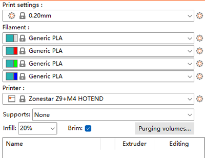
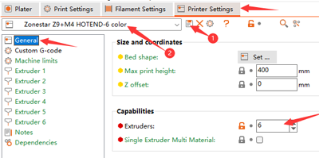

----
## <a id="choose-language">:globe_with_meridians: Choose language </a>

<!--  -->

----
## :warning: ATTENZIONE PER FAVORE :warning:
### Prestare attenzione a distinguere il tipo di hot-end
Si prega di prestare attenzione a distinguere il tipo di hot-end: quello utilizzato è **mix color (M4)** hot end o **non mix color (E4)** hot end.    
<u>**Se stampi un file gcode suddiviso su un hot-end M4 con un hot-end E4, potrebbe bloccare l'hot-end e viceversa.**</u>   
Se non sai cosa c'è di diverso tra l'hotend E4 e M4, fai riferimento a [**qui**][FAQ_M4E4].

----
## Slicing multi-colore per hotend M4
#### :loudspeaker: Questo manuale prende come esempio il Z9V5Pro-MK3
### :movie_camera: [**Video Tutorial**](https://youtu.be/_Ww2RFGlLNA)

### Passaggio 1: scegli le preimpostazioni della stampante "Z9 + M4 hotend"

### Passaggio 2: caricare i file del modello 3D (file stl/obj/AMF ecc.)
 
- :memo: Di solito, il "modello diviso" è necessario per stampare file di modelli 3D a più colori, ovvero un modello 3D è stato diviso in più file STL in base ai colori e questi file utilizzano la stessa posizione delle coordinate di origine in modo che possano essere uniti correttamente.
- :star2: PrusaSlicer ha una nuova potente funzionalità, può dipingere un file di modello 3D in più colori, per i dettagli, fare riferimento a :movie_camera: [**Guida allo slicing - Converti file 3D di un colore in più colori**](https://youtu.be/Yx4fKDRGEJ4).
##### 

### Passaggio 3: scegli il tipo di filamento e imposta il colore del filamento

### Passaggio 4: assegna gli estrusori a parti diverse

### Passaggio 5: ridimensiona, taglia, ruota e sposta il modello 3D se necessario

### Passaggio 6: definire le impostazioni di stampa
#### :warning: Tieni presente che "Retrazione quando lo strumento è disabilitato" dovrebbe essere impostato su 0.

#### imposta l'altezza del livello, la velocità di stampa, il supporto, il riempimento, ecc.
    
È necessario impostare questi parametri in base alla forma del modello e ai requisiti di qualità di stampa. Anche per alcuni modelli, la stampa non può essere completata normalmente senza supporto. Per i dettagli fare riferimento a:   
- :point_right: [**Introduzione a PrusaSlicer**](https://help.prusa3d.com/article/general-info_1910)
- :point_right: [**Manuale utente Slic3r**](https://manual.slic3r.org/)
  
### Passaggio 7: impostare i parametri per "wipe tower"
Potresti notare che apparirà un quadrato nella figura tagliata, che si chiama "Wipe tower" in PrusaSlicer. Poiché per la stampante multicolore, quando si cambia estrusore, ci sono ancora i filamenti del colore precedente all'interno dell'hotend, è necessario pulirli prima di stampare un altro colore.
###### 
Per ottenere un migliore effetto pulente e ridurre al minimo lo spreco di filamento, possiamo impostare il volume di spurgo in base ai diversi colori. Consultare la tabella seguente, le colonne mostrano l'estrusore precedente e le righe mostrano l'estrusore successivo da stampare. Quando passiamo dall'estrusore con filamenti di colore più chiaro all'estrusore con filamenti di colore più scuro, possiamo impostare un "volume di spurgo" più piccolo. Al contrario, quando passiamo dall'estrusore con filamenti di colore più scuro all'estrusore con filamento di colore più chiaro, dobbiamo impostare un "volume di spurgo" maggiore.
###### 
### Passaggio 8: affettare

### Passaggio 9: visualizzare l'anteprima del risultato suddiviso (file gcode), quindi salvare nel file gcode sul PC e quindi copiare sulla scheda SD

----
## Come stampare più di 4 colori utilizzando l'hot end M4
L'hot end di miscelazione del colore M4 può mescolare 2 ~ 4 filamenti di estrusori effettivi per produrre un nuovo filamento di colore e questo nuovo filamento di colore può essere utilizzato come un nuovo estrusore (chiamato **"estrusore virtuale"**), i passaggi operativi sono i seguenti :
***L'esempio seguente mostra come impostare 6 estrusori: 4 estrusori reali e 2 estrusori virtuali. E5 è miscelato al 50% E1 e 50% E2, E6 è miscelato al 50% E3 e 50% E4.***
### Passaggio 1: aggiungi estrusori virtuali
###### 
:warning: Suggeriamo di **salvare**1 le impostazioni in un **nuovo profilo**2.

### Passaggio 2: imposta la velocità di miscelazione del nuovo "estrusore virtuale"
#### Aggiungi i comandi "Imposta velocità di mixaggio" a "Avvia Gcode".
###### 
:warning: Suggeriamo che questi codici G siano posizionati all'inizio del "Codice G iniziale".
>
     ;Imposta la velocità di miscelazione
     ;E5 = 50%E1 + 50%E2
     M163 S0 P50
     M163 S1 P50
     M163 S2 P0
     M163 S3 P0
     M164 S4
     ;E6 = 50%E3 + 50%E4
     M163 S0 P0
     M163 S1 P0
     M163 S2 P50
     M163 S3 P50
     M164 S5

#### :memo: Introduzione ai comandi "M163" e "M164".
>
     M163: imposta un singolo fattore di miscelazione per un estrusore di miscelazione, deve essere seguito da M164 per normalizzarli e confermarli.
      S[indice] L'indice del canale (estrusore effettivo) da impostare
      P[float] Il valore del mix da (0,0 ~ 100,0)
      R Ripristina tutte le impostazioni predefinite dell'estrusore di miscelazione

     M164: normalizza e invia la velocità di miscelazione a un estrusore virtuale.
      S[indice] L'estrusore virtuale da archiviare
  
     Normalizza: ridimensiona automaticamente i valori del rapporto di miscelazione di ciascun estrusore per soddisfare i requisiti della macchina

### Passaggio 3: assegna i nuovi estrusori virtuali al modello 3D e allo slicing
Ora puoi assegnare 6 estrusori al modello 3D, il processo di slicing è esattamente lo stesso dei 4 estrusori.
1. Scegli il profilo della stampante.
2. Imposta il colore del filamento dei nuovi estrusori.
3. Assegna l'estrusore alla parte del modello 3D.
###### 

----
## Appendice
### [:libro: guida all'uso dell'hotend M4](https://github.com/ZONESTAR3D/Upgrade-kit-guide/tree/main/HOTEND/M4)
### [:libro: Guida all'uso della funzione di miscelazione del colore](https://github.com/ZONESTAR3D/Document-and-User-Guide/tree/master/Mixing_Color)
### [:arrow_down:Test dei file gcode per l'hot end M4](https://github.com/ZONESTAR3D/Slicing-Guide/tree/master/PrusaSlicer/test_gcode/M4/readme.md)

----
[FAQ_M4E4]: https://github.com/ZONESTAR3D/Upgrade-kit-guide/tree/main/HOTEND/FAQ_M4E4.md

