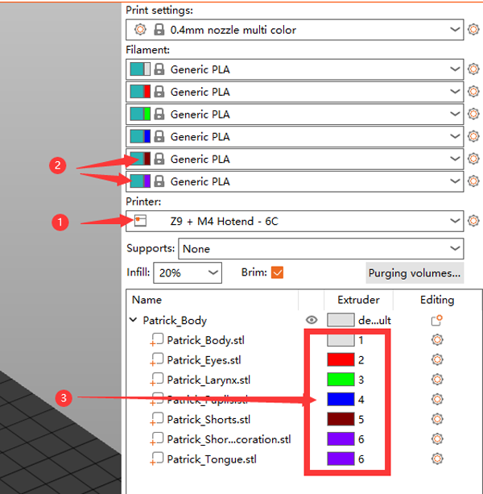

----
## <a id="choose-language">:globe_with_meridians: Choose language </a>

<!--  -->

----
## :warning: 注意してください :warning:
### ホットエンドのタイプの区別に注意してください
使用したホットエンドのタイプが**ミックスカラー(M4)**ホットエンドか**非ミックスカラー(E4)**ホットエンドかを区別するように注意してください。     
<u>**M4 ホット エンドでスライスされた gcode ファイルを E4 ホット エンドで印刷すると、ホット エンドがブロックされる可能性があります。その逆も同様です。**</u>    
E4 ホットエンドと M4 ホットエンドの違いがわからない場合は、[**こちら**][FAQ_M4E4] を参照してください。

----
## M4 ホットエンド用のマルチカラーのスライス
#### :loudspeaker: このマニュアルは Z9V5Pro-MK3 を例にしています
### :movie_camera: [**ビデオチュートリアル**](https://youtu.be/_Ww2RFGlLNA)

### ステップ 1: プリンター プリセット「Z9 + M4 ホットエンド」を選択します。

### ステップ 2: 3D モデル ファイル (stl/obj/AMF ファイルなど) をロードします。
 
- :memo: 通常、複数色の 3D モデル ファイルを印刷するには「分割モデル」が必要です。つまり、3D モデルが色に従って複数の STL ファイルに分割されており、これらのファイルは同じ原点座標位置を使用するため、 正しくマージされます。
- :star2: PrusaSlicer には強力な新機能があり、3D モデル ファイルをマルチカラーにペイントできます。詳細については、:movie_camera: [**Slicing guide - Convert one color 3d file to multi colors**](https://youtu.be/Yx4fKDRGEJ4)。  
##### 

### ステップ 3: フィラメントのタイプを選択し、フィラメントの色を設定します

### ステップ 4: 押出機をさまざまなパーツに割り当てる

### ステップ 5: 必要に応じて、3D モデルのサイズ変更、切り取り、回転、移動を行います。

### ステップ 6: 印刷設定を設定する
#### :warning: 「ツールが無効な場合のリトラクション」は 0 に設定する必要があることに注意してください。

#### レイヤーの高さ、印刷速度、サポート、充填などを設定します。
    
モデルの形状や印刷品質の要件に応じて、これらのパラメータを設定する必要があります。 一部の機種でもサポートが無い場合は正常に印刷が行えません。 詳細については、以下を参照してください。   
- :point_right: [**PrusaSlicer の紹介**](https://help.prusa3d.com/article/general-info_1910)
- :point_right: [**Slic3r ユーザーマニュアル**](https://manual.slic3r.org/)
  
### ステップ 7: 「ワイプタワー」のパラメータを設定する
スライスされた図に四角形が表示されることに気づくかもしれませんが、これは PrusaSlicer では「ワイプ タワー」と呼ばれます。 マルチカラー プリンタの場合、押出機を切り替えている間、ホットエンド内に前の色のフィラメントがまだ残っているため、別の色を印刷する前にホットエンドをきれいにする必要があります。
###### 
より良いクリーニング効果を得てフィラメントの無駄を最小限に抑えるために、色に応じてパージ量を設定できます。 次の表を参照してください。列は前の押出機を示し、行は印刷される次の押出機を示します。 明るい色のフィラメントを使用したエクストルーダーから濃い色のフィラメントを使用したエクストルーダーに変更すると、「パージ量」をより小さく設定できます。 逆に、濃い色のフィラメントを使用したエクストルーダーから明るい色のフィラメントを使用したエクストルーダーに変更する場合は、「パージ量」をより大きく設定する必要があります。
###### 
### ステップ 8: スライス

### ステップ 9: スライス結果 (gcode ファイル) をプレビューし、gcode ファイルを PC に保存して、SD カードにコピーします。

----
## M4 ホットエンドを使用して 4 色以上を印刷する方法
M4 カラー混合ホットエンドは、2 ～ 4 個の実際の押出機フィラメントを混合して新しいカラー フィラメントを生成でき、この新しいカラー フィラメントは新しい押出機 (**「仮想押出機」** と呼ばれます) として使用できます。操作手順は次のとおりです。 :
***次の例は、4 つの実際の押出機と 2 つの仮想押出機の 6 つの押出機を設定する方法を示しています。 E5 は 50% E1 と 50% E2 が混合され、E6 は 50% E3 と 50% E4 が混合されます。***
### ステップ 1: 仮想エクストルーダーを追加する
###### 
:warning: 設定を **新しいプロファイル**2 に **保存**1することをお勧めします。

### ステップ 2: 新しい「仮想押出機」の混合率を設定します。
#### 「Start Gcode」に「Set mix rate」コマンドを追加します。
###### 
:warning: これらの G コードは「開始 G コード」の前に配置することをお勧めします。
>
     ;混合率を設定する
     ;E5 = 50%E1 + 50%E2
     M163 S0 P50
     M163 S1 P50
     M163 S2 P0
     M163 S3 P0
     M164 S4
     ;E6 = 50%E3 + 50%E4
     M163 S0 P0
     M163 S1 P0
     M163 S2 P50
     M163 S3 P50
     M164 S5

#### :memo: 「M163」「M164」コマンドの紹介
>
     M163: 混合エクストルーダーの単一混合係数を設定します。正規化してコミットするには、その後に M164 を続ける必要があります。
      S[index] 設定するチャネル（実際のエクストルーダー）のインデックス
      P[float] (0.0 ～ 100.0) のミックス値
      R すべてのミキシングエクストルーダー設定をデフォルトにリセットします

     M164: 混合率を正規化し、仮想押出機にコミットします。
      S[index] 保存する仮想エクストルーダー
  
     正規化: 機械の要件に合わせて各押出機の混合比の値を自動的に調整します。

### ステップ 3: 新しい仮想エクストルーダーを 3D モデルとスライスに割り当てる
これで 6 つのエクストルーダーを 3D モデルに割り当てることができ、スライス プロセスは 4 つのエクストルーダーとまったく同じになります。
1. プリンター プロファイルを選択します。
2. 新しいエクストルーダーのフィラメントの色を設定します。
3. 3D モデルのパーツにエクストルーダーを割り当てます。
###### 

----
## 付録
### [:book: M4 ホットエンド使用ガイド](https://github.com/ZONESTAR3D/Upgrade-kit-guide/tree/main/HOTEND/M4)
### [:book: ミキシングカラー機能使用ガイド](https://github.com/ZONESTAR3D/Document-and-User-Guide/tree/master/Mixing_Color)
### [:arrow_down:M4 ホットエンドの gcode ファイルをテストする](https://github.com/ZONESTAR3D/Slicing-Guide/tree/master/PrusaSlicer/test_gcode/M4/readme.md)

----
[FAQ_M4E4]: https://github.com/ZONESTAR3D/Upgrade-kit-guide/tree/main/HOTEND/FAQ_M4E4.md