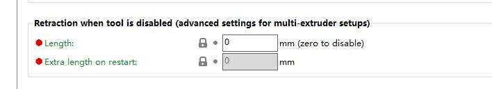
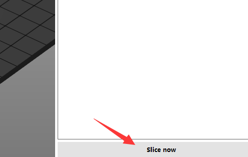

----
## <a id="choose-language">:globe_with_meridians: Choose language </a>

<!--  -->

----
## :warning: 주의하세요 :warning:
### 핫엔드 유형을 구별하려면 주의하세요.
사용하신 핫엔드 유형이 **혼합색(M4)** 핫엔드인지 **비혼합색(E4)** 핫엔드인지 구분하시기 바랍니다.   
<u>**M4 핫엔드와 E4 핫엔드에서 슬라이스된 gcode 파일을 인쇄하면 핫엔드가 차단될 수 있으며 그 반대의 경우도 마찬가지입니다.**</u>   
E4 핫엔드와 M4 핫엔드의 차이점을 모르신다면 [**여기**][FAQ_M4E4]를 참고해주세요.   

----
## M4 핫엔드용 다중 색상 슬라이싱
#### :loudspeaker: 이 설명서는 Z9V5Pro-MK3을 예로 사용했습니다.
### :movie_camera: [**동영상 튜토리얼**](https://youtu.be/_Ww2RFGlLNA)

### 1단계: 프린터 사전 설정 "Z9 + M4 hotend" 선택

### 2단계: 3D 모델 파일(stl/obj/AMF 파일 등) 로드
    
- :memo: 일반적으로 다중 색상 3D 모델 파일을 인쇄하려면 "분할 모델"이 필요합니다. 즉, 3D 모델은 색상에 따라 여러 STL 파일로 분할되었으며 이러한 파일은 동일한 원점 좌표 위치를 사용하여 인쇄할 수 있습니다. 올바르게 병합됩니다.
- :star2: PrusaSlicer에는 3D 모델 파일을 여러 색상으로 칠할 수 있는 강력한 새 기능이 있습니다. 자세한 내용은 :movie_camera: [**슬라이싱 가이드 - 하나의 색상 3D 파일을 여러 색상으로 변환**](https://youtu.be/Yx4fKDRGEJ4).
##### 

### 3단계: 필라멘트 유형 선택 및 필라멘트 색상 설정

### 4단계: 다양한 부품에 압출기 할당

### 5단계: 필요한 경우 3D 모델의 크기 조정, 자르기, 회전, 이동

### 6단계: 인쇄 설정 지정
#### :warning: "도구 비활성화 시 후퇴"는 0으로 설정되어야 합니다.

#### 레이어 높이, 인쇄 속도, 지지대, 채우기 등을 설정합니다.
   
모델의 모양과 인쇄 품질 요구 사항에 따라 이러한 매개변수를 설정해야 합니다. 일부 모델의 경우에도 지원하지 않으면 인쇄가 정상적으로 완료되지 않습니다. 자세한 내용은 다음을 참조하세요.
- :point_right: [**PrusaSlicer 소개**](https://help.prusa3d.com/article/general-info_1910)
- :point_right: [**Slic3r 사용자 매뉴얼**](https://manual.slic3r.org/)
  
### 7단계: "wipe tower"에 대한 매개변수 설정
PrusaSlicer에서는 "Wipe tower"라고 불리는 사각형이 슬라이스 그림에 나타나는 것을 볼 수 있습니다. 멀티 컬러 프린터의 경우 압출기를 전환하는 동안 핫엔드 내부에 이전 컬러 필라멘트가 여전히 남아 있기 때문에 다른 컬러를 인쇄하기 전에 청소해야 합니다.
###### 
더 나은 청소 효과를 얻고 필라멘트 낭비를 최소화하기 위해 다양한 색상에 따라 퍼지 볼륨을 설정할 수 있습니다. 다음 표를 참조하십시오. 열에는 이전 압출기가 표시되고 행에는 프린트할 다음 압출기가 표시됩니다. 더 밝은 색상의 필라멘트를 사용하는 압출기에서 더 어두운 색상의 필라멘트를 사용하는 압출기로 변경할 때 더 작은 "퍼징 볼륨"을 설정할 수 있습니다. 반대로, 더 어두운 색상의 필라멘트를 사용하는 압출기에서 밝은 색상의 필라멘트를 사용하는 압출기로 변경할 경우 더 큰 "퍼징 볼륨"을 설정해야 합니다.
###### 
### 8단계: 자르기

### 9단계: 슬라이스된 결과(gcode 파일)를 미리 보고 PC에 gcode 파일로 저장한 다음 SD 카드에 복사합니다.

----
## M4 핫엔드를 이용해 4색 이상 인쇄하는 방법
M4 색상 혼합 핫 엔드는 2~4개의 실제 압출기 필라멘트를 혼합하여 새로운 색상 필라멘트를 생성할 수 있으며, 이 새로운 색상 필라멘트는 새로운 압출기(**"가상 압출기"**라고 함)로 사용할 수 있습니다. 작업 단계는 다음과 같습니다. :
***다음 예에서는 6개의 압출기(실제 압출기 4개와 가상 압출기 2개)를 설정하는 방법을 보여줍니다. E5는 E1 50%와 E2 50%가 혼합되어 있고, E6은 E3 50%와 E4 50%가 혼합되어 있습니다.***
### 1단계: 가상 압출기 추가
###### 
:warning: 설정을 **새 프로필**2에 **저장**1하는 것이 좋습니다.

### 2단계: 새로운 "가상 압출기"의 혼합 비율 설정
#### "Gcode 시작"에 "혼합 속도 설정" 명령을 추가합니다.
###### 
:warning: 이러한 g-코드는 "시작 G-코드" 앞에 배치하는 것이 좋습니다.
>
     ;혼합 속도 설정
     ;E5 = 50%E1 + 50%E2
     M163 S0 P50
     M163 S1 P50
     M163 S2 P0
     M163 S3 P0
     M164 S4
     ;E6 = 50%E3 + 50%E4
     M163 S0 P0
     M163 S1 P0
     M163 S2 P50
     M163 S3 P50
     M164 S5

#### :memo: "M163" 및 "M164" 명령 소개
>
     M163: 혼합 압출기에 대한 단일 혼합 계수를 설정합니다. 정규화하고 커밋하려면 M164가 와야 합니다.
      S[index] 설정할 채널(실제 Extruder) 인덱스
      P[float] (0.0 ~ 100.0)의 혼합 값
      R 모든 혼합 압출기 설정을 기본값으로 재설정

     M164: 혼합 속도를 정규화하고 가상 압출기에 커밋합니다.
      S[index] 저장할 가상 압출기
  
     정규화: 기계 요구 사항에 맞게 각 압출기의 혼합 비율 값을 자동으로 조정합니다.

### 3단계: 새 가상 압출기를 3D 모델 및 슬라이싱에 할당
이제 3D 모델에 6개의 압출기를 할당할 수 있으며, 슬라이싱 프로세스는 4개의 압출기와 정확히 동일합니다.
1. 프린터 프로필을 선택합니다.
2. 새 압출기의 필라멘트 색상을 설정합니다.
3. 3D 모델의 일부에 압출기를 할당합니다.
###### 

----
## 부록
### [:book: M4 핫엔드 사용 가이드](https://github.com/ZONESTAR3D/Upgrade-kit-guide/tree/main/HOTEND/M4)
### [:book: Mixing color 기능 사용 가이드](https://github.com/ZONESTAR3D/Document-and-User-Guide/tree/master/Mixing_Color)
### [:arrow_down:M4 핫엔드용 gcode 파일 테스트](https://github.com/ZONESTAR3D/Slicing-Guide/tree/master/PrusaSlicer/test_gcode/M4/readme.md)

----
[FAQ_M4E4]: https://github.com/ZONESTAR3D/Upgrade-kit-guide/tree/main/HOTEND/FAQ_M4E4.md
