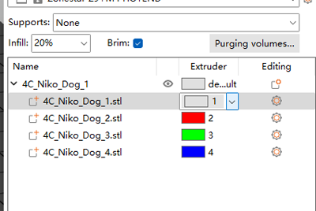

### :globe_with_meridians: Choose Language (Translated by google)

-----
## :warning: Attention Please, this guide is for M4 hot end :warning:
### **Please pay attention to distinguish the hot end type: M4 hot end or E4 hot end**. 
If your printer has a M4 hot end, but you used a gcode file sliced by M4 hot end, it may cause block the hot end, vice versa. For default, Z9M4, Z8PM4 and Z9V5-MK1/MK2/MK3 equiped with a M4 hotend, Z9V5-MK4 equiped with a E4 hotend. You can apply the same slice settings and the gcode file to all version of M4 hot end.
- **M4 hot end:** 4-IN-1-OUT **mix color** hot end.    
- **E4 hot end:** 4-IN-1-OUT **non-mix color** hot end.    

-----
## Slicing muti-color for M4 hotend 
***Take Z9V5Pro with M4 hotend as an example***
:movie_camera:[**Video Tutorial**](https://youtu.be/_Ww2RFGlLNA)
### Step 1: choose printer presets "Z9 + M4 hotend"

### Step 2: load 3d model files (stl/obj/AMF file etc.)
 
- :memo: Usually, "split model" is inneed to print multi colors 3d model files, that is, a 3d model has been split into multiple STL files according to colors, and these files use the same origin coordinate position so that they can be merged correctly.
- :star2: PrusaSlicer has a powerful new feature, it can paint a 3d model file into multi colors, for details, please refer to :movie_camera:[**video tutorial**](https://youtu.be/C0a3Uble8rY).
### Step 3: Choose filament type and set filament color

### Step 4: Assign extruders to different parts

### Step 5: Resize, cut, rotate, move the 3d model if need 
  
### Step 6: Set the print settings 
#### :warning: Please note that the "Retraction when tool is disabled" should be set to 0.    
  
#### set layer height, print speed, support, infill, etc.
  
You need to set these parameters according to the shape of the model and your requirements for print quality. Even for some models, printing cannot be completed normally without support. For details please refer to:
- :point_right: [**PrusaSlicer introduction**](https://help.prusa3d.com/article/general-info_1910)      
- :point_right: [**Slic3r User Manuual**](https://manual.slic3r.org/)      
  
### Step 7: Set parameters for "wipe tower"
You may notice that a square will appear in the sliced figure, which is called "Wipe tower" in PrusaSlicer. Because for the multi-color printer, while switching extruders, there are still the previous color filaments inside the hotend, it need to be clean before printing another color.   
        
In order to obtain better cleaning effect and minimize to waste filament, we can set the purging volume according to different colors. Please see the following table, the columns shows the previous extruder and the rows shows the next extruder to be printed. When we change from the extruder with lighter color filament to the extruder with darker color filaments, we can set a smaller "purging volume". On the contrary, when we change from the extruder with darker color filaments to the extruder with darker color filament, we need to set a bigger "purging volume".  
  
### Step 8: Slicing
  
### Step 9: Preview the sliced result (gcode file) and then save to gcode file to your PC and then copy to SD card
  

-----
### M4 hotend user guide
[:book: User guide](https://github.com/ZONESTAR3D/Upgrade-kit-guide/blob/main/HOTEND/M4%20%204-IN-1-OUT%20Mixing%20Color%20Hotend)

--------
### Testing gcode files for M4 (4-IN-1-OUT mixing color) hotend
We have uploaded some testing gcode files, you can download and print them to test.   
:point_right: Click [**here**](./test_gcode/M4/readme.md) to download.
