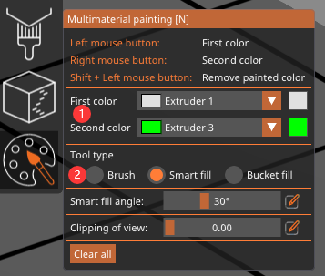

### :globe_with_meridians: Choose Language (Translated by google)

-----
## Multi Color Slicing Examples with PrusaSlicer
- [Convert one 3d model to multi color and slice](#example-1-convert-3d-model-to-multi-color-and-slice)
- [Slice auto-mergeable multiple 3D model files](#example-2-combine-multiple-separate-3d-model-files-and-slice)
- [Combine multiple separate 3D model files and slice](#example-3-slice-auto-mergeable-multiple-3d-model-files)

### Read me first!
#### :bulb: How to use a mouse in PrusaSlicer
1. Hold down the left button and drag the mouse to rotate the model display area.
2. Hold down the mouse wheel and drag the mouse to drag the model display area.
3. Scroll the mouse wheel to zoom the model display area.

#### :bulb: Set extruder color
It is recommended to set the extruder color according to the actually filament color you used on the extruder before slicing, about how to do, please watch [:video_camera:**this video**](./pic2/color.gif).

#### :bulb: About painting menu.   
In the following examples, you may need to use the painting color menu, here is a brief description of the menu.     
    
- **The function of color setting on the mouse button:**
  - Click the ComboBox on the right of "First Color" and "Second Color" to select the color. 
  - The color of the brush corresponding to the left mouse button is the color set by First Color (that is, it is assigned to print with this extruder), 
  - The color of the brush corresponding to the right mouse button is the color set by Second Color. 
  - When you press the left and right mouse buttons at the same time, the brush is set to remove all smeared colors and restore to the original color of the model. 
  - You can also use the Back button in the upper menu to cancel the previous doing. [:art:picture](./pic2/backbutton.png)  
- **About the painting tools**     
  PrusaSlicer provides several painting tools they are **Brush**, **Smart fill** and **bucket fill**.
  - **Brush**: Brush has three different shapes, sphere, circle and triangle. You can also set the size of different pen heads. Because 3D model files usually use multiple triangular shapes to describe the space shape, it is easier to find the boundary between model areas using triangular shapes. The use of sphere and circle will automatically separate the triangular shape on the model, and the use of others will be more flexible.
  - **Smart fill**: Smart fill can automatically identify continuous faces in space, which can quickly color areas with clear boundaries between the upper part of the model and other parts. By adjusting the value of the smart fill angle, you can make the area of one painting larger or smaller.
  - **Bucket fill**: Bucket fill can color the entire area, which is more suitable for use with Brush. When the boundary between the part to be colored on the model and other parts is not clear, you can use Brush to draw the boundary first, and then use bucket fill to color.

#### :bulb: All of the examples can be applied to M4 and E4 hot ends, but please note:
##### Select the machine and hot end model what you used before slicing, .  [:art:picture](./pic2/choosehotend.png)
##### Change **Purging Volume** according to the type of hot end and the filaments color before slicing.   
  - For **E4 hot end**, the recommend value of purging volume is 20 ~ 100 mm3; For **M4 hot end**, the recommend value of purging volume is 100 ~ 300 mm3.   
  - When switching from lighter color filament to darker filament, set purging volume to a larger value. When switching from darker filament to lighter color filament, purging volume to a smaller value.     
  [:video_camera: Change purging volume for E4 hotend](./pic2/purgevolume_E4.gif)        
  [:video_camera: Change purging volume for M4 hotend](./pic2/purgevolume_M4.gif)        
  **NOTE:** Although changing purging volume is not a MUST, but set to a good purging volume is beneficial for the color resolution of the prints or help to save filament.

-----
### Example 1: Convert one 3d model to multi color and slice
**[:movie_camera:Video Turorial](https://youtu.be/fFSAb-FAl1k)**    
This example shows the steps how to load one 3D model file, painting color on it (assign different extruders) and slicing.    
#### Step 1. load 3d model file
:bulb: If the model file units is drawn in Inch, please uniformly convert to mm units when importing. [:art:picture](./pic2/unit.png)      
:bulb: If there is an error in the 3d model file, a triangle icon will be displayed. Click it to repair automatically. If it cannot be repaired successfully, you may encounter problems when slicing at the next steps. [:art:picture](./pic2/fix.png)     
#### Step 2. painting color on the 3d model
1. Open the painting menu. [:video_camera:Video](./pic2/painting1.gif)    
2. Painting color on the 3d model. [:video_camera:Video](./pic2/painting2.gif)
#### Step 3. Set parameters
You need to set some parameters according to the shape of the models, parameters that are frequently modified include:
1. Print speed.
2. Support .
3. purging volume value. [refer to here](#change-purging-volume-according-to-the-type-of-hot-end-and-the-filaments-color-before-slicing)
#### Step 4. Save project
Save the project to a .3mf file, it will save the painting setting. Although this step is not a MUST, if you are not satisfied with the previous color after printing, you can directly import the .3mf and modify it, it may help to save some time for you.
#### Step 5. Slicing and save the gcode file.
Click the "Slice Now" button to start slicing. After slicing finished, export the gcode file and save it to the SD card. Then you can insert the SD card into the machine and start printing.

-----
### Example 2: Slice auto-mergeable multiple 3D model files
This example shows how to slice auto-mergeable multiple 3D model files which have set the same origin when drawing.     
:white_medium_square: TODO

-----
### Example 3: Combine multiple separate 3D model files and slice 
This example shows how to combine multiple 3D model files - which haven't set the same origin when drawing - toghter and slicing it.      
:white_medium_square: TODO

