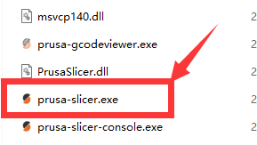

## <a id="choose-language">:globe_with_meridians: Choose language </a>

<!--  -->

----
## Laden Sie PrusaSlicer herunter und installieren Sie es
###  Für Windows:
##### ![][VIDEO_INSTALL]
   - Laden Sie PrusaSlicer über den folgenden Link herunter und entpacken Sie es auf Ihren PC.
     - [:+1: :arrow_down: **PrusaSlicer V2.4.2 herunterladen**][PRUSASLICER_242] (Stabile Version)
     - [:new: :arrow_down: **PrusaSlicer herunterladen**][PRUSASLICER] (Alle neueren Versionen)

   ###  Für MacOS:
   :arrow_down: Laden Sie [**PrusaSlicer mit ZONESTAR Profiles DMG-Datei**][PRUSASLICER_IMG] herunter und installieren Sie es dann auf Ihrem PC.

   ###  Für Linux:
   :arrow_down: Laden Sie PrusaSlicer von der [**Prusa Github-Seite**][PRUSASLICER_RELEASE] herunter und importieren Sie dann die neuesten ZONESTAR 3D-Druckerprofile.

#### ZONESTAR 3D-Druckerprofile importieren
- [**:arrow_down:ZONESTAR 3D-Druckerprofile herunterladen**](./Profiles.zip) und auf Ihren PC entpacken.
- Kopieren Sie Profile in das Verzeichnis „resource/profiles“ des Installationsverzeichnisses der PrusaSlicer-Software.      
:warning:Möglicherweise müssen Sie frühere Konfigurationseinstellungen löschen, andernfalls können die neueren Profile nicht richtig angewendet werden:warning:     
Sie finden das Verzeichnis, in dem die vorherigen Konfigurationen gespeichert sind: ***help>>Show Configuration Floder***, für Windows wird es normalerweise in ***"C:/Users/{Ihr PC-Name}/AppData/Roaming gespeichert /PrusaSlicer[-alpha/beta]"***. Löschen Sie alle diese Dateien in diesem Verzeichnis und führen Sie PrusaSlicer dann erneut aus.     
 

-----
## 2. Drucker einrichten
- 2.1 Suchen Sie prsua-slicer.exe und klicken Sie darauf, um es auszuführen.    

- 2.2 Wählen Sie Ihren Drucker, „Andere Anbieter>>Zonestar FFF>>Ihr Druckermodell>>Fertig stellen“.     

-----
## 3. Wählen Sie die Druckervoreinstellung
Wählen Sie die Druckervoreinstellung entsprechend Ihrem Druckermodell, Hotend-Typ und den Farben, die Sie drucken möchten.

| Druckerserie | drucken | Hotend-Typ | Voreinstellungen | Standard für Maschine |
|:-------------------:|:----------------------:|:----------------------:|:----------------------:|:----------------------:|
| Z5 | eine Farbe oder 2 Farben | M2 Hotend | Z5 + M2 Hotend | Z5M2 |
| Z5X | eine Farbe | einfarbiges Hotend | Z5X | Z5X |
| Z6 | eine Farbe | einfarbiges Hotend | Z6 | Z6 |
| Z8-Serie | eine Farbe | Irgendein | Z8 + eine Farbe | / |
| Z8-Serie | eine Farbe | Extruder mit Direktantrieb | Z8 + DDE | / |
| Z8-Serie | mehrfarbig | M3 Hotend | Z8 + M3 HOTEND | Z8S-M3/Z8T/Z8PM3 |
| Z8-Serie | mehrfarbig | M4 Hotend | Z8 + M4 HOTEND | Z8PM4/Z8PM4Pro |
| Z8-Serie | mehrfarbig | E4 Hotend | Z8 + E4 HOTEND | / |
| Z9-Serie | eine Farbe | Irgendein | Z9 + eine Farbe | / |
| Z9-Serie | eine Farbe | Extruder mit Direktantrieb | Z8 + DDE | / |
| Z9-Serie | mehrfarbig | M3 Hotend | Z9 + M3 HOTEND | Z9M3 |
| Z9-Serie | mehrfarbig | M4 Hotend | Z9 + M4 HOTEND | Z9M4/Z9V5Pro-MK1/2/3 |
| Z9-Serie | mehrfarbig | M4 Hotend | Z9 + E4 HOTEND | Z9V5Pro-MK4 |

(*)Standard für Maschine: Der von diesem 3D-Druckermodell verwendete Standard-Hotend-Typ.

-----
[PRUSASLICER_242]: https://github.com/ZONESTAR3D/Slicing-Guide/releases/tag/PrusaSlicer2.4.2
[PRUSASLICER_IMG]: https://github.com/ZONESTAR3D/Slicing-Guide/releases/tag/2.4.2
[PRUSASLICER]: https://github.com/ZONESTAR3D/Slicing-Guide/releases
[PRUSASLICER_RELEASE]: https://github.com/prusa3d/PrusaSlicer/releases
[VIDEO_INSTALL]: https://github.com/ZONESTAR3D/Slicing-Guide/assets/29502731/ce48a22c-a9aa-45e8-8544-c1c67c7cd021
