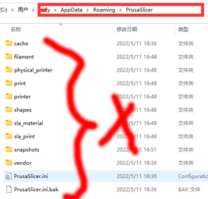

## <a id="choose-language">:globe_with_meridians: Choose language </a>

<!--  -->

----
## Téléchargez et installez PrusaSlicer
###  Pour Windows:
##### ![][VIDEO_INTSTALL]
   - Téléchargez PrusaSlicer à partir du lien ci-dessous et décompressez-le sur votre PC.
     - [:+1: :arrow_down: **Télécharger PrusaSlicer V2.4.2**][PRUSASLICER_242] (Version stable)
     - [:new: :arrow_down: **Télécharger PrusaSlicer**][PRUSASLICER] (Toute la version la plus récente)

   ###  Pour MacOS :
   :arrow_down: Téléchargez [**PrusaSlicer avec le fichier dmg des profils ZONESTAR**][PRUSASLICER_IMG], puis installez-le sur votre PC.

   ###  Pour Linux :
   :arrow_down: Téléchargez PrusaSlicer depuis [**Prusa Github Page**][PRUSASLICER_RELEASE], puis importez les derniers profils d'imprimante 3D ZONESTAR.

#### Importer des profils d'imprimante 3D ZONESTAR
- [**:arrow_down:Téléchargez les profils d'imprimante 3D ZONESTAR**](./Profiles.zip) et décompressez-le sur votre PC.
- Copiez les profils dans le répertoire "resource/profiles" du répertoire d'installation du logiciel PrusaSlicer.     
:warning:Vous devrez peut-être supprimer les paramètres de configuration précédents, sinon les profils les plus récents ne pourront pas être appliqués correctement :warning:   
Vous pouvez trouver le répertoire où stocker les configurations précédentes : ***aide>>Afficher le Floder de configuration***, pour Windows, il est généralement stocké dans ***"C:/Users/{votre nom de PC}/AppData/Roaming /PrusaSlicer[-alpha/bêta]"***. Supprimez tous ces fichiers dans ce répertoire, puis exécutez à nouveau PrusaSlicer.    
 

-----
## 2. Configurer l'imprimante
- 2.1 Trouvez le prsua-slicer.exe et cliquez dessus pour l'exécuter.    

- 2.2 Choisissez votre imprimante, "Autres fournisseurs>>Zonestar FFF>>votre modèle d'imprimante>>finition".     

-----
## 3. Choisissez le préréglage de l'imprimante
Choisissez le préréglage de l'imprimante en fonction de votre modèle d'imprimante, du type de hotend et des couleurs que vous souhaitez imprimer.

| Série d'imprimantes | imprimer | Type de hot-end | préréglages | Par défaut pour Machine |
|:-------------------:|:----------------------:|:----------------------:|:----------------------:|:----------------------:|
| Z5 | une couleur ou 2 couleurs | Hotend M2 | Hotend Z5 + M2 | Z5M2 |
| Z5X | une couleur | hotend une couleur | Z5X | Z5X |
| Z6 | une couleur | hotend une couleur | Z6 | Z6 |
| Série Z8 | une couleur | N'importe quel | Z8 + une couleur | / |
| Série Z8 | une couleur | Extrudeuse à entraînement direct | Z8 + DDE | / |
| Série Z8 | multicolore | Hotend M3 | Z8 + M3 HOTEND | Z8S-M3/Z8T/Z8PM3 |
| Série Z8 | multicolore | Hotend M4 | Z8 + M4 HOTEND | Z8PM4/Z8PM4Pro |
| Série Z8 | multicolore | Hotend E4 | Z8 + E4 HOTEND | / |
| Série Z9 | une couleur | N'importe quel | Z9 + une couleur | / |
| Série Z9 | une couleur | Extrudeuse à entraînement direct | Z8 + DDE | / |
| Série Z9 | multicolore | Hotend M3 | Z9 + M3 HOTEND | Z9M3 |
| Série Z9 | multicolore | Hotend M4 | Z9 + M4 HOTEND | Z9M4/Z9V5Pro-MK1/2/3 |
| Série Z9 | multicolore | Hotend M4 | Z9 + E4 HOTEND | Z9V5Pro-MK4 |

(*)Par défaut pour la machine : le type de hotend par défaut utilisé par ce modèle d'imprimante 3D.

-----
[PRUSASLICER_242]: https://github.com/ZONESTAR3D/Slicing-Guide/releases/tag/PrusaSlicer2.4.2
[PRUSASLICER_IMG]: https://github.com/ZONESTAR3D/Slicing-Guide/releases/tag/2.4.2
[PRUSASLICER]: https://github.com/ZONESTAR3D/Slicing-Guide/releases
[PRUSASLICER_RELEASE]: https://github.com/prusa3d/PrusaSlicer/releases
[VIDEO_INTSTALL]: https://github.com/ZONESTAR3D/Slicing-Guide/assets/29502731/ce48a22c-a9aa-45e8-8544-c1c67c7cd021
