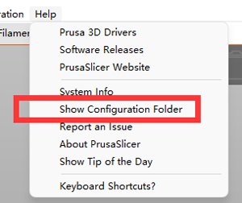

## <a id="choose-language">:globe_with_meridians: Choose language </a>

<!--  -->

----
## PrusaSlicer 다운로드 및 설치
###  Windows의 경우:
##### ![][VIDEO_INSTALL]
   - 아래 링크에서 PrusaSlicer를 다운로드하고 PC에 압축을 푼다.
     - [:+1: :arrow_down: **PrusaSlicer V2.4.2 다운로드**][PRUSASLICER_242] (안정 버전)
     - [:new: :arrow_down: **PrusaSlicer 다운로드**][PRUSASLICER] (모든 최신 릴리스 버전)

   ###  MacOS의 경우:
   :arrow_down: [**ZONESTAR 프로필 dmg 파일이 포함된 PrusaSlicer**][PRUSASLICER_IMG]를 다운로드한 다음 PC에 설치합니다.

   ###  Linux의 경우:
   :arrow_down: [**Prusa Github 페이지**][PRUSASLICER_RELEASE]에서 PrusaSlicer를 다운로드한 다음 최신 ZONESTAR 3d 프린터 프로필을 가져옵니다.

#### ZONESTAR 3D 프린터 프로필 가져오기
- [**:arrow_down: ZONESTAR 3d 프린터 프로필**](./Profiles.zip)을 다운로드하고 PC에 압축을 풉니다.
- 프로필을 PrusaSlicer 소프트웨어 설치 디렉터리의 "resource/profiles" 디렉터리에 복사하세요.     
:warning:이전 구성 설정을 삭제해야 할 수도 있습니다. 그렇지 않으면 최신 프로필이 제대로 적용될 수 없습니다. :warning:    
이전 구성이 저장된 디렉토리를 찾을 수 있습니다: ***help>>Show Configuration Floder***, Windows의 경우 일반적으로 ***"C:/Users/{your PC name}/AppData/Roaming/PrusaSlicer[-alpha/beta]"***. 이 디렉터리에서 해당 파일을 모두 삭제한 후 PrusaSlicer를 다시 실행하세요.    
 

-----
## 2. 프린터 설정
- 2.1 prsua-slicer.exe를 찾아 클릭하여 실행합니다.    

- 2.2 프린터를 선택하고 "다른 공급업체>>Zonestar FFF>>프린터 모델>>마침"을 선택합니다.    

-----
## 3. 프린터 사전 설정 선택
프린터 모델, 핫엔드 유형, 인쇄하려는 색상에 따라 프린터 사전 설정을 선택하세요.     

| 프린터 시리즈 | 인쇄하다 | 핫엔드 유형 | 사전 설정 | 시스템 기본값 |
|:------:|:---------:|:----------------------:|:---------:|:---------:|
| Z5 | 단색 또는 2색 | M2 핫엔드 | Z5 + M2 핫엔드 | Z5M2 |
| Z5X | 한 가지 색상 | 단색 핫엔드 | Z5X | Z5X |
| Z6 | 한 가지 색상 | 단색 핫엔드 | Z6 | Z6 |
| Z8 시리즈 | 한 가지 색상 | 모두 | Z8 + 단색 | / |
| Z8 시리즈 | 한 가지 색상 | 직접 구동 압출기 | Z8 + DDE | / |
| Z8 시리즈 | 멀티 컬러 | M3 핫엔드 | Z8 + M3 핫엔드 | Z8S-M3/Z8T/Z8PM3 |
| Z8 시리즈 | 멀티 컬러 | M4 핫엔드 | Z8 + M4 핫엔드 | Z8PM4/Z8PM4Pro |
| Z8 시리즈 | 멀티 컬러 | E4 핫엔드 | Z8 + E4 핫엔드 | / |
| Z9 시리즈 | 한 가지 색상 | 모두 | Z9 + 단색 | / |
| Z9 시리즈 | 한 가지 색상 | 직접 구동 압출기 | Z8 + DDE | / |
| Z9 시리즈 | 멀티 컬러 | M3 핫엔드 | Z9 + M3 핫엔드 | Z9M3 |
| Z9 시리즈 | 멀티 컬러 | M4 핫엔드 | Z9 + M4 핫엔드 | Z9M4/Z9V5Pro-MK1/2/3 |
| Z9 시리즈 | 멀티 컬러 | M4 핫엔드 | Z9 + E4 핫엔드 | Z9V5Pro-MK4 |

(*)기계의 기본값: 이 3D 프린터 모델에서 사용되는 기본 핫엔드 유형입니다.

-----
[PRUSASLICER_242]: https://github.com/ZONESTAR3D/Slicing-Guide/releases/tag/PrusaSlicer2.4.2
[PRUSASLICER_IMG]: https://github.com/ZONESTAR3D/Slicing-Guide/releases/tag/2.4.2
[PRUSASLICER]: https://github.com/ZONESTAR3D/Slicing-Guide/releases
[PRUSASLICER_RELEASE]: https://github.com/prusa3d/PrusaSlicer/releases
[VIDEO_INSTALL]: https://github.com/ZONESTAR3D/Slicing-Guide/assets/29502731/ce48a22c-a9aa-45e8-8544-c1c67c7cd021
