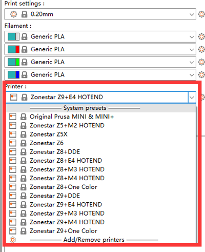

## <a id="choose-language">:globe_with_meridians: Choose language </a>

<!--  -->

----
## Загрузите и установите PrusaSlicer
###  Для Windows:
##### ![][VIDEO_INSTALL]
   - Загрузите PrusaSlicer по ссылке ниже и разархивируйте на свой компьютер.
     - [:+1: :arrow_down: **Загрузить PrusaSlicer V2.4.2**][PRUSASLICER_242] (Стабильная версия)
     - [:new: :arrow_down: **Загрузить PrusaSlicer**][PRUSASLICER] (все новые выпущенные версии)

   ###  Для MacOS:
   :arrow_down: Загрузите [**PrusaSlicer с dmg-файлом профилей ZONESTAR**][PRUSASLICER_IMG], а затем установите его на свой компьютер.

   ###  Для Linux:
   :arrow_down: Загрузите PrusaSlicer со страницы [**Prusa Github Page**][PRUSASLICER_RELEASE], а затем импортируйте новейшие профили 3D-принтеров ZONESTAR.

#### Импорт профилей 3D-принтера ZONESTAR
- [**:arrow_down: Загрузите профили 3D-принтера ZONESTAR**](./Profiles.zip) и разархивируйте его на свой компьютер.
- Скопируйте профили в каталог «resource/profiles» каталога установки программного обеспечения PrusaSlicer.    
:warning: Возможно, вам придется удалить настройки предыдущих конфигураций, иначе новые профили невозможно будет правильно применить :warning:     
Вы можете найти каталог, в котором хранятся предыдущие конфигурации: ***help>>Show Configuration Floder***, для Windows он обычно хранится в ***"C:/Users/{имя вашего компьютера}/AppData/Roaming /PrusaSlicer[-альфа/бета]"***. Удалите все эти файлы в этом каталоге, а затем снова запустите PrusaSlicer.     
 

-----
## 2. Настройка принтера
- 2.1 Найдите файл prsua-slicer.exe и щелкните его, чтобы запустить.    

- 2.2 Выберите свой принтер: «Другие поставщики>>Zonestar FFF>>ваша модель принтера>>финиш».    

-----
## 3. Выберите настройки принтера
Выберите настройки принтера в соответствии с моделью вашего принтера, типом хотэнда и цветами, которые вы хотите печатать.

| Серия принтеров | распечатать | Тип хотенда | пресеты | По умолчанию для машины |
|:-------------------:|:----------------------:|:----------------------:|:----------------------:|:----------------------:|
| Z5 | один цвет или 2 цвета | Хотэнд М2 | Хотенд Z5 + M2 | З5М2 |
| Z5X | один цвет | один цветной хотенд | Z5X | Z5X |
| Z6 | один цвет | один цветной хотенд | Z6 | Z6 |
| серия Z8 | один цвет | Любой | Z8 + один цвет | / |
| серия Z8 | один цвет | Экструдер с прямым приводом | Z8 + ДДЕ | / |
| серия Z8 | многоцветный | М3 хотенд | Z8 + M3 ХОТЭНД | З8С-М3/З8Т/З8ПМ3 |
| серия Z8 | многоцветный | Хотэнд М4 | Z8 + M4 ХОТЭНД | Z8PM4/Z8PM4Про |
| серия Z8 | многоцветный | E4 хотенд | Z8 + E4 ХОТЭНД | / |
| серия Z9 | один цвет | Любой | Z9 + один цвет | / |
| серия Z9 | один цвет | Экструдер с прямым приводом | Z8 + ДДЕ | / |
| серия Z9 | многоцветный | М3 хотенд | Z9 + M3 ХОТЭНД | З9М3 |
| серия Z9 | многоцветный | Хотэнд М4 | Z9 + M4 ХОТЭНД | Z9M4/Z9V5Pro-МК1/2/3 |
| серия Z9 | многоцветный | Хотэнд М4 | Z9 + E4 ХОТЭНД | Z9V5Pro-МК4 |

(*)По умолчанию для машины: тип Hotend по умолчанию, используемый этой моделью 3D-принтера.

-----
[PRUSASLICER_242]: https://github.com/ZONESTAR3D/Slicing-Guide/releases/tag/PrusaSlicer2.4.2
[PRUSASLICER_IMG]: https://github.com/ZONESTAR3D/Slicing-Guide/releases/tag/2.4.2
[PRUSASLICER]: https://github.com/ZONESTAR3D/Slicing-Guide/releases
[PRUSASLICER_RELEASE]: https://github.com/prusa3d/PrusaSlicer/releases
[VIDEO_INSTALL]: https://github.com/ZONESTAR3D/Slicing-Guide/assets/29502731/ce48a22c-a9aa-45e8-8544-c1c67c7cd021
