## Release Note:
#### Date: 2022-04-25
Update ZONESTAR profiles V1.0.3

#### Date: 2022-04-22
Update ZONESTAR profiles V1.0.2

#### Date: 2022-04-18
1. Update ZONESTAR profiles V1.0.1
2. Upgrade to PrusaSlicer V2.4.2-RC, [know more](https://github.com/prusa3d/PrusaSlicer/releases)

## PrusaSlicer software

### Version: 2.4.2+win64 for windows7/10/11

### [> Download](https://downgit.github.io/#/home?url=https://github.com/ZONESTAR3D/Slicing-Guide/tree/master/PrusaSlicer/PrusaSlicer-2.4.2%2Bwin64)

### After downloaded, unzip it to your PC, and then click "prusa-slicer" to start

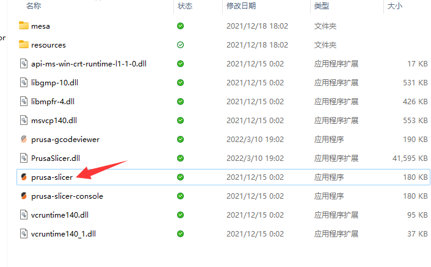

>  
A copy of PrusaSlicer software for win7/win10/win11, ZONESTAR 3d printer profiles has already added.
You can also download the PrusaSlicer software from here:
[**https://github.com/prusa3d/PrusaSlicer/releases**](https://github.com/prusa3d/PrusaSlicer/releases)

## PrusaSlicer Profiles for ZONESTAR 3D Printers

### [> Download](https://downgit.github.io/#/home?url=https://github.com/ZONESTAR3D/Slicing-Guide/tree/master/PrusaSlicer/Profiles)

### This directoy is Profiles for ZONESTAR 3D printer of PrusaSlicer, if your PrusaSilcer software doesn't download from Prusa3d github page or website, please download this profiles and copy to “\resources\profiles” folder which PrusaSlicer software installed

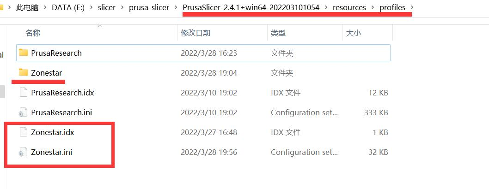

### If you have installed PrusaSlicer before, you may still need to delete previous configurations settings before apply this Profiles

1. You can find the directory by open the PrusaSlicer menu: **help>>Show Configuration Floder**, for Windows OS, it is usually stored in "C:/Users/{your PC name}/AppData/Roaming/PrusaSlicer", as below shown:
2. Delete all of the files in this directory, and then open PrusaSlicer software again.
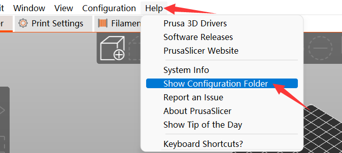

## PrusaSlicer Settings

### 1. Configuration>>Configuration Wizard>>Next

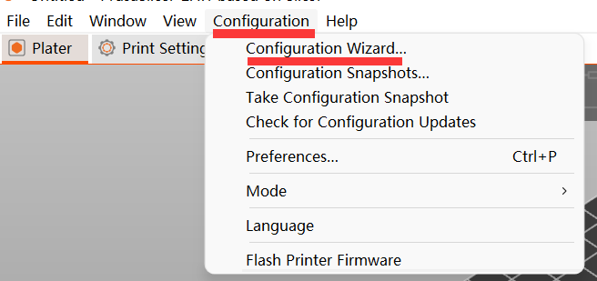

### 2. Other Vendor>>ZONESTAR>>Next

### 3. Choose machine model>>Next

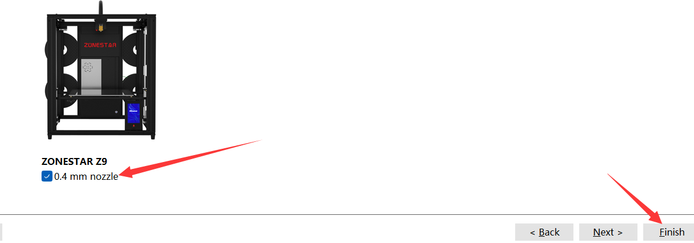

### 4. Choose printer model, filament(s) & print settings

  

- **printer model** For orignal Z9V5Pro, please choose Z9+M4 HOTEND.  
- **filament** Choose filament you used.
- **print settings** If you slicing one color 3d files, choose "SingelExtruder 0.2mm". If you slicing multi-color 3d files, choose "MultiExtruder 0.2mm".  

## PrusaSlicer Slicing

### PrusaSlicer User guide

- **[PrusaSlicer introduction](https://www.prusa3d.com/page/prusaslicer_424/)**
- **PrusaSlcier is base on Slic3d, so you can also refer to [Slic3r User Manuual](https://manual.slic3r.org/)**

### :star2: Superior function 1: Automatic recognition and merging of polychromatic models 

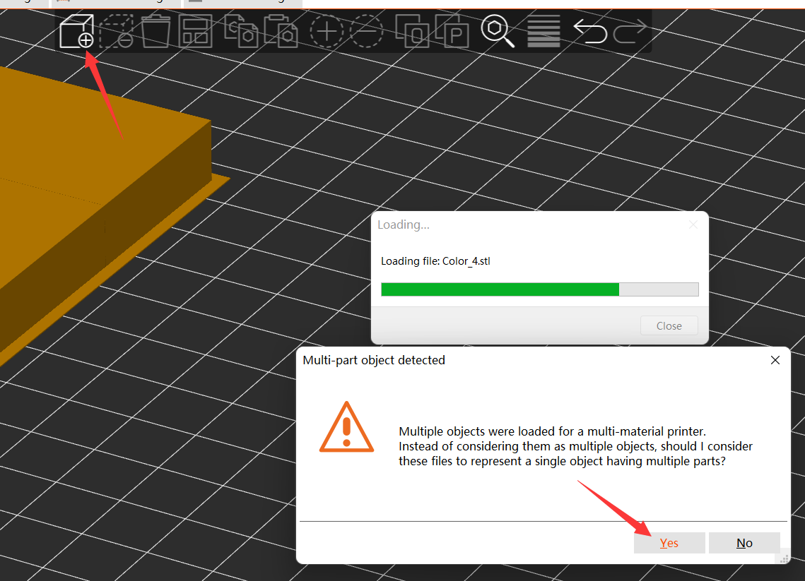

### :star2: Superior function 2: Automatic generation of color switching prime tower

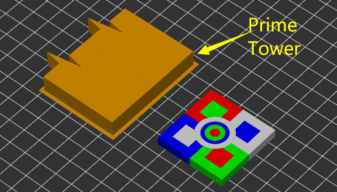

### :star2:  Superior function 3: Settable Purging volume of prime tower

#### To add the “loaded purge value” of light-color filament can prevent being polluted by filaments of other colors

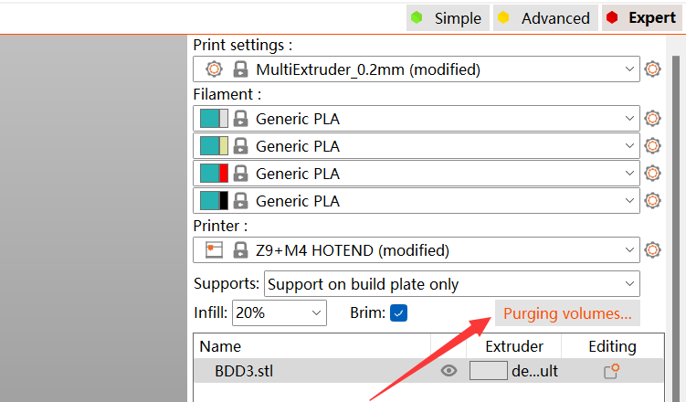
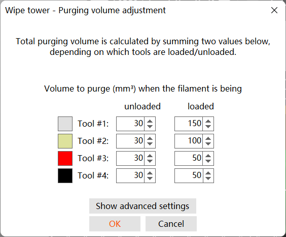
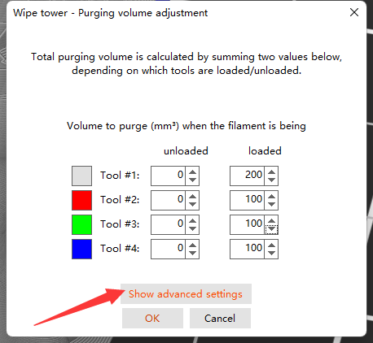
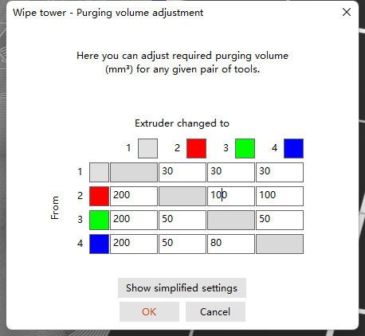

#### For example, suppose that the filaments color of extruder  you use is E1: White / E2: Red / E3: Green/ E4: Blue，because white is easy to be polluted

- set to 200mm3 from E2/E3/E4 to E1
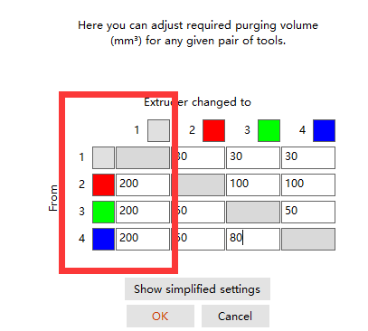

- Set to 30mm3 from E1 to E2/E3/E4  

#### Other parameters are set according to similar principles too

### :star2: Superior function 4: Painting the 3d model to multi color

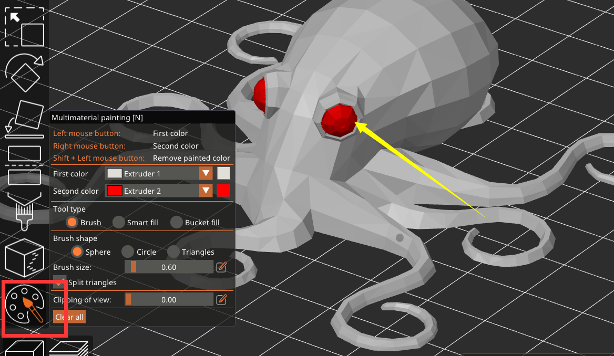

### Testing gcode files for 4-IN-1-OUT mixing color hotend
#### M4_4C_Test.gcode 
[> Download](https://downgit.github.io/#/home?url=https://github.com/ZONESTAR3D/Slicing-Guide/tree/master/PrusaSlicer/test_gcode/M4_4C_test.gcode)

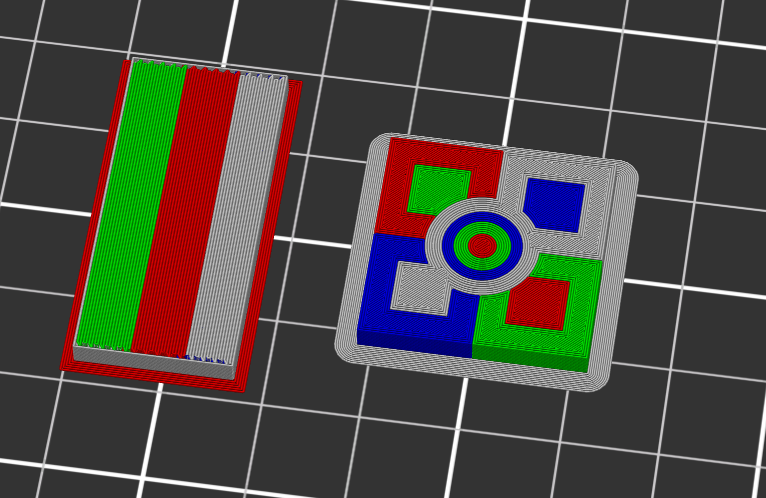

#### M4_4C_OWL.gcode 
[> Download](https://downgit.github.io/#/home?url=https://github.com/ZONESTAR3D/Slicing-Guide/tree/master/PrusaSlicer/test_gcode/M4_4C_OWL.gcode)

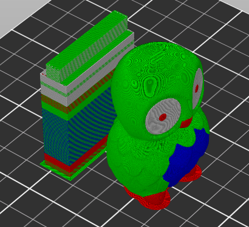

#### M4_4C_Dog.gcode 
[> Download](https://downgit.github.io/#/home?url=https://github.com/ZONESTAR3D/Slicing-Guide/tree/master/PrusaSlicer/test_gcode/M4_4C_Dog.gcode)

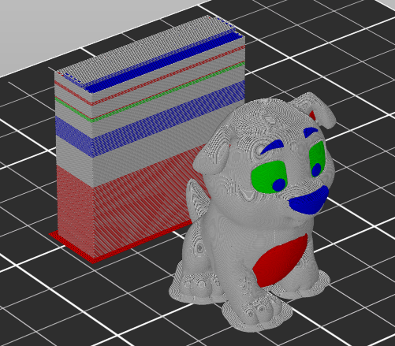

#### M4_4C_Bobomb.gcode 
[> Download](https://downgit.github.io/#/home?url=https://github.com/ZONESTAR3D/Slicing-Guide/tree/master/PrusaSlicer/test_gcode/M4_4C_Bobomb.gcode)

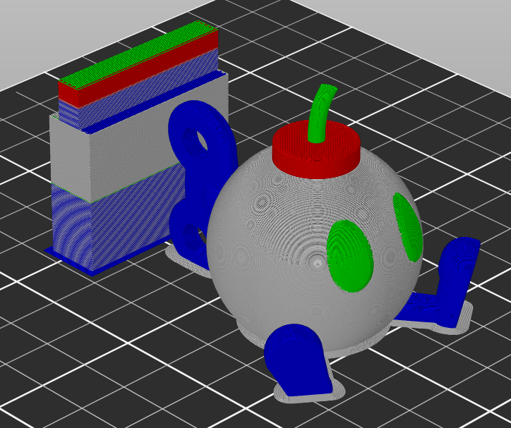

#### M4_4C_Patrick.gcode 
[> Download](https://downgit.github.io/#/home?url=https://github.com/ZONESTAR3D/Slicing-Guide/tree/master/PrusaSlicer/test_gcode/M4_4C_Patrick.gcode)

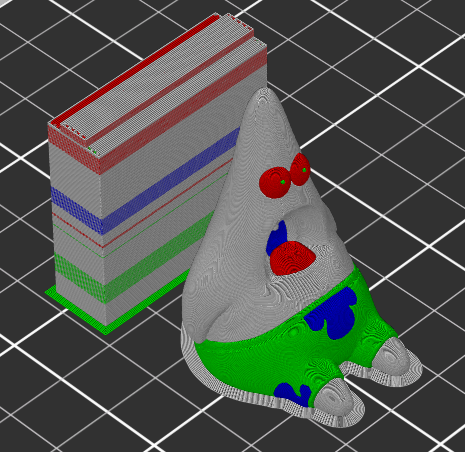

#### M4_4C_EarthCore.gcode 
[> Download](https://downgit.github.io/#/home?url=https://github.com/ZONESTAR3D/Slicing-Guide/tree/master/PrusaSlicer/test_gcode/M4_4C_EarthCore.gcode)

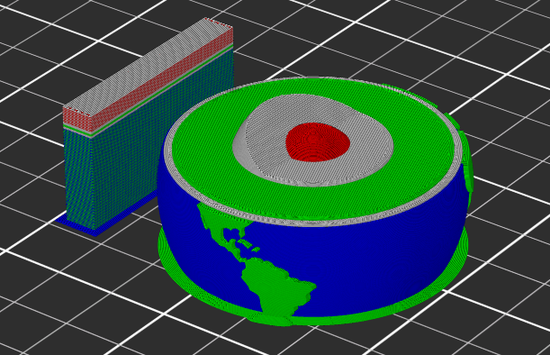

### Testing gcode files for 4-IN-1-OUT Non-mixing color hotend
Pleas refer [:point_right:here](https://github.com/ZONESTAR3D/Upgrade-kit-guide/tree/main/HOTEND/E4%204-IN-1-OUT%20Non-Mixing%20Color%20Hotend/example/PrusaSlicer)