## :book: Contents
- [Download software](#1-download-prusaslicer-software-and-profiles)
- [Setup printer](#2-setup-printer)
- [Set print preset](#3-set-print-preset)
- [Slicing one Color](#4-slicing-one-color)
- [Slicing muti-color for M4 hotend ](#5-slicing-muti-color-for-m4-hotend)
- [Slicing muti-color for E4 hotend ](#6-slicing-muti-color-for-e4-hotend)

## 1. Download PrusaSlicer software and profiles
#### :point_right: [PrusaSlicer introduction](https://help.prusa3d.com/article/general-info_1910)

#### For Windows
- :arrow_down: [**Download PrusaSlicer 2.4.2 with ZONESTAR 3D Printer Profiles**](https://github.com/ZONESTAR3D/Slicing-Guide/releases)     
Download it and unzip it to your PC or laptop, and then find and run the "PrusaSlicer.exe".    

#### For Macos or linux
- :arrow_down: [**Download PrusaSlicer software**](https://github.com/prusa3d/PrusaSlicer/releases)
- :arrow_down: [**Download profiles**](https://downgit.github.io/#/home?url=https:%2F%2Fgithub.com%2FZONESTAR3D%2FSlicing-Guide%2Ftree%2Fmaster%2FPrusaSlicer%2FProfiles)
- Copy Profiles to "resource/profiles" directory of the installation directory of the PrusaSlicer software.

#### If you have installed PrusaSlicer before, you may still need to delete previous configurations settings before apply this Profiles
##### You can find the directory by open the PrusaSlicer menu: **help>>Show Configuration Floder**, for Windows OS, it is usually stored in "C:/Users/{your PC name}/AppData/Roaming/PrusaSlicer", as below shown:
##### Delete all of the files in this directory, and then open PrusaSlicer software again.
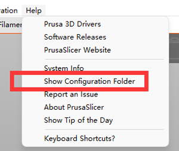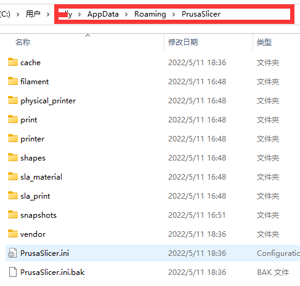

## 2. Setup printer
#### 2.1 Find the PrsuaSlicer.exe and click it to run
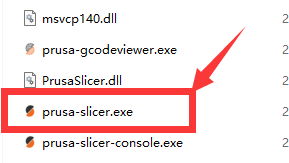
#### 2.2 Choose your printer, "Other Vendors>>Zonestar FFF>>your printer model>>finish"
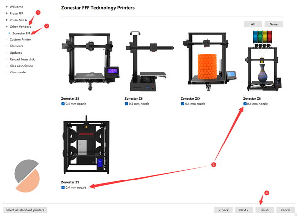

## 3. Set print preset
Choose system presets according to your printer, hotend and the colors you want to print. 
#### 3.2 Printer model: Z9V5Pro and Z9M4
- If you print one color, choose "Z9 + One Color"  
- If your printer has a M4 (4-IN-1-OUT mixing color) hotend and print multi-color, choose "Z9 + M4 HOTEND"  
- If your printer has a E4 (4-IN-1-OUT Non-mixing color) hotend and print multi-color, choose "Z9 + E4 HOTEND"  
- If you printer has a Direct Drive Extruder, choose “Z9 + DDE”  
#### 3.2 Printer model: Z9M3 
- If you print one color, choose "Z9 + One Color"  
- If you print multi-color, choose "Z9 + M3 HOTEND"  
- If your printer has M4 (4-IN-1-OUT mixing Color) HOTEND, choose “Z9 + M4 HOTEND“ 
- If your printer has E4 (4-IN-1-OUT Non-mixing Color) HOTEND, choose “Z9 + E4 HOTEND“ 
- If your printer has a Direct Drive Extruder, choose “Z9 + DDE”  
#### 3.3 Printer model: Z8S-M3/Z8T-M3/Z8P-M3/Z8P-M4
  - If you print one color, choose "Z8 + One Color"  
  - If your printer has a M3 hotend and print multi-color, choose "Z8 + M3 HOTEND"  
  - If your printer has a M4 hotend and print multi-color, choose "Z8 + M4 HOTEND"  
  - If your printer has a E4 (4-IN-1-OUT Non-mixing Color) HOTEND, choose “Z9 + E4 HOTEND“    
  - If your printer has a Direct Drive Extruder, choose “Z8 + DDE” 
#### 3.4 Printer model: Z5S-M2/D805S-M2, choose "Z5 + M2 HOTEND"  
#### 3.5 Printer model: Z5X/Z6, , choose "Zonestar Z5X" or "Zonestar Z6"
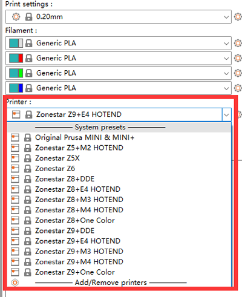

## 4. Slicing one color
***take Z9V5pro with M4 hotend as an example***
#### :movie_camera:[**Video Tutorial**](https://youtu.be/6QU-jnycS8c)
#### 4.1 choose printer presets "Z9 + One Color"
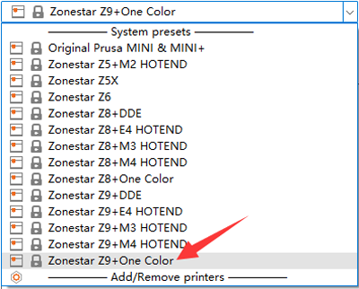
#### 4.2 load 3d model file (stl/obj/AMF file etc.)
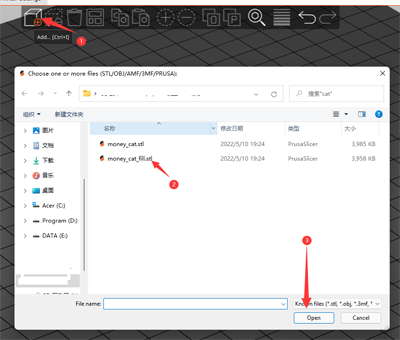
#### 4.3 Choose print filament type
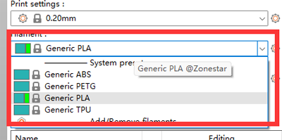
#### 4.4 Resize, cut, rotate, move the 3d model if need
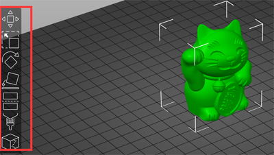  
#### 4.5 Set the print settings: layer height, print speed, support, infill, etc.
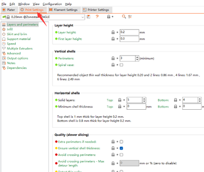  
You may need to set these parameters according to the shape of the model and your requirements for print quality. For some models, the object even cannot be printed successfully if the settings is incorrect. For details please refer to:
- :point_right: [**Print Settings**](https://help.prusa3d.com/category/print-settings_212)
- :point_right: [**PrusaSlicer introduction**](https://help.prusa3d.com/article/general-info_1910)
#### 4.6 Slicing
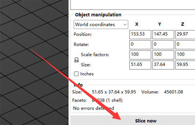  
#### 4.7 Preview the sliced result (gcode file) and then save to gcode file to your PC and then copy to SD card
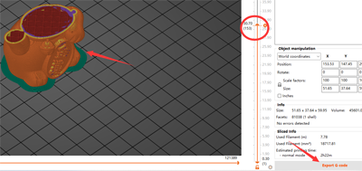  
#### :warning: Note :warning: 
Please pay attention these settings:
|-----------|-----------|-----------|-----------|
|  Hotend   |Max Retract speed|Retract length|
1. For M4 hotend, please 

## 5. Slicing muti-color for M4 hotend 
***Take Z9V5Pro with M4 hotend as an example***
#### :movie_camera:[**Video Tutorial**](https://youtu.be/_Ww2RFGlLNA)
### 5.1 choose printer presets "Z9 + M4 hotend"
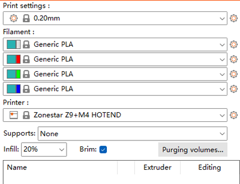
### 5.2 load 3d model files (stl/obj/AMF file etc.)
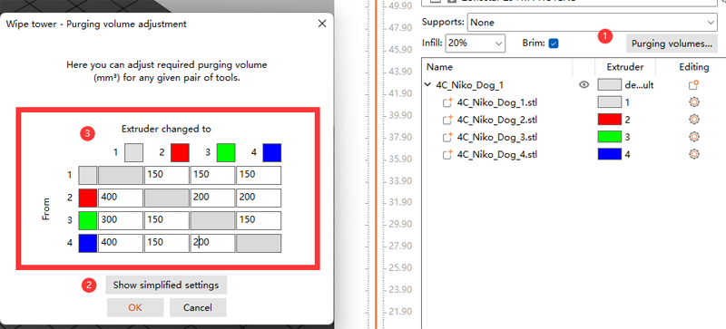 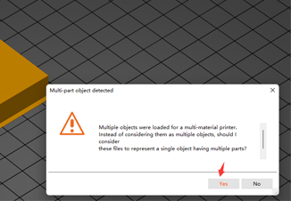
- :memo: Usually, "split model" is inneed to print multi colors 3d model files, that is, a 3d model has been split into multiple STL files according to colors, and these files use the same origin coordinate position so that they can be merged correctly.
- :star2: PrusaSlicer has a powerful new feature, it can paint a 3d model file into multi colors, for details, please refer to :movie_camera:[this video tutorial](./video/PrusaSlicer_Painting.mp4).
### 5.3 Choose print filament type - PLA and set filament color

### 5.4 Assign extruders to different parts
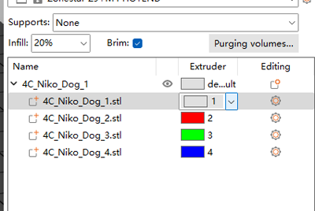
### 5.5 Resize, cut, rotate, move the 3d model if need 
  
### 5.6 Set the print settings: layer height, print speed, support, infill, etc.
  
You need to set these parameters according to the shape of the model and your requirements for print quality. Even for some models, printing cannot be completed normally without support. For details please refer to:
- :point_right: [**PrusaSlicer introduction**](https://help.prusa3d.com/article/general-info_1910)
- :point_right: [**Slic3r User Manuual**](https://manual.slic3r.org/)
### 5.7 Set parameters for "wipe tower"
##### You may notice that a square square will appear in the sliced figure, which is called "Wipe tower" in PrusaSlicer. Because for the multi-color printer, while switching extruders, there are still the previous color filaments inside the hotend, it need to be clean before printing another color.   
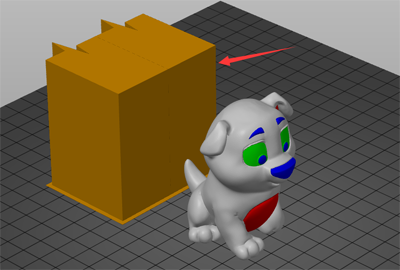    
##### In order to obtain better cleaning effect and minimize to waste filament, we can set the amount of color purge according to different colors. Please pay attention to the following table, the columns shows the filament color of the last extruder printed, and the rows shows the filament color of the next extruder to be printed.
##### When we change from the extruder with lighter color filament to the extruder with darker color consumables, we can set a smaller extrusion erasure. On the contrary, when we change from the extruder with darker color consumables to the extruder with darker color filament, we need to set a smaller extrusion erasure
  
### 5.8 Slicing
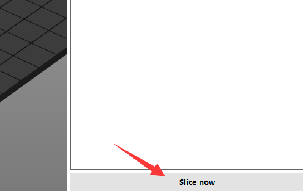  
### 5.9 Preview the sliced result (gcode file) and then save to gcode file to your PC and then copy to SD card
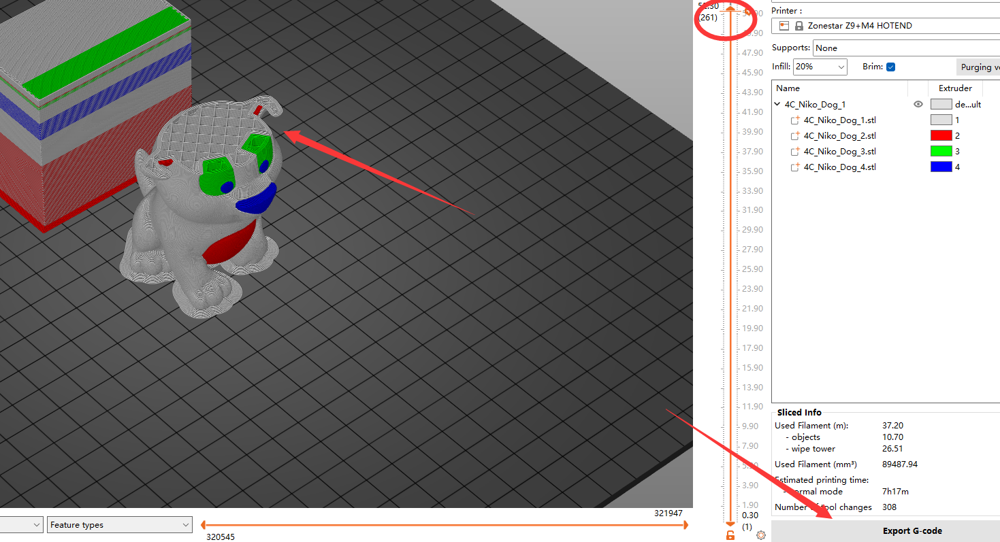  
### 5.10 Testing gcode files for M4 (4-IN-1-OUT mixing color) hotend
Please refer to :point_right: [here.](./test_gcode/M4/readme.md)

## 6. Slicing muti-color for E4 hotend
***Take Z9V5Pro with E4 hotend as an example***
#### :movie_camera:[**Video Tutorial**](https://youtu.be/aets9JZ92iU)
### 6.1 choose printer presets "Z9 + E4 hotend"
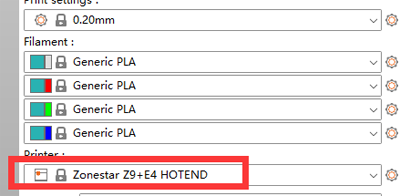
### 6.2 the other steps for E4 hotend and M4 hotend is the same, please refer to 
:star:For E4 hotend, there are few filaments left in the hot end, so we can use smaller purging volume on wipe tower.  
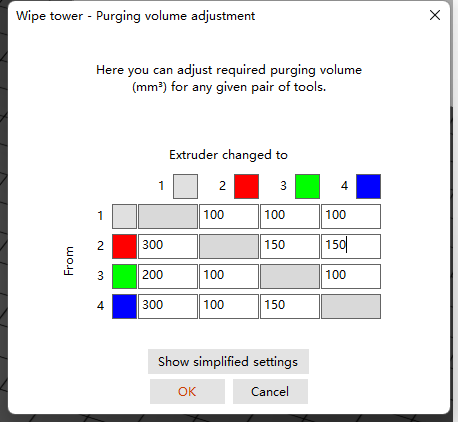  
:star:When previewing the gcode file, you can see that some additional print lines will appear on the side of bed, which are for preloading filament. For detail how to pre-load filament, please refer to "E4 Hotend user guide".   
  
### 6.3 Testing gcode files for E4 (4-IN-1-OUT Non-mixing color) hotend
Please refer to :point_right: [here.](./test_gcode/E4/readme.md)