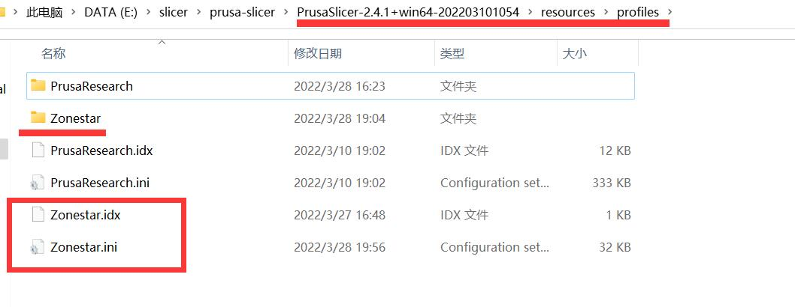

## PrusaSlicer/SuperSlicer :
- Slicing guide for Multi Color Printer (PrusaSlicer)
- PrusaSlicer_config_bundle_Z9.ini: ini file of Z9V5, it canbe used to Z9M4 too
* [SuperSlicer download page](https://github.com/supermerill/SuperSlicer/releases): https://github.com/supermerill/SuperSlicer/releases
* [PrusaSlicer download page](https://github.com/prusa3d/PrusaSlicer/releases): https://github.com/prusa3d/PrusaSlicer/releases

## Profiles:
PrusaSilicer Profiles for ZONESTAR 3D printer, download them and copy to “\resources\profiles” folder of the PrusaSlicer software installation folder.

