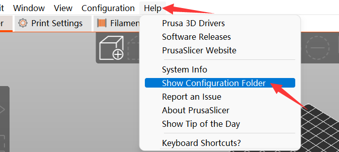
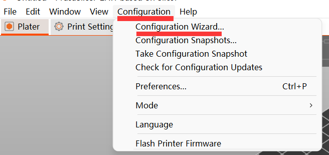
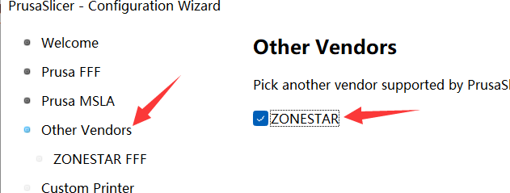
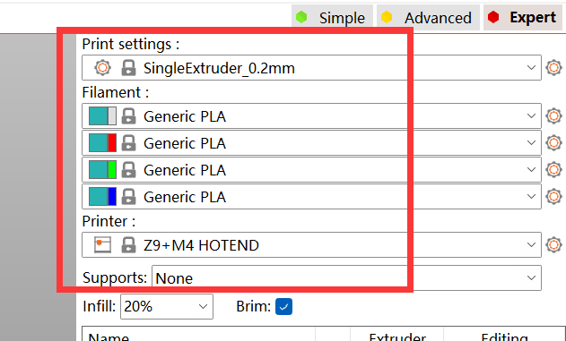
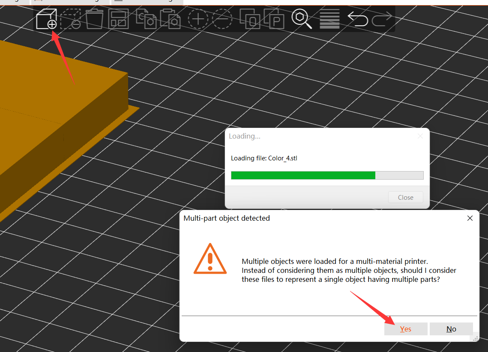
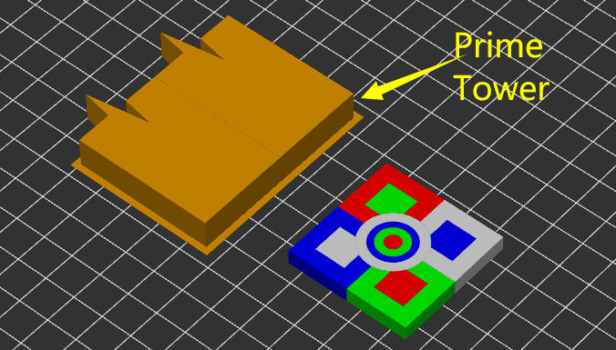
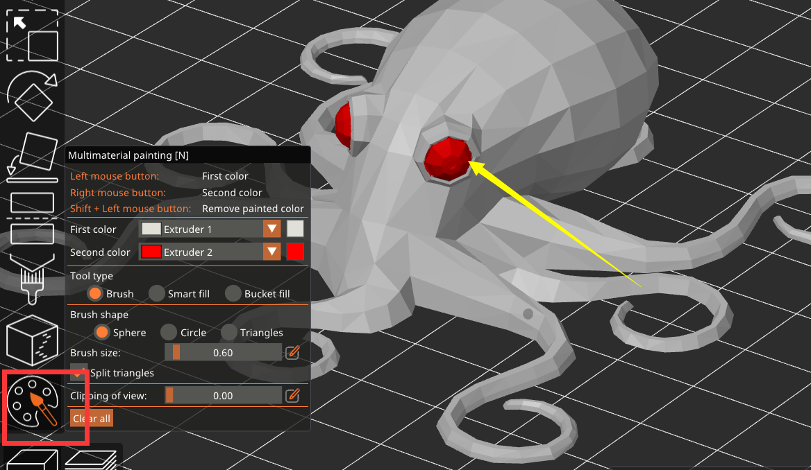
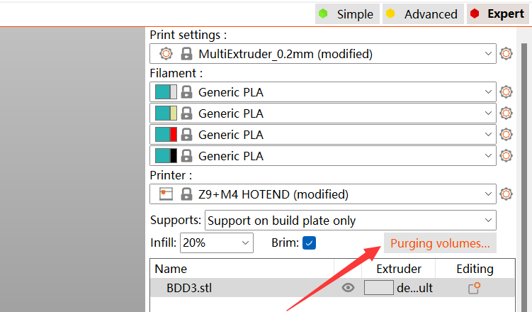
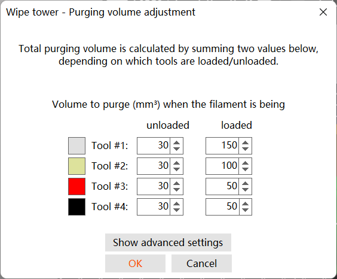

## PrusaSlicer-2.4.0-rc+win64 
#### [> Download](https://downgit.github.io/#/home?url=https://github.com/ZONESTAR3D/Slicing-Guide/tree/master/PrusaSlicer/PrusaSlicer-2.4.0-rc%2Bwin64)  
A copy of PrusaSlicer software for win7/win10/win11, ZONESTAR 3d printer profiles has already added.
You can also download the PrusaSlicer software for others OS from here: 
[**https://github.com/prusa3d/PrusaSlicer/releases**](https://github.com/prusa3d/PrusaSlicer/releases)

## Profiles
#### [> Download](https://downgit.github.io/#/home?url=https://github.com/ZONESTAR3D/Slicing-Guide/tree/master/PrusaSlicer/Profiles)   
#### This directoy is PrusaSilicer Profiles for ZONESTAR 3D printer, download them and copy to “\resources\profiles” folder which PrusaSlicer software installed.

#### If you have installed PrusaSlicer before, you still need to delete previous configurations settings before apply the new Profiles.
1. You can find the directory by open the PrusaSlicer menu: **help>>Show Configuration Floder**, as below shown:

2. For Windows, it is usually stored in "C:/Users/{PC name}/AppData/Roaming/PrusaSlicer"
3. Delete all of the files in this directory, and then open PrusaSlicer again.  

## PrusaSlicer Settings
### 1. Configuration>>Configuration Wizard>>Next

### 2. Other Vendor>>ZONESTAR>>Next

### 3. Choose machine model>>Next

### 4. Choose printer model, filament(s) & print settings
  
- **printer model** For orignal Z9V5Pro, please choose Z9+M4 HOTEND.  
- **filament** Choose filament you used.     
- **print settings** If you slicing one color 3d files, choose "SingelExtruder 0.2mm". If you slicing multi-color 3d files, choose "MultiExtruder 0.2mm".  

## PrusaSlicer Slicing
### PrusaSlicer User guide 
- **[PrusaSlicer introduction](https://www.prusa3d.com/page/prusaslicer_424/)**
- **PrusaSlcier is base on Slic3d, so you can also refer to [Slic3r User Manuual](https://manual.slic3r.org/)**

### 1. load stl files

### 2. Auto add prime tower

### 3. Amazing new features: Painting the 3d model to multi color

### 4. Set purge volume
To add the “loaded purge value” of light-color filament can prevent  being polluted by filaments of other colors.

   
