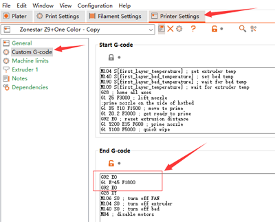

<!-- ### :globe_with_meridians: Choose Language (Translated by google)

----- -->
## Single color 3d model slicing guide
***Take Z9V5pro as an example***  
:movie_camera:[**Video Tutorial**](https://youtu.be/6QU-jnycS8c)        
#### 1. **Choose printer presets "Z9 + One Color"**   

#### 2. **load 3d model file (stl/obj/AMF file etc.)**    

#### 3. **Choose filament type**   

#### 4. **Resize, cut, rotate, move the 3d model if need**    
  
#### 5. **Set the print settings: layer height, print speed, support, infill, etc.**  
  
You may need to set these parameters according to the shape of the model and your requirements for print quality. For some models, the object even cannot be printed successfully if the settings is incorrect. For details please refer to:
  - :point_right: [**Print Settings**](https://help.prusa3d.com/category/print-settings_212)
  - :point_right: [**PrusaSlicer introduction**](https://help.prusa3d.com/article/general-info_1910)
#### 6. **Slicing**    
  
#### 7. **Preview the sliced result (gcode file) and then save the gcode file to your PC**     
  

-----
### :pushpin:Auto unload filament after printing finished  
If you were using the E4 hot end, we recommend that you add the following gcode commands to the "End G-code", to let the printer unload the filament from the hot end after printing finished.   
>
    ;pull out the filament 
    G92 E0
    G1 E-45 F1800
    G92 E0

 