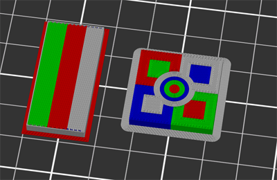
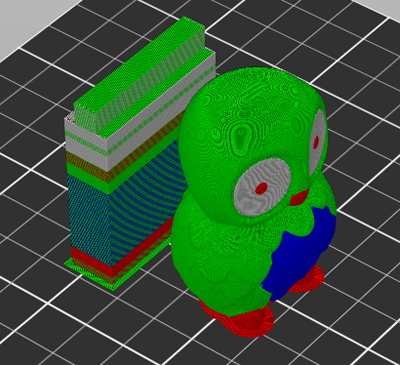
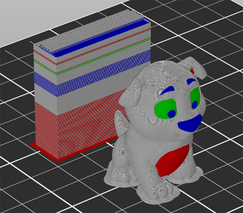
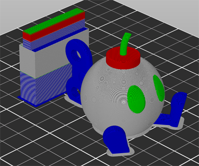
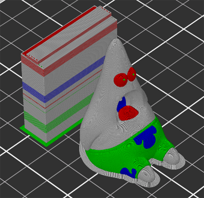
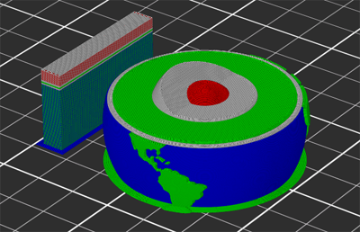
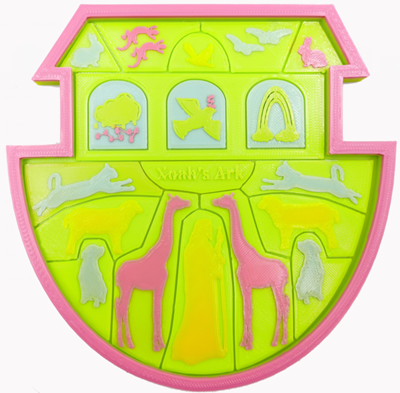
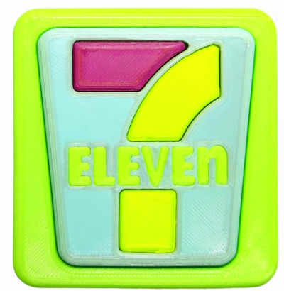
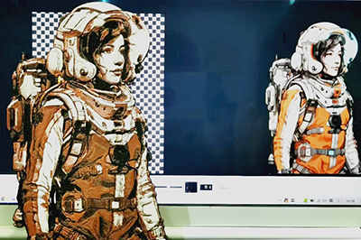

## Testing gcode files for M4 (4-IN-1-OUT mixing color) hotend
#### M4_4C_Test.gcode 
:arrow_down: [Download gcode files](M4_4C_test.zip)  

#### M4_4C_OWL.gcode 
:arrow_down: [Download gcode files](M4_4C_OWL.zip)  

#### M4_4C_Dog.gcode 
:arrow_down: [Download gcode files](M4_4C_Dog.zip)  

#### M4_4C_Bobomb.gcode 
:arrow_down: [Download gcode files](M4_4C_Bobomb.zip)  

#### M4_4C_Patrick.gcode 
:arrow_down: [Download gcode files](M4_4C_Patrick.zip)  

#### M4_4C_EarthCore.gcode 
:arrow_down: [Download gcode files](M4_4C_EarthCore.zip)  

#### M4_4C_Noahs.gcode 
:arrow_down: [Download gcode files](M4_4C_Noahs.zip)  

#### M4_4C_BODY3D.gcode 
:arrow_down: [Download gcode files](M4_4C_BODY3D.zip)  

#### 7_11.gcode 
:arrow_down: [Download gcode/stl files](7_11.zip)  

#### M4_C4_astronaut.gcode 
- **[:clapper: Video tutorial](https://youtu.be/UF3nUM7WgFQ)**      
- **:arrow_down: [Download gcode/stl files](M4_C4_Astronaut.zip)**    
