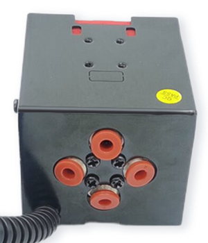
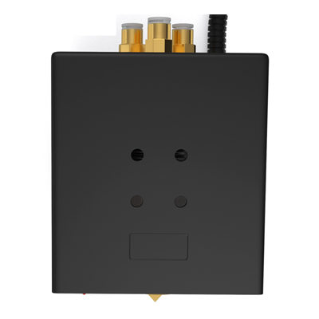

## :warning: Please pay attention to distinguish the type of hot end.
#### E4: 4-IN-1-OUT non-mixing color HOTEND. [test gcode file](./E4/readme.md)

#### M4: 4-IN-1-OUT mixing color HOTEND. [test gcode file](./M4/readme.md)
 

