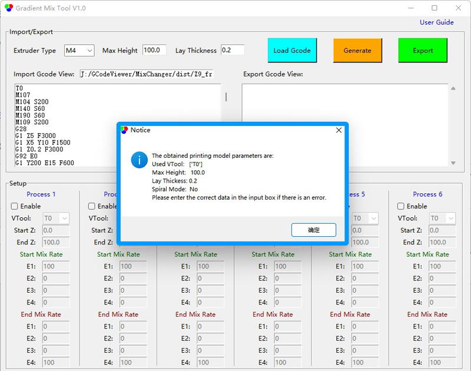

## <a id="choose-language">:globe_with_meridians: Choose language </a>

----
# Gradient Mix Tool
#### :warning: هذه الأداة قابلة للتطبيق حاليًا فقط على الطابعات ثلاثية الأبعاد ذات 4 مكابس لخلط الألوان من ZONESTAR (M4).
## :arrow_down: تنزيل 
### [تنزيل (لنظام Windows)](GradientMixToolV1.zip)
<!-- ### :arrow_down:[Download (for Linux)](GradientMixToolV1.zip) -->

----
## دليل المستخدم
### موجز
**أداة خلط التدرج** هي برنامج معالجة لاحقة من GCode، تم تطويره لضبط نسبة خلط المكابس تلقائيًا في ارتفاع الطباعة (اتجاه المحور Z). ويمكن تطبيقها على الطابعات ثلاثية الأبعاد ذات 4 مكابس لخلط الألوان من ZONESTAR.

**أداة خلط التدرج** تسمح بإعداد ما يصل إلى 6 ***عمليات تدرج***، ويمكن تطبيق كل عملية تدرج على إحدى أدوات VTools المستخدمة في ملف GCode المستورد، وتعيين نطاق الارتفاع المطبق ونسبة خلط المكابس في البداية والنهاية. من الممكن تطبيق عمليات متعددة في وقت واحد عندما:
- يتم تطبيق العمليات على نفس أداة VTool في نطاق ارتفاع مختلف.
**أو:**
- يتم تطبيق العمليات على نفس نطاق الارتفاع على أدوات VTools المختلفة.

### تعليمات الاستخدام
#### 1. تنزيل البرنامج وفك ضغطه على جهاز الكمبيوتر الخاص بك (ملف exe واحد فقط).
#### 2. قم بتشغيل GradientMixToolVx.exe.

#### 3. قم بتحميل ملف Gcode.
سيقوم البرنامج تلقائيًا بصياغة ملف Gcode المستورد للحصول على ارتفاع النموذج وسمك الطبقة وأداة VTool المستخدمة وما إلى ذلك، ثم يظهر مربع مطالبة لإظهار هذه المعلومات.

#### 4. اضبط معلمات "العمليات".

#### 5. انقر فوق الزر "إنشاء" لإنشاء ملف gcode جديد.
يمكنك رؤية أوامر Gcode التي تمت إضافتها في نافذة ***export Gcode view***

#### 6. انقر فوق الزر Export (تصدير) لتصدير ملف Gcode وحفظه في ملف Gcode جديد.
بعد ذلك، يمكنك طباعة ملف Gcode المُصدَّر على طابعة ZONESTR Mix Color 3D Printer.

----
### أمثلة
#### مثال:one: [Spiral Vase :arrow_down:](./SpiralVase.zip)
يوضح هذا المثال كيفية تحويل ملف Gcode لمزهرية حلزونية بلون واحد إلى ملف Gcode متعدد التدرجات:
- عند ارتفاع 0~20 مم، تدرج من الطارد 1 لون إلى الطارد 2 لون.
- عند ارتفاع 20~40 مم، تدرج من الطارد 2 لون إلى الطارد 3 لون.
- عند ارتفاع 40~60 مم، تدرج من الطارد 3 لون إلى الطارد 4 لون.
- على ارتفاع 60~80 مم، تدرج من الطارد 4 ألوان إلى الطارد 1 لون.
- فوق ارتفاع 80 مم، حافظ على مزيج الألوان بين الطارد 1 والطارد 2 بنسبة 50:50 تقريبًا.

#### مثال:two: [M4_4C_test :arrow_down:](./M4_4C_test.zip)
يوضح هذا المثال كيفية تحويل ملف Gcode لنموذج اختبار بأربعة ألوان إلى ملف Gcode مع تدرجات لكل لون:
- يتم تحويل اللون الأصلي للطارد 1 إلى لون يتدرج من الطارد 1 إلى الطارد 2.
- يتم تحويل اللون الأصلي للطارد 2 إلى لون يتدرج من الطارد 2 إلى الطارد 3.
- يتم تحويل اللون الأصلي للطارد 3 إلى لون يتدرج من الطارد 3 إلى الطارد 4.
- يتم تحويل اللون الأصلي للطارد 4 إلى لون يتدرج من الطارد 4 إلى الطارد 1.
