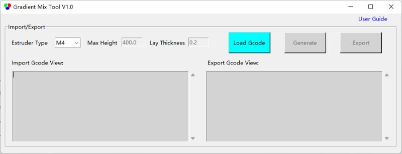
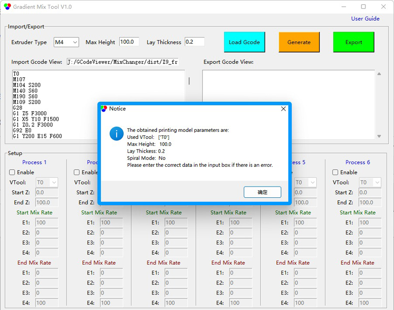
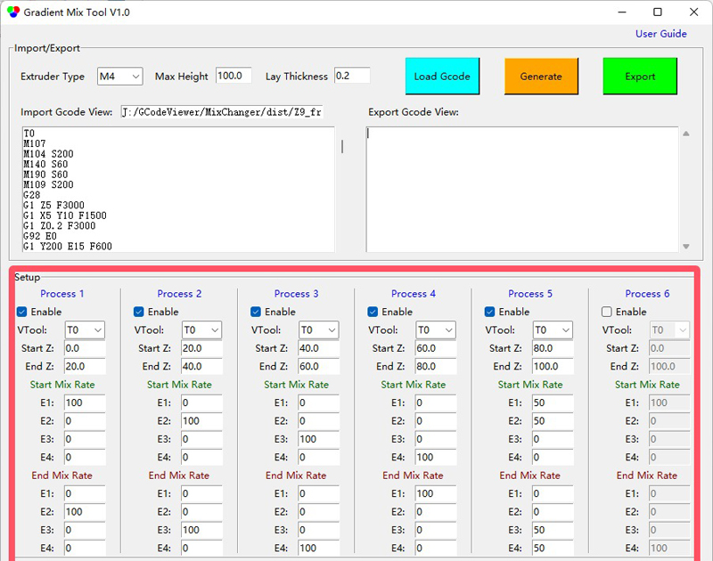
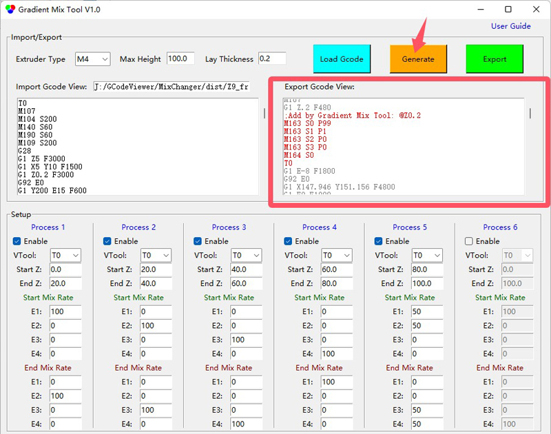
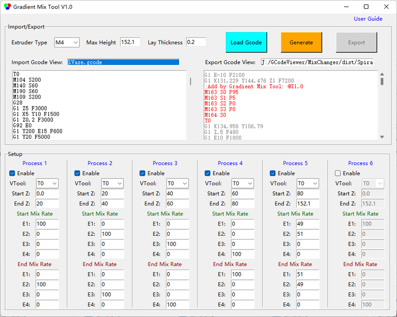

## <a id="choose-language">:globe_with_meridians: Choose language </a>

----
## Guía del usuario de Gradient Mix Tool
#### :warning: Esta herramienta actualmente solo se aplica a las impresoras 3D de mezcla de colores de 4 extrusores ZONESTAR (M4).
### Resumen
**Gradient Mix Tool** es un software de posprocesamiento de GCode, que se desarrolló para ajustar automáticamente la relación de mezcla de los extrusores en la altura de impresión (dirección del eje Z). Se puede aplicar a las impresoras 3D de mezcla de colores ZONESTAR.
**Gradient Mix Tool** permite configurar hasta 6 ***Procesos de degradado***, cada proceso de degradado se puede aplicar a una de las VTools utilizadas en el archivo GCode importado y configurar el rango de altura aplicado y la relación de mezcla inicial y final de los extrusores. Es posible aplicar varios procesos simultáneamente cuando:
- Los procesos se aplican a la misma VTool en un rango de altura diferente.
**O:**
- Los procesos se aplican al mismo rango de altura en las diferentes VTools.
### :arrow_down:[Descargar (para Windows)](./GradientMixToolV1)
### Instrucciones de uso
#### 1. [Descargue el software](./GradientMixToolV1) y descomprímalo en su PC (solo un archivo exe).
#### 2. Ejecute GradientMixToolVx.exe.

#### 3. Cargue un archivo Gcode.
El software expresará automáticamente el archivo Gcode importado para obtener la altura del modelo, el grosor de la capa, la herramienta VTool utilizada, etc., y mostrará un cuadro emergente para mostrar esta información.

#### 4. Establezca los parámetros de los "procesos".

#### 5. Haga clic en el botón Generar para generar un nuevo archivo Gcode.
Puede ver qué comandos Gcode se han agregado en la ventana ***exportar vista Gcode***

#### 6. Haga clic en el botón Exportar para exportar y guardar en un nuevo archivo Gcode.
A continuación, puede imprimir el archivo Gcode exportado en su impresora 3D ZONESTR Mix Color.
### Ejemplos
#### Ejemplo:one: [Spiral Vase :arrow_down:](./SpiralVase.zip)
Este ejemplo muestra cómo convertir un archivo Gcode de jarrón espiral de un solo color en un archivo Gcode de múltiples gradientes:
- A una altura de 0~20 mm, gradiente del color 1 del extrusor al color 2 del extrusor.
- A una altura de 20~40 mm, gradiente del color 2 del extrusor al color 3 del extrusor.
- A una altura de 40~60 mm, gradiente del color 3 del extrusor al color 4 del extrusor.
- A una altura de 60~80 mm, gradiente del color del extrusor 4 al color del extrusor 1.
- Por encima de una altura de 80 mm, mantenga la mezcla de colores del extrusor 1 y el extrusor 2 en aproximadamente 50:50.

#### Ejemplo:two: [M4_4C_Test :arrow_down:](./M4_4C_test.zip)
Este ejemplo muestra cómo convertir un archivo Gcode de un jarrón en espiral de un solo color en un archivo Gcode con múltiples gradientes:
Este ejemplo muestra cómo convertir un archivo Gcode de modelo de prueba de 4 colores en un archivo Gcode con gradientes para cada color:
- El color original del extrusor 1 se convierte en un color que se degrada del extrusor 1 al extrusor 2.
- El color original del extrusor 2 se convierte en un color que se degrada del extrusor 2 al extrusor 3.
- El color original del extrusor 3 se convierte en un color que se degrada del extrusor 3 al extrusor 4.
- El color original del extrusor 4 se convierte en un color que se degrada del extrusor 4 al extrusor 1.
