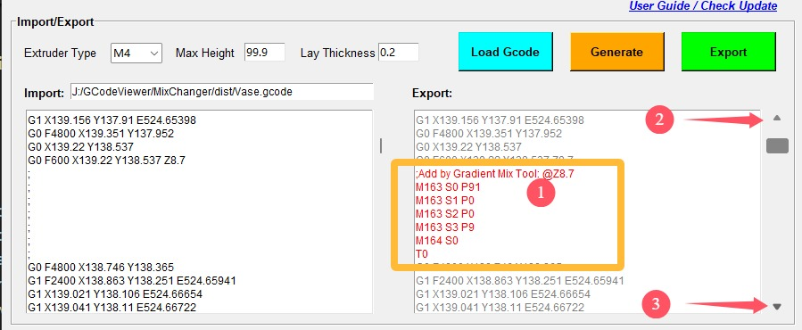
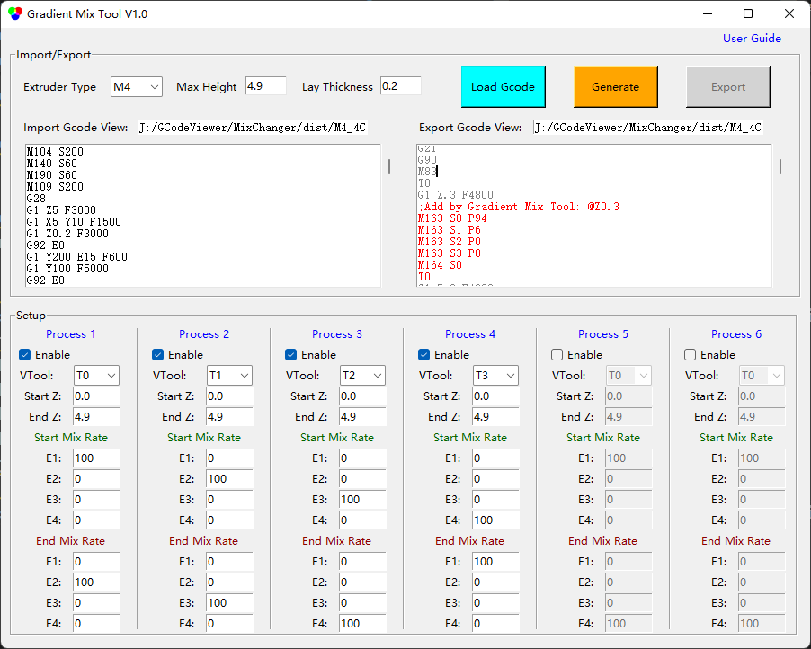

## <a id="choose-language">:globe_with_meridians: Choose language </a>

----
# Gradient Mix Tool
#### :warning: cet outil n'est actuellement applicable qu'aux imprimantes 3D de mélange de couleurs à 4 extrudeuses ZONESTAR (M4).
#### [:arrow_down: Download](https://github.com/ZONESTAR3D/Slicing-Guide/releases/tag/gmt-v1.2) 

----
##  l'utilisateur
### Résumé
**Gradient Mix Tool** est un logiciel de post-traitement GCode, qui a été développé pour ajuster automatiquement le rapport de mélange des extrudeuses dans la hauteur d'impression (direction de l'axe Z). Il peut être appliqué aux imprimantes 3D de mélange de couleurs ZONESTAR.
**Gradient Mix Tool** permet de configurer jusqu'à 6 ***Processus de dégradé***, chaque processus de dégradé peut être appliqué à l'un des VTools utilisés dans le fichier GCode importé, et définir la plage de hauteur appliquée et le rapport de mélange des extrudeuses de début et de fin. Il est possible d'appliquer plusieurs processus simultanément lorsque :
- Les processus sont appliqués au même VTool dans une plage de hauteur différente.
**Ou :**
- Les processus sont appliqués à la même plage de hauteur sur les différents VTools.

### Instructions d'utilisation
#### 1. Télécharger le logiciel et le décompresser sur votre PC (un seul fichier exe).
#### 2. Exécutez GradientMixToolVx.exe.

#### 3. Chargez un fichier Gcode.
Le logiciel exprimera automatiquement le fichier Gcode importé pour obtenir la hauteur du modèle, l'épaisseur de la couche, le VTool utilisé, etc., et affichera une boîte de dialogue pour afficher ces informations.

#### 4. Définissez les paramètres des « processus ».

#### 5. Cliquez sur le bouton Générer pour générer un nouveau fichier gcode.
Vous pouvez voir quelles commandes Gcode ont été ajoutées dans la fenêtre ***Export***

Cliquez sur les boutons HAUT et BAS de la barre de défilement pour accéder rapidement à la position précédente/suivante où le Gcode est inséré.

#### 6. Cliquez sur le bouton Exporter pour exporter et enregistrer dans un nouveau fichier gcode.
Ensuite, vous pouvez imprimer le fichier Gcode exporté sur votre imprimante 3D ZONESTR Mix Color.

----
### Exemples
#### Exemple:one: [Vase en spirale :arrow_down:](./SpiralVase.zip)
Cet exemple montre comment convertir un fichier Gcode de vase en spirale d'une couleur en un fichier Gcode multi-dégradé :
- À une hauteur de 0 à 20 mm, dégradé de la couleur de l'extrudeuse 1 à la couleur de l'extrudeuse 2.
- À une hauteur de 20 à 40 mm, dégradé de la couleur de l'extrudeuse 2 à la couleur de l'extrudeuse 3.
- À une hauteur de 40 à 60 mm, dégradé de la couleur de l'extrudeuse 3 à la couleur de l'extrudeuse 4.
- À une hauteur de 60 à 80 mm, passez de la couleur de l'extrudeuse 4 à la couleur de l'extrudeuse 1.
- Au-dessus de 80 mm de hauteur, maintenez le mélange de couleurs de l'extrudeuse 1 et de l'extrudeuse 2 à environ 50:50.

#### Exemple:two: [M4_4C_test :arrow_down:](./M4_4C_test.zip)
Cet exemple montre comment convertir un fichier Gcode de modèle de test à 4 couleurs en un fichier Gcode avec des dégradés pour chaque couleur :
- La couleur d'origine de l'extrudeuse 1 est convertie en une couleur qui varie de l'extrudeuse 1 à l'extrudeuse 2.
- La couleur d'origine de l'extrudeuse 2 est convertie en une couleur qui varie de l'extrudeuse 2 à l'extrudeuse 3.
- La couleur d'origine de l'extrudeuse 3 est convertie en une couleur qui varie de l'extrudeuse 3 à l'extrudeuse 4.
- La couleur d'origine de l'extrudeuse 4 est convertie en une couleur qui varie de l'extrudeuse 4 à l'extrudeuse 1.
