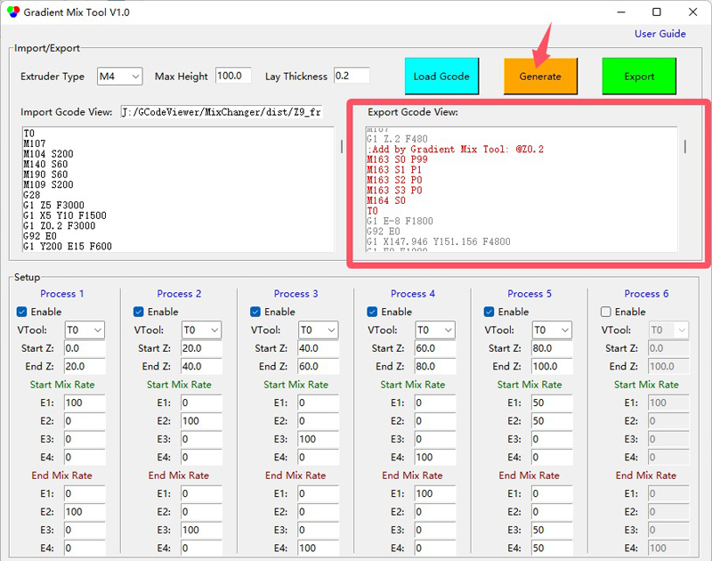

## <a id="choose-language">:globe_with_meridians: Choose language </a>

----
# Gradient Mix Tool
#### :warning: Questo strumento è attualmente applicabile solo alle stampanti 3D ZONESTAR a 4 estrusori con miscelazione dei colori (M4).
#### [:arrow_down: Download](https://github.com/ZONESTAR3D/Slicing-Guide/releases/tag/gmt-v1.2) 

----
## Manuale utente
### Breve
**Gradient Mix Tool** è un software di post-elaborazione GCode, sviluppato per regolare automaticamente il rapporto di miscelazione degli estrusori nell'altezza di stampa (direzione dell'asse Z). Può essere applicato alle stampanti 3D ZONESTAR con miscelazione dei colori.
**Gradient Mix Tool** consente di impostare fino a 6 ***Processi di gradiente***, ogni processo di gradiente può essere applicato a uno dei VTool utilizzati nel file GCode importato e impostare l'intervallo di altezza applicato e il rapporto di miscelazione degli estrusori iniziale e finale. È possibile applicare più processi contemporaneamente quando:
- I processi vengono applicati allo stesso VTool in intervalli di altezza diversi.
**Oppure:**
- I processi vengono applicati allo stesso intervallo di altezza sui diversi VTool. 

### Istruzioni per l'uso
#### 1. Scarica il software e decomprimilo sul tuo PC (un solo file exe).
#### 2. Esegui GradientMixToolVx.exe.

#### 3. Carica un file Gcode.
Il software formulerà automaticamente il file Gcode importato per ottenere l'altezza del modello, lo spessore del livello, il VTool utilizzato ecc. e aprirà una finestra di richiesta per mostrare queste informazioni.

#### 4. Imposta i parametri dei "processi".

#### 5. Fai clic sul pulsante Genera per generare un nuovo file gcode. Puoi vedere quali comandi Gcode sono stati aggiunti nella finestra ***Export***

Fare clic sui pulsanti SU e GIÙ della barra di scorrimento per individuare rapidamente la posizione precedente/successiva in cui inserire il Gcode.

#### 6. Fai clic sul pulsante Esporta per esportare e salvare in un nuovo file gcode.
Successivamente, puoi stampare il file Gcode esportato sulla tua stampante 3D ZONESTR Mix Color.

----
### Esempi
#### Esempio:one: [Spiral Vase :arrow_down:](./SpiralVase.zip)
Questo esempio mostra come convertire un file Gcode di un vaso a spirale monocolore in un file Gcode multi-gradiente:
- A 0~20 mm di altezza, gradiente dal colore dell'estrusore 1 al colore dell'estrusore 2.
- A 20~40 mm di altezza, gradiente dal colore dell'estrusore 2 al colore dell'estrusore 3.
- A 40~60 mm di altezza, gradiente dal colore dell'estrusore 3 al colore dell'estrusore 4.
- A 60~80mm di altezza, gradiente dal colore dell'estrusore 4 al colore dell'estrusore 1.
- Oltre 80mm di altezza, mantenere la miscela di colori dell'estrusore 1 e dell'estrusore 2 a circa 50:50. 

#### Esempio:two: [M4_4C_test :arrow_down:](./M4_4C_test.zip)
Questo esempio mostra come convertire un file Gcode di un modello di test a 4 colori in un file Gcode con gradienti per ogni colore:
- Il colore originale dell'estrusore 1 viene convertito in un colore che sfuma dall'estrusore 1 all'estrusore 2.
- Il colore originale dell'estrusore 2 viene convertito in un colore che sfuma dall'estrusore 2 all'estrusore 3.
- Il colore originale dell'estrusore 3 viene convertito in un colore che sfuma dall'estrusore 3 all'estrusore 4.
- Il colore originale dell'estrusore 4 viene convertito in un colore che sfuma dall'estrusore 4 all'estrusore 1.
