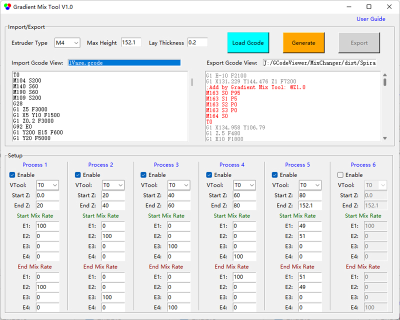

## <a id="choose-language">:globe_with_meridians: Choose language </a>

----
# Gradient Mix Tool
#### :warning: このツールは現在、ZONESTAR 4 エクストルーダー カラー ミキシング 3D プリンター (M4) にのみ適用できます。
#### [:arrow_down: ダウンロード](https://github.com/ZONESTAR3D/Slicing-Guide/releases/tag/gmt-v1.2) 

----
## ユーザー ガイド
### 概要
**Gradient Mix Tool** は、印刷高さ (Z 軸方向) におけるエクストルーダーの混合比を自動的に調整するために開発された GCode 後処理ソフトウェアです。ZONESTAR カラー ミキシング カラー 3D プリンターに適用できます。
**Gradient Mix Tool** を使用すると、最大 6 つの ***Gradient Processes*** を設定できます。各グラデーション プロセスは、インポートされた GCode ファイルで使用される VTool の 1 つに適用でき、適用する高さの範囲と開始および終了のエクストルーダー混合比を設定できます。次の場合に、複数のプロセスを同時に適用できます。
- プロセスが異なる高さの範囲で同じ VTool に適用されます。
**または:**
- プロセスが異なる VTool の同じ高さの範囲に適用されます。

### 使用手順
#### 1. ソフトウェアをダウンロード し、PC に解凍します (exe ファイルは 1 つだけ)。
#### 2. GradientMixToolVx.exe を実行します。

#### 3. Gcode ファイルを読み込みます。
ソフトウェアは、インポートした Gcode ファイルを自動的にフレーズして、モデルの高さ、レイヤーの厚さ、使用する VTool などを取得し、これらの情報を表示するプロンプト ボックスをポップアップ表示します。

#### 4. 「プロセス」のパラメータを設定します。

#### 5. [生成] ボタンをクリックして、新しい gcode ファイルを生成します。
***Gcode ビューのエクスポート*** ウィンドウで、追加された Gcode コマンドを確認できます

#### 6. [エクスポート] ボタンをクリックして、新しい gcode ファイルにエクスポートして保存します。
次に、エクスポートした Gcode ファイルを ZONESTR Mix Color 3D プリンターで印刷できます。

----
### 例
#### 例:one: [Spiral Vase :arrow_down:](./SpiralVase.zip)
この例は、1 色のスパイラル花瓶 Gcode ファイルをマルチグラデーション Gcode ファイルに変換する方法を示しています:
- 高さ 0~20mm で、押し出し機 1 の色から押し出し機 2 の色へのグラデーション。
- 高さ 20~40mm で、押し出し機 2 の色から押し出し機 3 の色へのグラデーション。
- 高さ 40~60mm で、押し出し機 3 の色から押し出し機 4 の色へのグラデーション。
- 60～80mmの高さでは、押出機4の色から押出機1の色にグラデーションをかけます。
- 80mm以上の高さでは、押出機1と押出機2の色の混合比を約50:50に保ちます。

#### 例:two: [M4_4C_test :arrow_down:](./M4_4C_test.zip)
この例は、4 色のテスト モデルの Gcode ファイルを各色のグラデーションを含む Gcode ファイルに変換する方法を示しています:
- 押し出し機 1 の元の色は、押し出し機 1 から押し出し機 2 にグラデーションする色に変換されます。
- 押し出し機 2 の元の色は、押し出し機 2 から押し出し機 3 にグラデーションする色に変換されます。
- 押し出し機 3 の元の色は、押し出し機 3 から押し出し機 4 にグラデーションする色に変換されます。
- 押し出し機 4 の元の色は、押し出し機 4 から押し出し機 5 にグラデーションする色に変換されます。 1.
