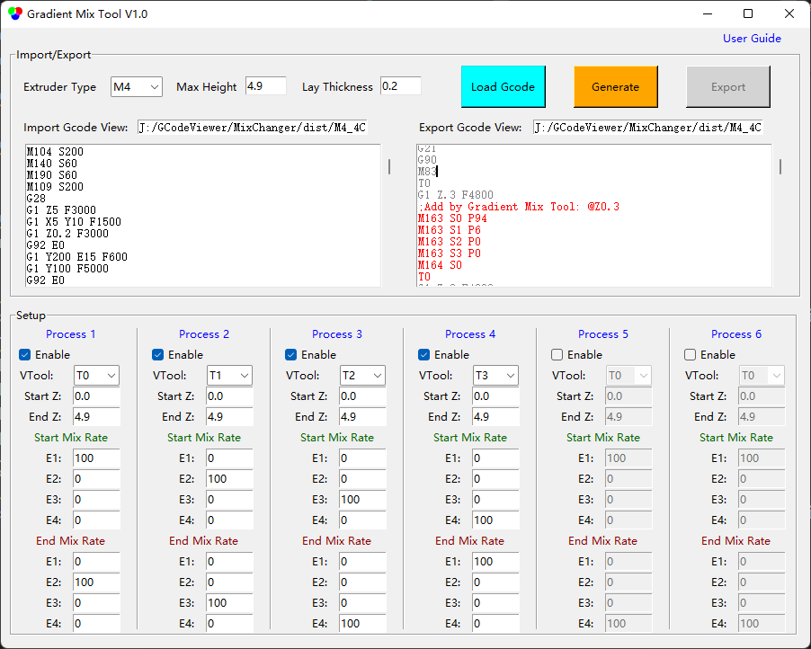

## <a id="choose-language">:globe_with_meridians: Choose language </a>

----
# Gradient Mix Tool
#### :warning: Этот инструмент в настоящее время применим только к 3D-принтерам ZONESTAR с четырьмя экструдерами для смешивания цветов (M4).
## :arrow_down: Загрузить 
### [Загрузить (для Windows)](GradientMixToolV1.zip)
<!-- ### :arrow_down:[Загрузить (for Linux)]() -->

----
## Руководство пользователя
### Краткое описание
**Gradient Mix Tool** — это программное обеспечение для постобработки GCode, разработанное для автоматической регулировки соотношения смешивания экструдеров по высоте печати (направление оси Z). Его можно применять к 3D-принтерам ZONESTAR с функцией смешивания цветов.
**Gradient Mix Tool** позволяет настроить до 6 ***процессов градиента***, каждый процесс градиента можно применить к одному из VTools, используемых в импортированном файле GCode, и задать применяемый диапазон высот и начальное и конечное соотношение смешивания экструдера. Возможно применять несколько процессов одновременно, когда:
- Процессы применяются к одному и тому же VTool в разном диапазоне высот.
**Или:**
- Процессы применяются к одному и тому же диапазону высот на разных VTools.

### Инструкции по использованию
#### 1. Загрузить программное обеспечение и распаковать его на свой ПК (только один exe-файл).
#### 2. Запустить GradientMixToolVx.exe.

#### 3. Загрузите файл Gcode.
Программное обеспечение автоматически сформулирует импортированный файл Gcode, чтобы получить высоту модели, толщину слоя, используемый VTool и т. д., и выведет всплывающее окно с подсказкой, чтобы показать эту информацию.

#### 4. Задайте параметры «процессов».

#### 5. Нажмите кнопку «Сгенерировать», чтобы сгенерировать новый файл Gcode.
Вы можете увидеть, какие команды Gcode были добавлены в окне ***export Gcode view***

#### 6. Нажмите кнопку Export, чтобы экспортировать и сохранить в новый файл Gcode.
Далее вы можете распечатать экспортированный файл Gcode на вашем 3D-принтере ZONESTR Mix Color.

----
### Примеры
#### Пример:one: [Спиральная ваза :arrow_down:](./SpiralVase.zip)
В этом примере показано, как преобразовать файл Gcode одноцветной спиральной вазы в файл Gcode с несколькими градиентами:
- На высоте 0~20 мм градиент от цвета экструдера 1 к цвету экструдера 2.
- На высоте 20~40 мм градиент от цвета экструдера 2 к цвету экструдера 3.
- На высоте 40~60 мм градиент от цвета экструдера 3 к цвету экструдера 4.
- На высоте 60~80 мм градиент от цвета экструдера 4 к цвету экструдера 1.
- Выше 80 мм сохраняйте цветовую смесь экструдера 1 и экструдера 2 примерно 50:50.

#### Пример:two: [M4_4C_test :arrow_down:](./M4_4C_test.zip)
В этом примере показано, как преобразовать файл Gcode тестовой модели из 4 цветов в файл Gcode с градиентами для каждого цвета:
- Исходный цвет экструдера 1 преобразуется в цвет, который градиентно переходит от экструдера 1 к экструдеру 2.
- Исходный цвет экструдера 2 преобразуется в цвет, который градиентно переходит от экструдера 2 к экструдеру 3.
- Исходный цвет экструдера 3 преобразуется в цвет, который градиентно переходит от экструдера 3 к экструдеру 4.
- Исходный цвет экструдера 4 преобразуется в цвет, который градиентно переходит от экструдера 4 к экструдеру 1.
