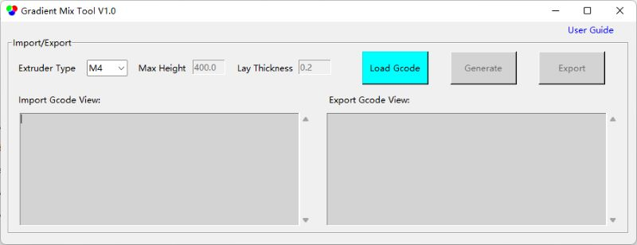

## <a id="choose-language">:globe_with_meridians: Choose language </a>

----
# Gradient Mix Tool
#### :warning: This tool is currently only applicable to ZONESTAR 4-extruder color mixing 3D printers (M4).
#### [:arrow_down: Download](https://github.com/ZONESTAR3D/Slicing-Guide/releases/tag/gmt-v1.2) 

----
## :book:User Guide
### Brief
**Gradient Mix Tool** is a GCode post-processing software, which developed to automatically adjust the extruders' mixing ratio in the printing height (Z-axis direction). It can be applied to ZONESTAR color mixing color 3D printers.    
**Gradient Mix Tool** allows to set up to 6 ***Gradient Processes***, each gradient process can be applied to one of the VTools used in the imported GCode file,  and set the applied height range and the starting and ending extruder mixing ratio. It is possible to apply multiple processes simultaneously when:    
  - The processes are applied to the same VTool in different height range.  
  **Or:**   
  - The processes are applied to the same height range on the different VTools.
### Use Instructions
#### 1. Download the software and unzip it to your PC (only one exe file).
#### 2. Execute GradientMixToolVx.exe.

#### 3. Load Gcode file.
The software will automatically phrase the imported Gcode file to get the model's height, layer thickness, VTool used etc., and pop up a prompt box to show these information.

#### 4. Set parameters of the "processes".

#### 5. Click Generate button to generate a new gcode file.
You can see which Gcode commands have been added in the ***export Gcode view*** window

#### 6. Click Export button to export and save to a new gcode file.
Next, you can print the exported Gcode file on your ZONESTR Mix Color 3D Printer.

----
### Examples
#### Example:one: [Spiral Vase :arrow_down:](./SpiralVase.zip)
This example shows how to convert a one color spiral vase Gcode file into a multi-gradient Gcode file:
- At 0~20mm height, gradient from extruder 1 color to extruder 2 color. 
- At 20~40mm height, gradient from extruder 2 color to extruder 3 color. 
- At 40~60mm height, gradient from extruder 3 color to extruder 4 color. 
- At 60~80mm height, gradient from extruder 4 color to extruder 1 color. 
- Above 80mm height, keep the color mixture of extruder 1 and extruder 2 about 50:50.

#### Example:two: [M4_4C_test :arrow_down:](./M4_4C_test.zip)
This example shows how to convert a 4-color test model Gcode file into a Gcode file with gradients for each color:
- The original color of extruder 1 is converted to a color that gradients from extruder 1 to extruder 2.
- The original color of extruder 2 is converted to a color that gradients from extruder 2 to extruder 3.
- The original color of extruder 3 is converted to a color that gradients from extruder 3 to extruder 4.
- The original color of extruder 4 is converted to a color that gradients from extruder 4 to extruder 1.
