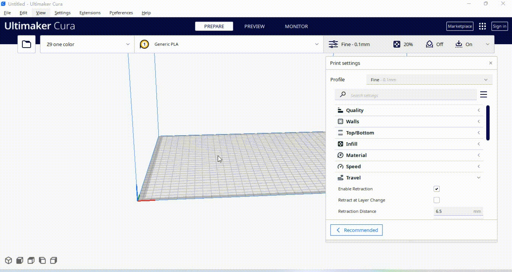
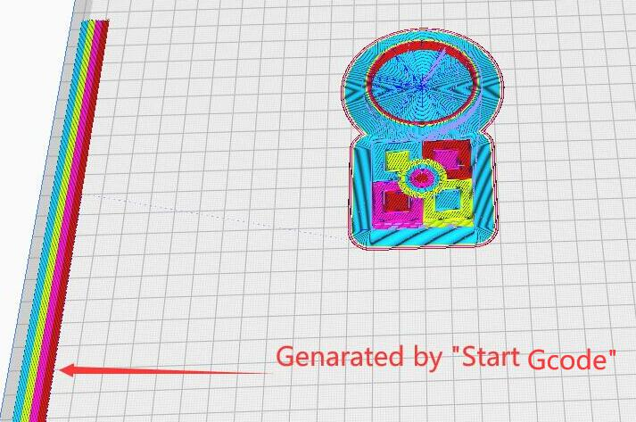

## Slicing guide for E4 hotend with Cura Slicer
Use ***Z9 with E4 hotend*** as an exmple.
### Prepare
- **Add printer** 

- **Take a look the 'machine Start/End gcode' and 'exturder Start/End gcode'** 
    
For details about the ***machine Start/End gcode***  and ***exturder Start/End gcode***, please refer :point_down:[here](#about-start-and-end-gcode)

-----------
### About start and end gcode
#### Start Gcode of Machine
In the ***Start Gcode*** of the machine, In addition to the "common" homing and temperature setting gcode,  also adds some codes for preloading filament for multi colos 3d printer.
>
    ; common homing and  temperature setting gcode
    M220 S100 ;Reset Feedrate
    M221 S100 ;Reset Flowrate
    G28 ;Home
    G21
    G90
    G1 Z5 F600
    G1 X5 Y10 F1500
    G1 Z0.3 F600

    ;Pre-load filament gcodes for E4 hotend
    ;===Pre-load filament start
    T0
    G92 E0
    G1 E20 F120
    G0  X5 Y50 F1200
    G1 Y250 E35
    G0  X5.5
    G1 Y50 E50
    G0  X6
    G1 Y250 E65
    G0  X6.5
    G1 Y50 E80
    G0  X7
    G1 Y250 E95
    G0  X7.5
    G1 Y50 E110
    G0  X8
    G92 E0
    G1 E-80 F3000
    G92 E0
    T1
    G92 E0
    G1 E20 F120
    G0  X8 Y50 F1200
    G1 Y250 E35
    G0  X8.5
    G1 Y50 E50
    G0  X9
    G1 Y250 E65
    G0  X9.5
    G1 Y50 E80
    G0 X10
    G1 Y250 E95
    G0 X10.5
    G1 Y50 E110
    G0 X11
    G92 E0
    G1 E-80 F3000
    G92 E0
    T2
    G92 E0
    G1 E20 F120
    G0 X11 Y50 F1200
    G1 Y250 E35
    G0 X11.5
    G1 Y50 E50
    G0 X12
    G1 Y250 E65
    G0 X12.5
    G1 Y50 E80
    G0 X13
    G1 Y250 E95
    G0 X13.5
    G1 Y50 E110
    G0 X14
    G92 E0
    G1 E-80 F3000
    G92 E0
    T3
    G92 E0
    G1 E20 F120
    G0 X14 Y50 F1200
    G1 Y250 E35
    G0 X14.5
    G1 Y50 E50
    G0 X15
    G1 Y250 E65
    G0 X15.5
    G1 Y50 E80
    G0 X16
    G1 Y250 E95
    G0 X16.5
    G1 Y50 E110
    G0 X17
    G0 Y155 F4800
    G92 E0
    G1 E-80 F3000
    G92 E0
    ;===Pre-load filament end
  The ***Pre-load filament gcodes*** is for printing some lines on side of the bed before starting to print the 3d model, to confirm whether the filaments are correctly loaded to the extruders and hot end.  

#### End Gcode of Machine 
***End gcode*** is almost the same as other machines, except that two commands "G92 E0 and G1 E-45 F2100" are added to unload (the last used) filament from the hot end.
>
    ;unload the filament from hot end
    G92 E0
    G1 E-45 F2100
  
    G28 XY
    M106 S0 ;Turn-off fan
    M104 S0 ;Turn-off hotend
    M140 S0 ;Turn-off bed
    M84 X Y E ;Disable all steppers but Z

#### Exturder Start/End gcode of E4 hotend
The ***Extruder Start/End gcode*** is used to load and unload the filament when switching the extruder.
- Extruder 1 start gcode.
>
    ;These commands are for load filament of extruder #1 to the nozzle of hot end
    T0
    G92 E0
    G1 E20 F2100
    G1 E45 F1200
    G1 E65 F1800
    G1 E80 F600
    G92 E0
- Extruder 1 end gcode
>
    ;These commands are for unload filament of extruder #1 from the nozzle of hot end
    T0
    G92 E0
    G1 E-80 F3000
    G92 E0
- Extruder 2 start gcode.
>
    ;These commands are for load filament of extruder #2 to the nozzle of hot end
    T1
    G92 E0
    G1 E20 F2100
    G1 E45 F1200
    G1 E65 F1800
    G1 E80 F600
    G92 E0
- Extruder 2 end gcode
>
    ;These commands are for unload filament of extruder #2 from the nozzle of hot end
    T1
    G92 E0
    G1 E-80 F3000
    G92 E0
- Extruder 3 start gcode    
>
    ;These commands are for load filament of extruder #3 to the nozzle of hot end
    T2
    G92 E0
    G1 E20 F2100
    G1 E45 F1200
    G1 E65 F1800
    G1 E80 F600
    G92 E0
- Extruder 3 end gcode
>
    ;These commands are for unload filament of extruder #3 from the nozzle of hot end
    T2
    G92 E0
    G1 E-80 F3000
    G92 E0
- Extruder 4 start gcode    
>
    ;These commands are for load filament of extruder #4 to the nozzle of hot end
    T3
    G92 E0
    G1 E20 F2100
    G1 E45 F1200
    G1 E65 F1800
    G1 E80 F600
    G92 E0
- Extruder 4 end gcode
>
    ;These commands are for unload filament of extruder #4 from the nozzle of hot end
    T3
    G92 E0
    G1 E-80 F3000
    G92 E0