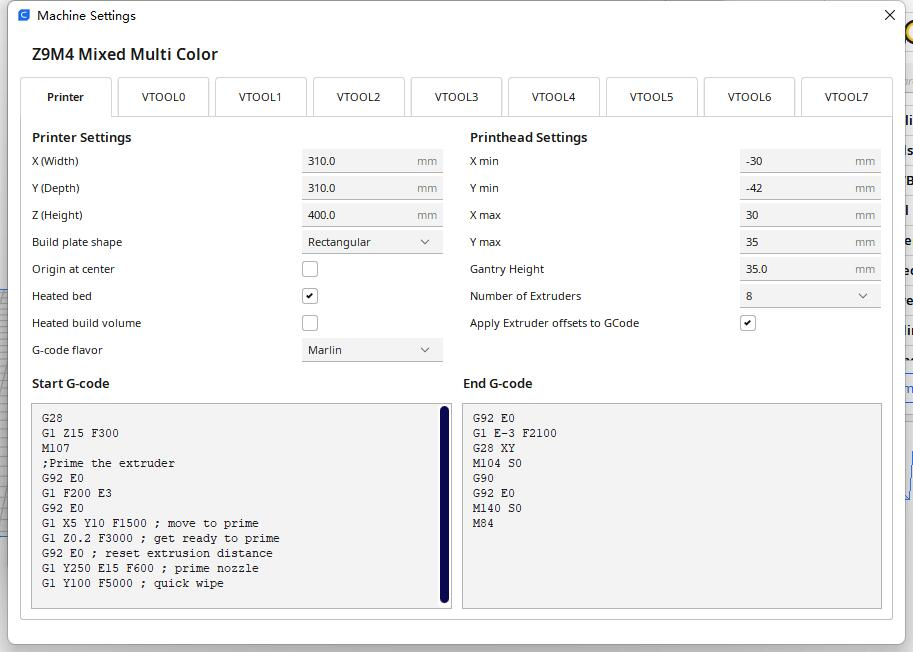
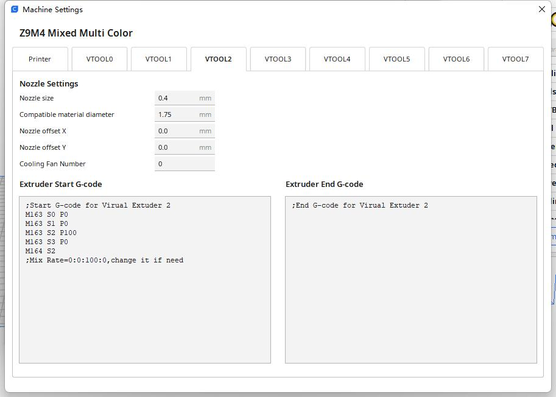
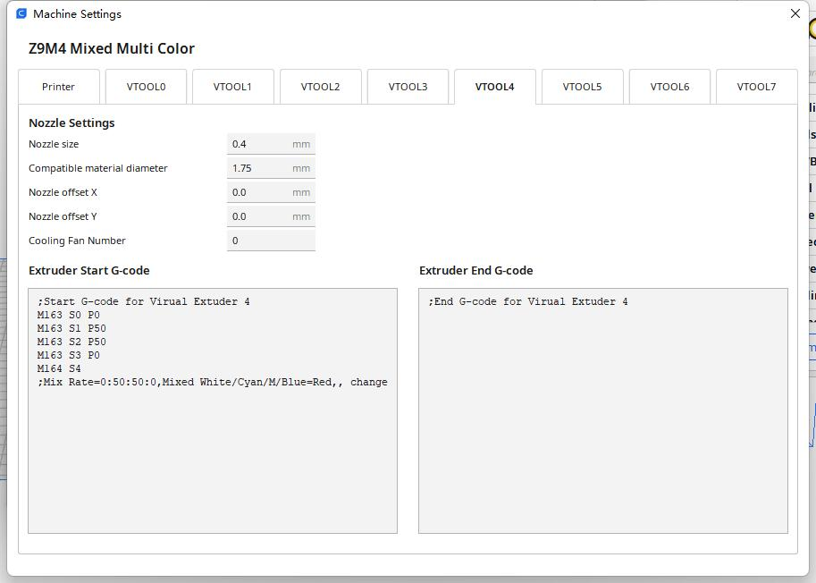
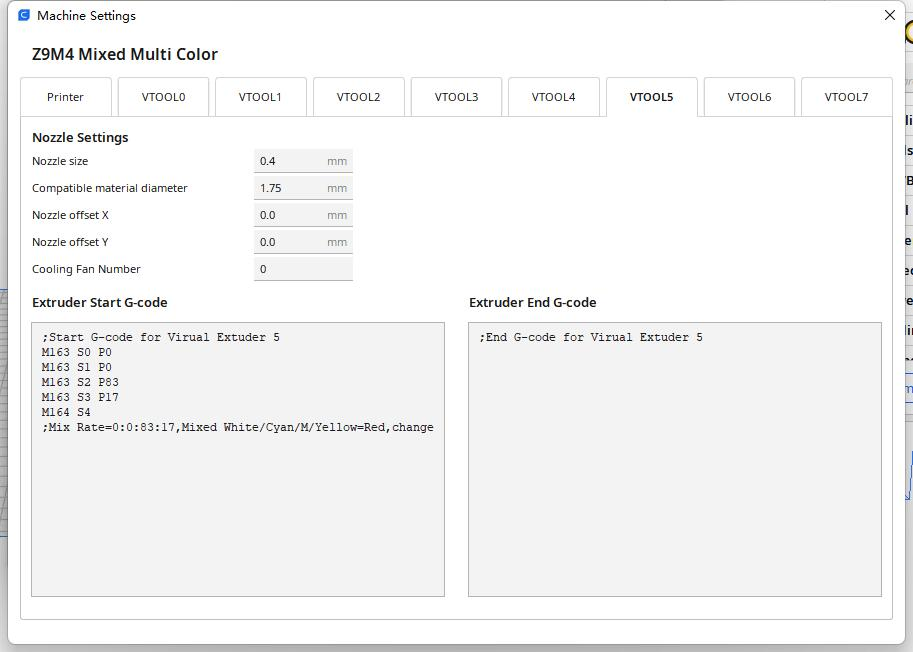
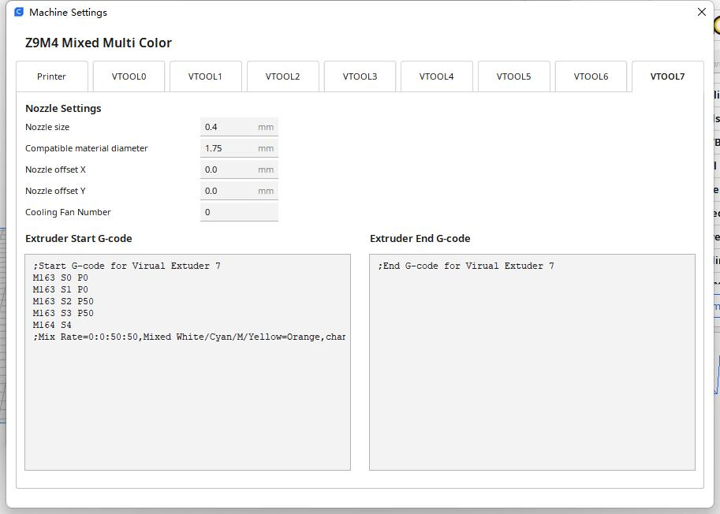

## Slicing guide for Z8/Z9 with M4 hotend
- [:blue_book:Slicing guide pdf file](./SlicingGuide_V2_1.pdf)   
- :movie_camera: [**slicing 4 colors 3d object (Z9 + M4 hotend)**](https://youtu.be/hP6Socp-Cz0)    
- :movie_camera: [**slicing 8 colors 3d object (Z9 + M4 hotend)**](https://youtu.be/qQ6UnTysqK0) 

  
## Machine Setting Reference
    
    
    
    
    
    
    
    
    
