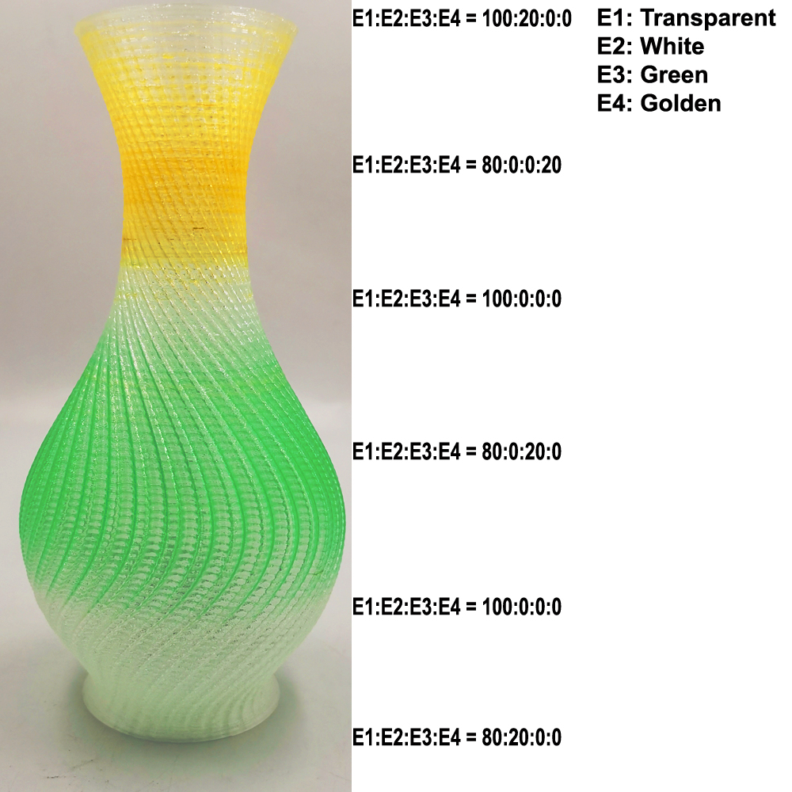

### Language / Translate

-----
## ZONESTAR Cura Plugins
### How to install the cura Plugins
- **Step 1**: Download [:arrow_down: **ZONESTAR Cura Plugin**](./ZONESTAR_Cura_plugin.zip) to your PC and unzip it.
- **Step 2**: Copy the "[**ZonestarGradientMix.py**](./ZonestarGradientMix.py)" and "[**ColorSwitchTower_V1_1_0.py**](./ColorSwitchTower_V1_1_0.py)" to the cura plugin installation directory.    
:pushpin: For **Cura 5.x.x**, resource files store in ***"{Cura installed directory}\share\cura\plugins\PostProcessingPlugin\scripts"(e.g.:C:\Program Files\Ultimaker Cura 5.1.0\share\cura\plugins\PostProcessingPlugin\scripts)***         
:pushpin: For **Cura 4.x.x**, resource files store in ***"{Cura installed directory}\plugins\PostProcessingPlugin\scripts"(e.g.:C:\Program Files\Ultimaker Cura 4.13.1\plugins\PostProcessingPlugin\scripts)***  

### ZonestarGradientMix - Gradient Mix Color Plugin 
By using this plug-in, you can make more abundant gradient 3D models (change at Z axis), as shown in the following picture. **This plug in can be used to all of the ZONESTAR 3d printer with mixing color hotend**, for exmaple: M8R2, D805SM2, Z5SM2, Z8XM2(3), Z8T, Z8PM3(4), Z9M2, Z9M3, Z9M4, Z10M2, Z9V5 with m4 hotend, etc..   
You may already know how to start the [**"automatic gradient mix color"**]() function on the LCD screen to print a gcode file with single color into a gradient mix color 3D model. However, using this function of LCD can only process one time gradient. If you want to get more rich gradient effects (multiple gradients), you can use this plug-in.

#### Settings of Gradient Mix Color Plugin
- **Extruders:** The actual number of extruders of your printer, e.g., Z9M2 = 2, Z9M3 = 3, Z9V5 = 4.
- **Segments:** Number of segments, that is, the times you want to achieve different gradient changes at Z axis.
- **Units:** Unit of starting and ending height (layer or mm).
- **Segment n Start Height**: The start height of this segment.
- **Segment n End Height**: The end height of this segment.
- **Ex Start weight -Sn**: Ratio of Extruder "x" at the beginning of the "segment n".
- **Ex End weight -Sn**: Ratio of Extruder "x" at the end of the "segment n".
- **Joint with end of segment n**: If this selection box is enabled, the mixing ratio of extruders at the start height of this segment will be the same as the end of previous segment.

#### Example 1: 

##### 1. Sketch out
  - **Filament color:** E1: Transparent, E2: white, E3: Green, E4: Yellow    
  
##### 2. Slicing settings
  - **Printer: Z9 one color**   
  - **Layer thickness: 0.2mm**   
    
  - **Top Layer: 0**   
  - **Bottom Layer: 4** 
  - **Infill: 0**    
     
  - **Nozzle temperature: 205**   
  - **Bed temperature: 60** 
  - **Print speed: 60mm/s**   
  - **Wall speed: 50mm/s**    
      
  - **Spirlize Outer  Contour: enabled**   
      
##### 3. Plugin settings 
  - :movie_camera:[**Video tutorial**](./plugin_setting.gif)
      
##### 4. File download 
- [STL file :arrow_down:](./Vase0.zip) 
- [Gcode file :arrow_down:](./M4_Vase.zip)

### ColorSwitchTower- Color Switch Tower Plugin
:warning:This plug-in is applicable to the older version of Cura. Now we recommend using the built-in "Prime Tower" of Cura.  

