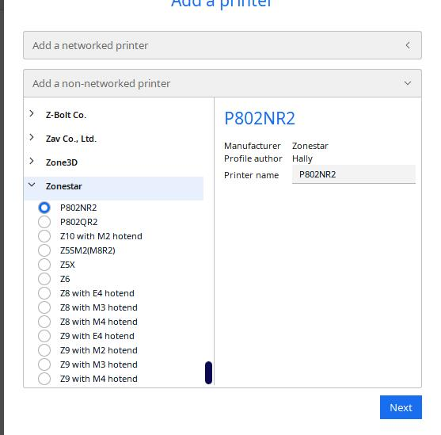

## Install Cura and import ZONESTAR 3d printer profiles
 
### :movie_camera: [***Video tutorial***](https://youtu.be/h2GynyUo7wQ).    
### Following the below steps to install cura and then import the ZONESTAR 3d printer profiles:  
- **Step 1**:  :arrow_down: Download and install  [**Cura software**](https://github.com/Ultimaker/Cura/releases)
- **Step 2**:  :arrow_down: Download [**Zonestar 3D Printer Profiles**](./ZONESTAR_Cura_resources.zip). 
- **Step 3**:   Unzip ***ZONESTAR_Cura_Resource.zip*** to your PC and then copy the "resource" files to the cura installation directory.     
:warning: For **Cura 5.x.x**, resource files store in ***"{Cura installed directory}\share\cura\resource"(e.g.:C:\Program Files\Ultimaker Cura 5.1.0\share\cura\resource)***         
:warning: For **Cura 4.x.x**, resource files store in ***"{Cura installed directory}\resource"(e.g.:C:\Program Files\Ultimaker Cura 4.13.1\resource)***     
- **Step 4**: Run cura, you can find the Zonestar printers in the list while you choose "add mechine" in cura.    

##### :star2: If your printer is not in the machine list of Cura, please select your printer according to the following table  
|           Your Printer         |         Machine in Cura         |  
|--------------------------------|---------------------------------|  
|            Z8M2                |        Z10 with M2 hotend       |
|            Z9M4                |        Z9  with M4 hotend       |
|        Z9V5-MK1                |        Z9  with M4 hotend       |
|        Z9V5-MK2                |        Z9  with M4 hotend       |
|        Z9V5-MK3                |        Z9  with M4 hotend       |
|        Z9V5-MK4                |        Z9  with E4 hotend       |  

- :green_book: [**What is resources files**](https://github.com/Ultimaker/Cura/wiki/Definition-Files-Explained)  
- :green_book: [**Cura user guide**](https://support.ultimaker.com/hc/en-us/categories/360002327600-Software)    

### Slicing Guide and video tutorial for ZONESTAR 3D Printer
- :movie_camera: [**Install and setup Cura**](https://youtu.be/h2GynyUo7wQ)   
- :movie_camera: [**slicing 1 color 3d object (Z9V5 + M4 hotend)**](https://youtu.be/UDgjGRFrELc)   
- :movie_camera: [**slicing 4 colors 3d object (Z9V5 + M4 hotend)**](https://youtu.be/hP6Socp-Cz0)    
- :movie_camera: [**slicing 8 colors 3d object (Z9V5 + M4 hotend)**](https://youtu.be/qQ6UnTysqK0)  

------------
### Test gcode files
Example gcode and stl files.  
:point_right: [***More examples for M4(4-IN-1-OUT mixing color) hotend***](https://github.com/ZONESTAR3D/Upgrade-kit-guide/tree/main/HOTEND/M4%20%204-IN-1-OUT%20Mixing%20Color%20Hotend)  
:point_right: [***More examples for E4((4-IN-1-OUT non-mixing color)) hotend***](https://github.com/ZONESTAR3D/Upgrade-kit-guide/tree/main/HOTEND/E4%204-IN-1-OUT%20Non-Mixing%20Color%20Hotend)  
#### Settings for R3 hotend 
User guide for Cura slicing process of R3 hotend   
More hotend user guide, please refer to :point_right: [***More hotend user guide***](https://github.com/ZONESTAR3D/Upgrade-kit-guide/tree/main/HOTEND)  
### How to downlod files from Github page
#### Step 1: Click this link [**https://downgit.github.io/**](https://downgit.github.io/) 
#### Step 2: Copy the Github file or direcotry link which you want to download.
#### Step 3: Click download button and wait a few seconds, it will start to download automatically. 
   