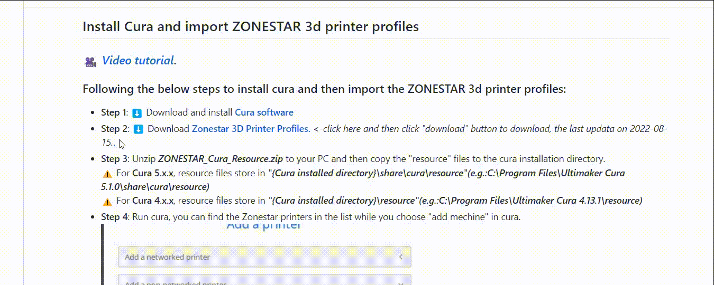
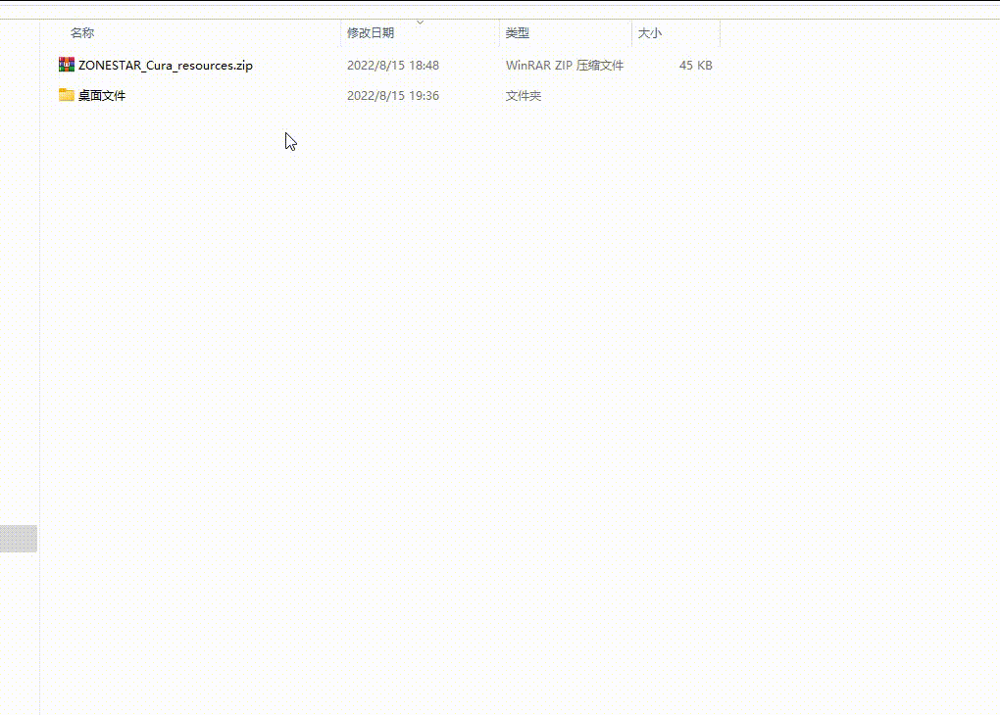
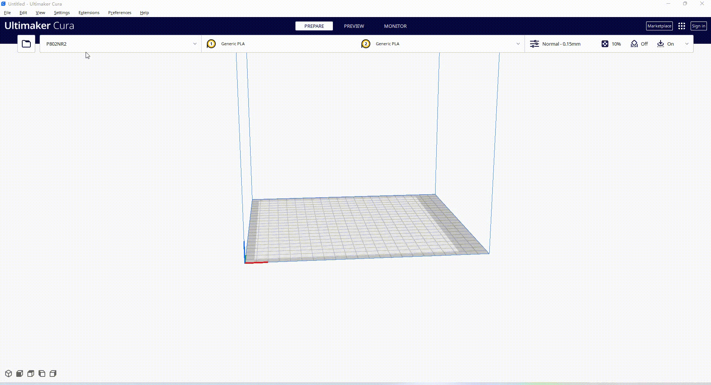
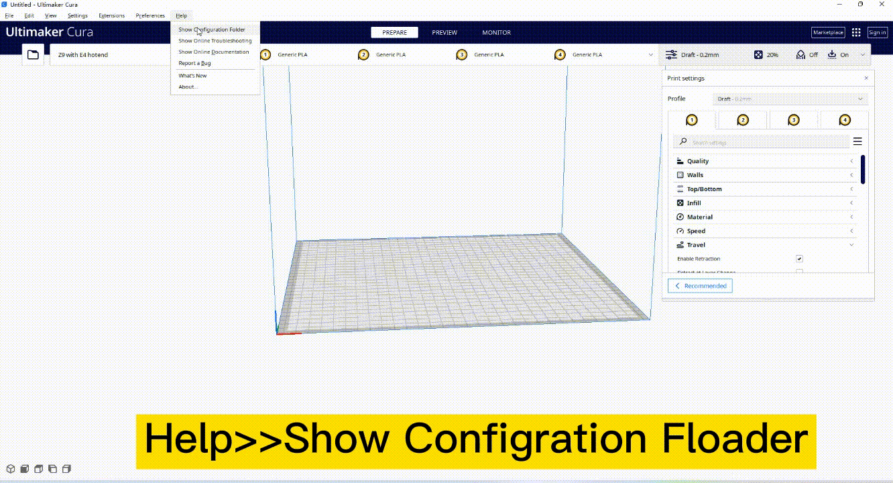

### :warning: On what operating systems is Ultimaker Cura available? please refre to [this link](https://support.makerbot.com/s/article/1667337917781)

-----
### How to install Cura and import ZONESTAR 3d printer profiles
#### Step 1: Install Cura and download ZONESTAR 3d printer profiles
Following the below steps to install cura and then import the ZONESTAR 3d printer profiles:  
- [:arrow_down: **Download Cura software**](https://github.com/Ultimaker/Cura/releases/download/5.4.0/UltiMaker-Cura-5.4.0-win64.exe) and install it to your PC.
- [:arrow_down: **Download Zonestar 3D Printer Profiles.**](https://github.com/ZONESTAR3D/Slicing-Guide/blob/master/cura/ZONESTAR_Cura_resources.zip) *:point_left:Click here and then click "download" button. the last updata on 2023-11-08*.   
  
#### Step 2: Import ZONESTAR 3d printer profiles
 Unzip ***ZONESTAR_Cura_Resource.zip*** to your PC and then copy the "resource" files to the cura installation directory.    
:pushpin: Resource files store in ***"{Cura installed directory}\share\cura\resource"***    
  
 Unzip ***ZONESTAR_Cura_Resource.zip*** to your PC and then copy the "resource" files to the cura installation directory.    
:pushpin: you need to copy the files in "defintions", "extruders" and "materials" folders to the same folders, but can't copy "resuorce" folder directory.
    

#### Step 3: Choose machine and setting
Run cura, you can find the Zonestar printers in the list while you choose "add mechine" in cura.    

#### :warning: If you have installed Zonestar 3D printer profiles or an older vresion Cura, you need to delete the older "configura" before importing the profiles.
   

-----  
### You need to choose different printer model on Cura when you slicing one color or multi colors 3d models, please refer to the below table:
|   Printer model                                 |Printing Colors | Choose printer in Cura |
|-------------------------------------------------|----------------|------------------------|
| P802 series                                     | 1~2 color      | P802Q with R2 Hotend   |
| Z6                                              | 1 color        | ZONESTAR Z6            |
| Z5M2/M8R2                                       | 1~2 color      | Z5 wiht M2 Hotend      |
| Z5M2/M8R2                                       | 3~8 color      | Z5M2 mixed multi color |
| Z5 with R2S Hotend                              | 1~2 color      | Z5 with R2S Hotend     |
| Z5X                                             | 1 color        | ZONESTAR Z5X           |
| Z5XM2/Z8XM2/Z8SM2/Z10M2                         | 1~2 color      | Z10 wiht M2 Hotend     |
| Z5XM2/Z8XM2/Z8SM2/Z10M2                         | 3~8 color      | Z10M2 mixed multi color|
| Z8SM3/Z8T/Z8PM3                                 | 1~3 color      | Z8 wiht M3 Hotend      |
| Z8SM3/Z8T/Z8PM3                                 | 4~8 color      | Z8M3 mixed multi color |
| Z8PM4/Z8PM4Pro                                  | 1~4 color      | Z8 wiht M4 Hotend      |
| Z8PM4/Z8PM4Pro                                  | 5~8 color      | Z8M4 mixed multi color |
| Z8E4(2)                              | 1~4 color      | Z8 with E4 Hotend      |
| Z9M2                                            | 1~2 color      | Z9 wiht M2 Hotend      |
| Z9M2                                            | 3~8 color      | Z9M2 mixed multi color |
| Z9M3                                            | 1~3 color      | Z9 wiht M3 Hotend      |
| Z9M3                                            | 4~8 color      | Z9M3 mixed multi color |
| Z9M4/Z9V5-MK1/MK2/MK3/MK5/MK6(3)     | 1~4 color      | Z9 wiht M4 Hotend      |
| Z9M4/Z9V5-MK1/MK2/MK3/MK5/MK6(3)     | 5~8 color      | Z9M4 mixed multi color |
| Z9V5-MK4(4)                          | 1~4 color      | Z9 wiht E4 Hotend      |
#### Note 
1. P802 series included these models: P802C/P802M/P802N/P802NR2/P802Q/P802QS/P802QR2.
2. Z8E4 means Z8PM4 Upgraded a E4 hot end
3. The printer model was **Z9M4** and **Z9V5-MK1/MK2/MK3/MK5/MK6**, or the printer model was Z9V5-MK4 but you **changed the orignal hot end to a M4 hot end**.
4. The printer model was **Z9V5-MK4**, or the printer model was Z9M4 and Z9V5-MK1/MK2/MK3/MK5/MK6 but you **changed the orignal hot end to a E4 hot end**.

#### About hotend type
- **R2 hotend:  2-IN-2-OUT hotend** :point_right:[setting reference](./R2_Hotend/)    
- **R2S hotend: 2-IN-1-OUT hotend, shared one heater** :point_right:[setting reference](./R2S_Hotend/)    
- **M2 hotend: 2-IN-1-OUT mix color hotend** :point_right:[setting reference](./M2_Hotend/)    
- **R3 hotend: 3-IN-3-OUT hotend, shared one heater** :point_right:[setting reference](./R3_hotend/)    
- **M3 hotend: 3-IN-1-OUT mix color hotend** :point_right:[setting reference](./M3_Hotend/)    
- **M4 hotend: 4-IN-1-OUT mix color hotend** :point_right:[setting reference](./M4_Hotend/)        
- **E4 hotend: 4-IN-1-OUT non-mix color hotend** :point_right:[setting reference](./E4_Hotend/)      
For more information of the hotend, please refer to [**here**](https://github.com/ZONESTAR3D/Upgrade-kit-guide/tree/main/HOTEND).

-----  
### Slicing guide for Z8/Z9 3D Printer
:warning: If you don't know what's different between E4 and M4 hotend, please refder to [**:arrow_right:this guide**](https://github.com/ZONESTAR3D/Upgrade-kit-guide/tree/main/HOTEND/FAQ_M4E4.md).
#### :book:Slicing guide for Z8/Z9 with M4 hotend
:pushpin: Default Z8PM4(Pro), Z9V5Pro-MK1/MK2/MK3/MK5/MK6 equipped with a M4 hotend, please refer to the below video tutorial to slicing:
- :movie_camera: [**slicing 4 colors 3d object (Choose Machine: Z8(Z9) wiht M4 Hotend)**](https://youtu.be/hP6Socp-Cz0)    
- :movie_camera: [**slicing 8 colors 3d object (Choose Machine: Z8M4(Z9M4) mixed multi color)**](https://youtu.be/qQ6UnTysqK0)  
#### :book:Slicing guide for Z8/Z9 with E4 hotend
:pushpin: Default Z9V5Pro-MK4 equiped with a E4 hotend, please refer to the below video tutorial to slicing:
- :book: [**Slicing 4 colors 3d object (Z9 + E4 hotend)**](./E4_hotend/readme.md)

-----
### Test gcode files
[**Example gcode and stl files.**](./test-gcode-file/readme.md)    
:point_right: [***More examples for M4(4-IN-1-OUT mix color) hotend***](https://github.com/ZONESTAR3D/Upgrade-kit-guide/tree/main/HOTEND/M4%20%204-IN-1-OUT%20Mixing%20Color%20Hotend)  
:point_right: [***More examples for E4((4-IN-1-OUT non-mix color)) hotend***](https://github.com/ZONESTAR3D/Upgrade-kit-guide/tree/main/HOTEND/E4%204-IN-1-OUT%20Non-Mixing%20Color%20Hotend)  
### Settings for R3 hotend 
User guide for Cura slicing process of R3 hotend   
More hotend user guide, please refer to :point_right: [***More hotend user guide***](https://github.com/ZONESTAR3D/Upgrade-kit-guide/tree/main/HOTEND)  

-----
## [ZONESTAR Cura Plugins](./plugins/readme.md)
We have made some plug-ins so that you can better (simplier) use some functions of our 3d printer, for details, please refer to :point_right:[**here**](./plugins/readme.md)
