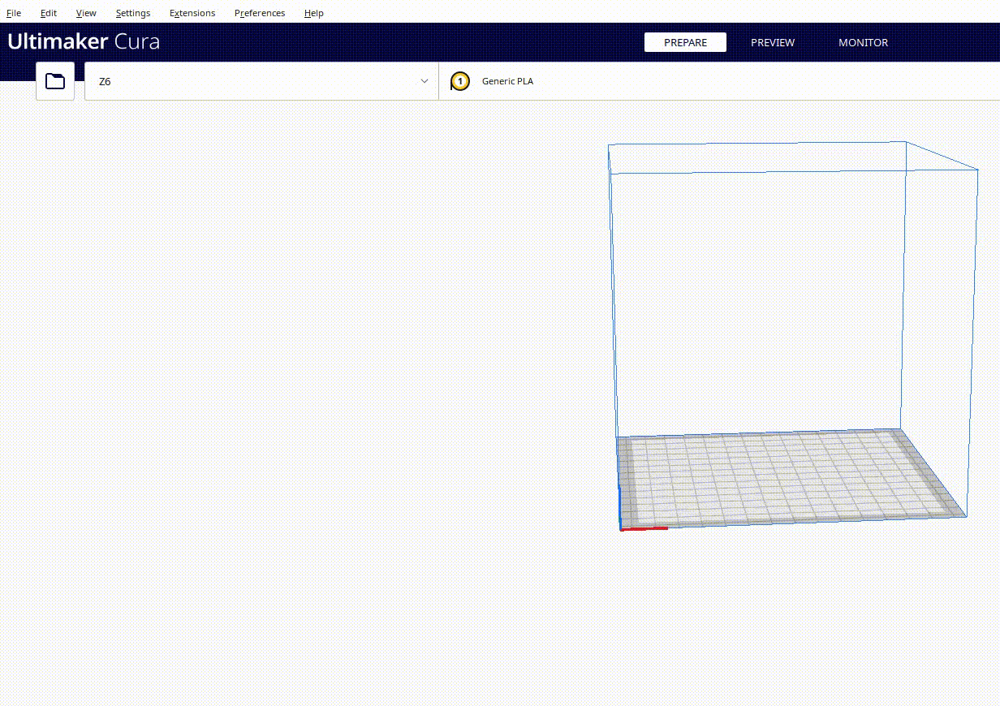
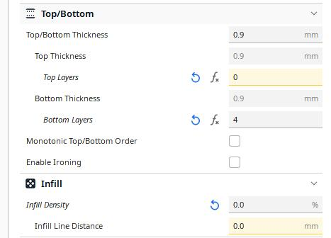
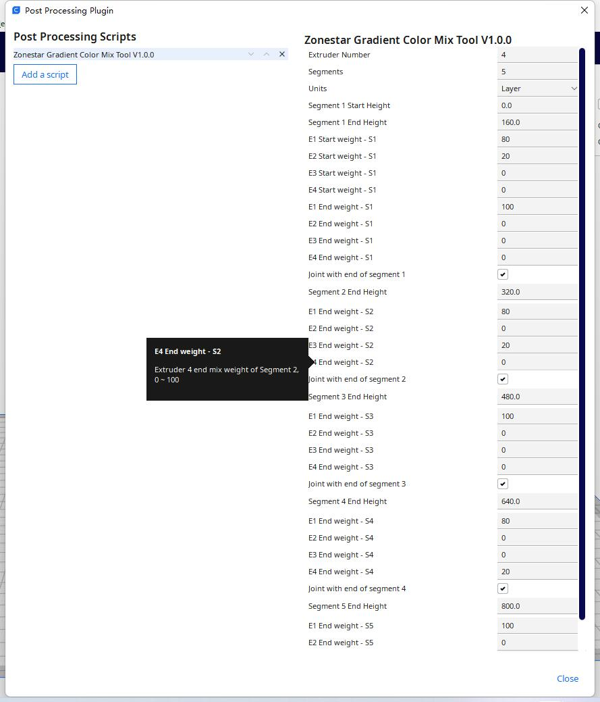

### Language / Translate

--------
## ZONESTAR 3d printer profiles for Cura 
:green_book: [**What is resources files**](https://github.com/Ultimaker/Cura/wiki/Definition-Files-Explained)     
:green_book: [**Cura user guide**](https://support.ultimaker.com/hc/en-us/categories/360002327600-Software)  
### How to install Cura and import ZONESTAR 3d printer profiles 
Following the below steps to install cura and then import the ZONESTAR 3d printer profiles:  
- **Step 1**:  Download [:arrow_down: **Cura software**](https://github.com/Ultimaker/Cura/releases) and install it to your PC.
- **Step 2**:  Download [:arrow_down: **Zonestar 3D Printer Profiles.**](./ZONESTAR_Cura_resources.zip) *<-click here and then click "download" button to download, the last updata on 2022-08-15.*.   
  
- **Step 3**:   Unzip ***ZONESTAR_Cura_Resource.zip*** to your PC and then copy the "resource" files to the cura installation directory.    
:pushpin: For **Cura 5.x.x**, resource files store in ***"{Cura installed directory}\share\cura\resource"(e.g.:C:\Program Files\Ultimaker Cura 5.1.0\share\cura\resource)***         
:pushpin: For **Cura 4.x.x**, resource files store in ***"{Cura installed directory}\resource"(e.g.:C:\Program Files\Ultimaker Cura 4.13.1\resource)***   
       
- **Step 4**: Run cura, you can find the Zonestar printers in the list while you choose "add mechine" in cura.    

  
### You need to choose different printer model on Cura when you slicing one color or multi-colors 3d models, please refer to the below table:
|   Printer model  |Orignal Hotend Type| Print one color | Print multi colors |  
|------------------|-------------------|-----------------|--------------------|
|      Z6          |    one color      |       Z6        |        NA          | 
|      Z5X         |    one color      |       Z5X       |        NA          | 
|      Z5XM2       |    M2 hotend      |       Z5X       | Z10 with M2 hotend | 
|    Z8X/Z10S      |    one color      |  Z8 one color   |        NA          |
|    Z8XM2/Z10M2   |    M2 hotend      |  Z8 one color   | Z10 with M2 hotend |
|      Z8S         |    M3 hotend      |  Z8 one color   | Z10 with M2 hotend |
|      Z8T         |    M3 hotend      |  Z8 one color   | Z8 with M3 hotend  |
|      Z8PM3       |    M3 hotend      |  Z8 one color   | Z8 with M3 hotend  |
|      Z8PM4       |    M4 hotend      |  Z8 one color   | Z8 with M4 hotend  |
|      Z9M2        |    M2 hotend      |  Z9 one color   | Z9 with M2 hotend  |
|      Z9M3        |    M3 hotend      |  Z9 one color   | Z9 with M3 hotend  |
|      Z9M4        |    M4 hotend      |  Z9 one color   | Z9 with M4 hotend  |
|      Z9E4        |    E4 hotend      |  Z9 one color   | Z9 with E4 hotend  | 
| Z9V5-MK1/MK2/MK3 |    M4 hotend      |  Z9 one color   | Z9 with M4 hotend  | 
|   Z9V5-MK4       |    E4 hotend      |  Z9 one color   | Z9 with E4 hotend  | 

#### About hotend type
- [**M2 hotend:**](https://github.com/ZONESTAR3D/Upgrade-kit-guide/tree/main/HOTEND#m2-2-in-1-out--mixing-color-hotend) 2-IN-1-OUT mixing color hotend    
- [**M3 hotend:**](https://github.com/ZONESTAR3D/Upgrade-kit-guide/tree/main/HOTEND#m2-2-in-1-out--mixing-color-hotend) 3-IN-1-OUT mixing color hotend    
- [**M4 hotend:**](https://github.com/ZONESTAR3D/Upgrade-kit-guide/tree/main/HOTEND#m44-in-1-out-mixing-color-hotend) 4-IN-1-OUT mixing color hotend    
- [**E4 hotend:**](https://github.com/ZONESTAR3D/Upgrade-kit-guide/tree/main/HOTEND#e4-4-in-1-out-non-mix-color-hotend) 4-IN-1-OUT non-mixing color hotend    
For more information of the hotend, please refer to [**here**](https://github.com/ZONESTAR3D/Upgrade-kit-guide/tree/main/HOTEND).
  
### Slicing guide for ZONESTAR 3D Printer
<!-- - :movie_camera: [**Install and setup Cura 5.1.x**]()    -->
- :movie_camera: [**Install and setup Cura 4.x.x**](https://youtu.be/h2GynyUo7wQ)   
- :movie_camera: [**slicing 1 color 3d object (Z9V5 + M4 hotend)**](https://youtu.be/UDgjGRFrELc)   
- :movie_camera: [**slicing 4 colors 3d object (Z9V5 + M4 hotend)**](https://youtu.be/hP6Socp-Cz0)    
- :movie_camera: [**slicing 8 colors 3d object (Z9V5 + M4 hotend)**](https://youtu.be/qQ6UnTysqK0)  

### Test gcode files
[**Example gcode and stl files.**](./test-gcode-file/readme.md)    
:point_right: [***More examples for M4(4-IN-1-OUT mix color) hotend***](https://github.com/ZONESTAR3D/Upgrade-kit-guide/tree/main/HOTEND/M4%20%204-IN-1-OUT%20Mixing%20Color%20Hotend)  
:point_right: [***More examples for E4((4-IN-1-OUT non-mix color)) hotend***](https://github.com/ZONESTAR3D/Upgrade-kit-guide/tree/main/HOTEND/E4%204-IN-1-OUT%20Non-Mixing%20Color%20Hotend)  
### Settings for R3 hotend 
User guide for Cura slicing process of R3 hotend   
More hotend user guide, please refer to :point_right: [***More hotend user guide***](https://github.com/ZONESTAR3D/Upgrade-kit-guide/tree/main/HOTEND)  

-----
## ZONESTAR Cura Plugins
### How to install the cura Plugins
- **Step 1**: Download [:arrow_down: **ZONESTAR Cura Plugin**](./plugins/ZONESTAR_Cura_plugin.zip) to your PC and unzip it.
- **Step 2**: Copy the "[**ZonestarGradientMix.py**](./plugins/ZonestarGradientMix.py)" and "[**ColorSwitchTower_V1_1_0.py**](./plugins/ColorSwitchTower_V1_1_0.py)" to the cura plugin installation directory.    
:pushpin: For **Cura 5.x.x**, resource files store in ***"{Cura installed directory}\share\cura\plugins\PostProcessingPlugin\scripts"(e.g.:C:\Program Files\Ultimaker Cura 5.1.0\share\cura\plugins\PostProcessingPlugin\scripts)***         
:pushpin: For **Cura 4.x.x**, resource files store in ***"{Cura installed directory}\plugins\PostProcessingPlugin\scripts"(e.g.:C:\Program Files\Ultimaker Cura 4.13.1\plugins\PostProcessingPlugin\scripts)***  
 

### ZonestarGradientMix - Gradient Mix Color Plugin 
By using this plug-in, you can make more abundant gradient 3D models (change at Z axis), as shown in the following picture. **This plug in can be used to all of the ZONESTAR 3d printer with mixing color hotend**, for exmaple: M8R2, D805SM2, Z5SM2, Z8XM2(3), Z8T, Z8PM3(4), Z9M2, Z9M3, Z9M4, Z10M2, Z9V5 with m4 hotend, etc..   
You may already know how to start the [**"automatic gradient mix color"**]() function on the LCD screen to print a gcode file with single color into a gradient mix color 3D model. However, using this function of LCD can only process one time gradient. If you want to get more rich gradient effects (multiple gradients), you can use this plug-in.

#### Settings of Gradient Mix Color Plugin
- **Extruders:** The actual number of extruders of your printer, e.g., Z9M2 = 2, Z9M3 = 3, Z9V5 = 4.
- **Segments:** Number of segments, that is, the times you want to achieve different gradient changes at Z axis.
- **Units:** Unit of starting and ending height (layer or mm).
- **Segment n Start Height**: The start height of this segment.
- **Segment n End Height**: The end height of this segment.
- **Ex Start weight -Sn**: Ratio of Extruder "x" at the beginning of the "segment n".
- **Ex End weight -Sn**: Ratio of Extruder "x" at the end of the "segment n".
- **Joint with end of segment n**: If this selection box is enabled, the mixing ratio of extruders at the start height of this segment will be the same as the end of previous segment.

#### Example 1: 
##### Sketch out
  - **Filament color:** E1: Transparent, E2: white, E3: Green, E4: Yellow    
  
##### Slicing settings
  - **Printer: Z9 one color**   
  - **Layer thickness: 0.2mm**   
    
  - **Top Layer: 0**   
  - **Bottom Layer: 4** 
  - **Infill: 0**    
     
  - **Nozzle temperature: 205**   
  - **Bed temperature: 60** 
  - **Print speed: 60mm/s**   
  - **Wall speed: 50mm/s**    
      
  - **Spirlize Outer  Contour: enabled**   
      
##### Plugin settings 
  - :movie_camera:[**Video tutorial**](./plugins/plugin_setting.gif)
      
##### [Gcode file :arrow_down:](./plugins/M4_Vase.zip)

### ColorSwitchTower- Color Switch Tower Plugin
